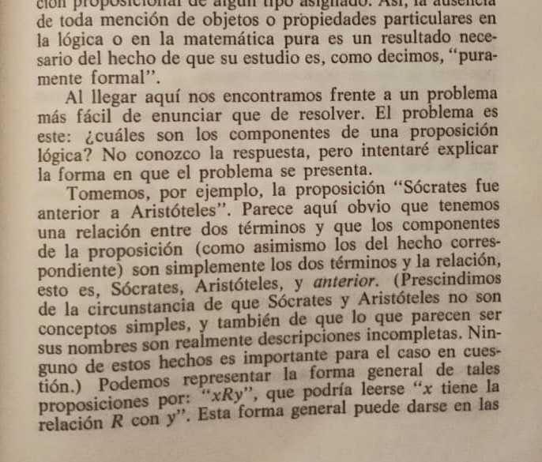
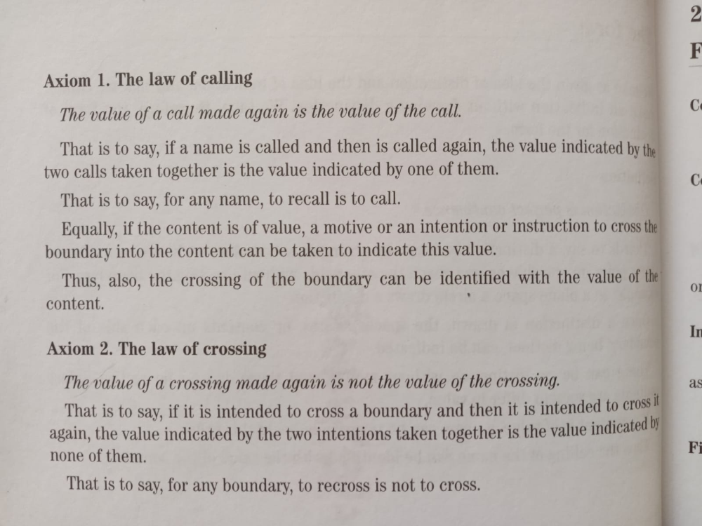

# Axiomatización del Marco Ontológico de la Distinción


")

## Primitivos Ontológicos

### Continuo Ontológico ($\mathcal{C}$)

Flujo dinámico sin solución de continuidad donde ocurren todas las distinciones, con límites asintóticos $\top$ (TODO)
y $\bot$ (NADA), inalcanzables pero definitorios del rango ontológico.

> **Ejemplo natural**: El aire en una habitación representa un continuo indiferenciado, donde las corrientes de aire
> emergen como estructuras organizadas solo cuando hay perturbaciones específicas, sin que exista una "separación"
> previa en el aire mismo.

### Operador de Distinción ($\mathcal{D}$)

Acción primaria que genera la tríada relacional $(A,R,\tilde{A})$ mediante fractura mínima en $\mathcal{C}$, donde $R$
es el proceso relacional en curso cuya tensión se mide mediante $\tau$, y $\tilde{R}$ representa su estabilización
completa, con frontera crítica determinada por $\theta_c$.

> **Ejemplo natural**: Un río que encuentra una roca genera naturalmente dos corrientes que fluyen a ambos lados,
> creando una distinción sin que existieran previamente dos aguas separadas.

## Distinciones fundamentales emergentes

```
        _____→_____         Ref:
       /           \        A = ┬ ≡ TODO, Ã = ┴ ≡ NADA
      /      S      \       R = ↔ ≡ Continuo (Contextual)
    _|___→_______←___|_     R' ≡ ∞, R" ≡ 0
   / ↑ ∞  /  ¦  \ 0  ↓ \
  /   \R'/   Ṙ   \R"/   \   Ṙ = ¦ ≡ ALGO (Relación Estabilizada)
 |  ┬  \|____←____|/  ┴  |  S = Complemento ≡ Observador
 ↑  A   ↓    ↔    ↓   Ã  ↑
  \      \   R   /      /
   \____←_\_____/_→____/
```

### Tensión ontológica ($\tau$)

Deriva directamente del acto de distinción $\mathcal{D}$. Es una medida de la inestabilidad introducida por la fractura
en $\mathcal{C}$: $\tau\to 0$ representa equilibrio óptimo; valores crecientes indican mayor inestabilidad.

> **Ejemplo natural**: La tensión en una telaraña mide cuánto se aleja su estructura del equilibrio mínimo de energía,
> aumentando cuando hay perturbaciones y disminuyendo cuando se restablece el equilibrio.

Matemáticamente, se interpreta como una función de la relación entre configuraciones permitidas; en aplicaciones
prácticas, se estima mediante medidas locales de sensibilidad de la transformación que genera la nueva configuración.

### Umbral crítico ($\theta_c$)

Distinción emergente que marca el límite donde la tensión ontológica debe ser reconfigurada. Es análogo a un punto de
bifurcación y su valor depende de la historia de distinciones en $\mathcal{C}$.

> **Ejemplo natural**: Un puente colgante que oscila con el viento alcanza un umbral crítico cuando las vibraciones
> superan su capacidad de estabilidad, generando un salto ontológico a un nuevo estado estable o colapso.

### Relación estabilizada ($\tilde R^{(n)}$)

Producto de una distinción que ha minimizado la tensión ontológica hasta un mínimo local; sirve como base para nuevas
distinciones.

> **Ejemplo natural**: Una gota de agua en equilibrio sobre una superficie representa la primera estabilización lógica,
> donde las fuerzas de cohesión y adhesión alcanzan un equilibrio estable emergente del continuo de formas posibles.

## Axiomas Fundamentales Emergentes



")

### Axioma de Distinción Primaria

Para cualquier configuración $A\in\mathcal{C}$ existe una distinción $\mathcal{D}(A)=(A,\tilde A)$ tal que la tensión
ontológica local $\tau(A,\tilde A)>0$.

**Interpretación**: toda distinción genuina introduce una diferencia medible que genera tensión y estructura el
continuo.

> **Ejemplo natural**: Al sembrar una semilla, no se separa una planta de un suelo previamente distinto, sino que se
> constituyen ambas estructuras a través del proceso de crecimiento, generando tensión ontológica entre las fuerzas de
> crecimiento y resistencia del suelo.

### Axioma de Minimización de Tensión

Toda configuración estable en $\mathcal{C}$ es un mínimo local de la tensión $\tau$. En consecuencia, las
estabilizaciones emergen como reconfiguraciones que disminuyen $\tau$ en la vecindad pertinente.

**Definición local de referencia**: Se fija una función de tensión $\tau:\mathcal{X}\to[0,\infty)$ y un umbral
interno $\theta_c>0$ mediante la elección de un estado de referencia $A_{\mathrm{ref}}$
con $\theta_c:=\tau(A_{\mathrm{ref}})$.

La relación entre la tensión ontológica y el umbral crítico determina directamente la estabilidad de las
configuraciones:

- $\tau(A) < \theta_c$: configuración dentro del dominio de coherencia local, estable.
- $\tau(A) = \theta_c$: frontera crítica relativa al referente, transición inminente.
- $\tau(A) > \theta_c$: configuración inestable que requiere reconfiguración ontológica.

> **Ejemplo natural**: Un sistema de seguridad en una olla a presión libera presión automáticamente al alcanzar un
> umbral crítico, manteniendo el sistema dentro de límites seguros mediante una respuesta binaria clara.

### Axioma de Transición Ontológica

Axioma de Reconfiguración Mínima. Si para $X$ se verifica $\Delta\tau(X)>\theta_c$, entonces $X$ sufre la
reconfiguración mínima necesaria mediante el operador $\mathcal{D}$ para devolver $\tau<\theta_c$ en la vecindad
considerada.

**Definición operacional de paradoja**: Una construcción es paradójica si su realización implica la existencia de una
vecindad $U$ con $\sup_{A\in U}\tau(A)\ge\theta_c$. En tal caso, la TdD garantiza que existe una reconfiguración
mínima (Todo-o-Nada) que restaura $\tau<\theta_c$ en $U$.

> **Ejemplo natural**: En una cascada, el agua fluye continuamente pero forma remolinos estables en ciertos puntos.
> Cuando las condiciones cambian, el remolino se transforma abruptamente en una nueva estructura estable, sin
> transiciones intermedias.

### Axioma de Emergencia del 0 y del 1

Se define la magnitud ontológica $|S|$ de una relación completada $S$ como el valor de equilibrio relacional que esta
adquiere cuando la tensión $\tau$ se minimiza en su vecindad de estabilización.

El 0 emerge como la designación de una configuración de mínima tensión de referencia, $\tau_{ref}$, que actúa como el
umbral subyacente para toda distinción observable.

El 1 emerge como la magnitud de equilibrio de la primera relación completada y estabilizada, $|\tilde{R}^{(1)}| = 1$,
estableciendo la unidad fundamental de distinción en la calibración adoptada.

> **Ejemplo natural**: En la cristalización, el primer núcleo representa la primera estabilización lógica (el 1), único
> incluso si hay núcleos aparentemente idénticos. El "0" corresponde al estado líquido inmediatamente antes de la
> formación del primer núcleo.

### Axioma de Simetría Ontológica

Si $\mathcal{D}(A)=(A,\tilde A)$ genera $\tilde R^{+}=+1$, entonces $\mathcal{D}(\tilde A)=(\tilde A,A)$
genera $\tilde R^{-}=-1$. Existe un valor de tensión de equilibrio $c$ tal que $\tau(+1,-1)=c$ en la vecindad de
estabilización.

La identidad composicional de negativos se interpreta como cierre o composición del ciclo relacional: la composición
sucesiva de dos direcciones opuestas recupera la condición de estabilización (identidad relacional).

> **Ejemplo natural**: Un imán con polos norte y sur muestra simetría ±1: cada polo define y requiere la existencia del
> otro. La tensión ontológica se minimiza cuando los polos están en equilibrio.

## Reglas de Inferencia

### Regla de Indistinguibilidad

Se introduce la tensión local $\tau(\cdot,\cdot)\ge 0$, un umbral interno $\theta_c>0$ y una tolerancia $\varepsilon>0$
con $\varepsilon \ll \theta_c$.

Si $\tau(A^{(m)},A^{(n)})<\varepsilon$, entonces $A^{(m)}$ y $A^{(n)}$ son indistinguibles en la calibración local y se
identifican como la misma proyección estabilizada (se define la relación de equivalencia $A^{(m)}\sim A^{(n)}$).

**Interpretación**: la identidad lógica y las clases de equivalencia emergen por indistinguibilidad subumbral;
transformaciones con $\tau<\varepsilon$ no generan distinción operacional.

> **Ejemplo natural**: En un río tranquilo, dos hojas flotantes que se acercan mucho entre sí pueden considerarse una
> sola unidad para observadores distantes, aunque para un insecto en una hoja son claramente distintas.

### Regla de Derivación Numérica

Definiciones locales: se fija un elemento base $0$ (configuración de referencia con tensión de referencia) y una
relación completada estabilizada $\tilde R^{(1)}$ que representa la unidad elemental $1$ en la calibración adoptada.

El sucesor se define mediante la operación composicional $\oplus$ por $\mathcal{S}(A^{(n)}) ;=; A^{(n)};\oplus; 1$.

Los números naturales emergen por
iteración: $n ;=; \underbrace{\mathcal{S}(\mathcal{S}(\dots\mathcal{S}}_{n\text{ veces}}(0)\dots))$.

> **Ejemplo natural**: La ramificación de un árbol muestra derivación numérica: a medida que crece, el tronco se divide
> en ramas principales, que a su vez se subdividen en ramas secundarias, formando una secuencia numérica natural donde
> cad nivel de ramificación representa una nueva estabilización del proceso de distinción.

### Regla de Composición

Condición de composición. Si $\tau(A^{(m)},A^{(n)})<\theta_c$ entonces la composición está bien definida localmente y se
escribe $A^{(m)}\oplus A^{(n)} = A^{(m+n)}$, donde la derecha corresponde a la composición de $m+n$ unidades elementales
en la calibración adoptada.

> **Ejemplo natural**: En una orquesta sinfónica, los instrumentos pueden tocar juntos armoniosamente (baja tensión
> ontológica) o producir discordancia (tensión alta). La coherencia musical emerge cuando las diferencias entre los
> instrumentos permanecen por debajo de un umbral crítico.

**Compatibilidad de tensión**: La composición satisface la condición de coherencia
local $\tau\big(A^{(m)}\oplus A^{(n)},,A^{(m+n)}\big)\le\varepsilon$.

**Propiedades algebraicas (observación local)**: Bajo la condición de indistinguibilidad subumbral (tensiones por debajo
de $\varepsilon$), la operación $\oplus$ puede asumirse asociativa y conmutativa en la vecindad considerada.

# Análisis de Axiomas



")

## 1. Axiomas de Peano

**Descripción**: Los axiomas que definen los números naturales, incluyendo que 0 es un número y que cada número tiene un
sucesor.

> **Ejemplo natural**: En un sistema de hormigas que construyen su nido, cada hormiga deposita material en una secuencia
> ordenada, donde cada acción es un "sucesor" de la anterior, y el proceso comienza desde un estado inicial (como una
> semilla de material) que actúa como el "0" del sistema.

**Análisis desde el marco**: El número 0 emerge como configuración límite donde $\tau \to 0$, correspondiendo a un
estado crítico en el continuo de distinción. El sucesor representa la aplicación del operador $\mathcal{D}$ (TdD),
generando nuevas estabilizaciones mediante el mecanismo de reconfiguración fractal cuando $\tau$ excede el umbral
crítico. El principio de inducción matemática emerge naturalmente de esta recursividad fractal, donde la transición
de $k$ a $k+1$ ocurre solo si $\tau(k, k+1)$ está por debajo del umbral crítico.

**Conclusión**: Los axiomas de Peano son manifestaciones directas del proceso de distinción y su carácter recursivo,
donde cada nuevo número emerge como una estabilización coherente del continuo.

## 2. Principio de Inducción Matemática

**Descripción**: Si $P(1)$ es verdadero y $P(k) \implies P(k+1)$ para todo $k$, entonces $P(n)$ es verdadero para
todo $n \in \mathbb{N}$.

> **Ejemplo natural**: Un árbol crece formando anillos concéntricos, donde cada anillo nuevo se forma sobre la base del
> anterior, y el patrón emergente contiene constitutivamente las estructuras previas en su dinámica repetitiva.

**Análisis desde el marco**: Este principio emerge de la naturaleza recursiva del proceso de distinción. Los números
naturales son estabilizaciones sucesivas donde cada número contiene constitutivamente a los anteriores (
ej., $2 = 1_1$, $3 = 1_{1_1}$). La transición de $k$ a $k+1$ ocurre solo si la tensión ontológica $\tau(k, k+1)$
permanece bajo el umbral crítico, permitiendo la estabilización.

**Conclusión**: La inducción es una propiedad fractal del continuo de distinción, no un axioma arbitrario. Reflecta la
herencia constitutiva y la minimización de tensión en cada paso del proceso de distinción.

## 3. Regla de Signos

**Descripción**: ¿Por qué $(-1) \times (-1) = 1$?

> **Ejemplo natural**: Al doblar un papel por la mitad y luego doblarlo nuevamente en la misma dirección, el papel
> vuelve a su orientación original, ilustrando cómo dos aplicaciones de una misma dirección pueden resultar en la
> dirección opuesta.

**Análisis desde el marco**: Esta regla emerge de la completitud del ciclo ontológico A-R-Ã. La multiplicación de
negativos representa una doble aplicación de la distinción (doble cruce de frontera), que completa el
ciclo: $A \overset{R}{\longleftrightarrow} \tilde{A} \overset{R}{\longleftrightarrow} A$, resultando en una
estabilización con mayor complejidad relacional. Ontológicamente, corresponde a la ley de cruce de
Spencer-Brown: $(()) = $, donde cruzar dos veces la frontera equivale a no cruzarla.

**Conclusión**: Es una manifestación necesaria del principio de mínima acción: el ciclo completo minimiza $\tau$, y, por
tanto, está permitido.

## 4. Ley del Tercio Excluido (LET)

**Descripción**: Para cualquier proposición $p$, $p \vee \neg p$ es verdadera.

> **Ejemplo natural**: En un río tranquilo, el agua fluye claramente en una dirección o en la contraria; no existe un
> estado intermedio definido cuando se mide en un momento específico.

**Análisis desde el marco**: La LET no es un axioma primitivo, sino una proyección estabilizada de la tríada ontológica
cuando la frontera R es estable. Emerge cuando la tensión ontológica $\tau(p, \neg p)$ es baja y el ciclo A-R-Ã se
completa. En sistemas dinámicos o cuánticos, donde R es inestable, la LET falla porque la distinción entre A y à no está
bien definida; la tensión ontológica es alta y el sistema no se estabiliza en una dicotomía binaria.

**Conclusión**: La LET es válida solo en dominios de baja tensión ontológica. En el marco, su aplicabilidad está
determinada por $\tau$; si $\tau > \theta_c$, la LET no se proyecta.

## 5. Teoremas de Incompletitud de Gödel

**Descripción**: En cualquier sistema formal consistente que contenga aritmética, hay proposiciones indecidibles.

> **Ejemplo natural**: Un ecosistema complejo siempre contiene relaciones que no pueden ser completamente descritas por
> un único observador, reflejando la imposibilidad de capturar toda la complejidad en un modelo finito.

**Análisis desde el marco**: Estos teoremas reflejan la naturaleza inherente del proceso de distinción: siempre hay más
tensión ontológica por resolver, y los sistemas formales son proyecciones estabilizadas finitas que no pueden capturar
la totalidad del continuo ontológico. Las proposiciones indecidibles corresponden a distinciones que exceden el umbral
crítico de tensión si se incluyeran, por lo que están prohibidas en el sistema.

**Conclusión**: La incompletitud es una consecuencia de la imposibilidad de agotar el continuo de distinción en una
proyección finita. Cada sistema formal es una estabilización local que inevitablemente deja fuera algunas distinciones.

## 6. Axioma de Elección

**Descripción**: Permite seleccionar un elemento de cada conjunto en una colección de conjuntos.

> **Ejemplo natural**: Al recoger frutas en un árbol, seleccionamos una fruta de cada rama sin necesidad de una regla
> explícita, operando bajo el principio de que "lo que no está permitido, —generalmente— está prohibido".

**Análisis desde el marco**: Este axioma puede interpretarse como una proyección estabilizada que opera
cuando $\tau < \theta_c$, permitiendo selecciones coherentes en dominios donde el operador $\mathcal{D}$ satisface la
condición de contracción. En contextos donde $\tau \geq \theta_c$, su aplicación puede generar configuraciones
inestables, como en la paradoja de Banach-Tarski, donde se viola la condición de contracción necesaria para
estabilizaciones coherentes.

**Conclusión**: El axioma de elección es válido solo en dominios donde la tensión ontológica es baja. Su aplicación está
sujeta al principio de mínima acción; si lleva a aumentar $\tau$, está prohibido.

## 7. Axiomas de Zermelo-Fraenkel (ZF)

**Descripción**: Axiomas que formalizan la teoría de conjuntos, como el axioma de extensionalidad, de unión, de
infinito, etc.

> **Ejemplo natural**: Un bosque de árboles que comparten raíces comunes representa la cohesión interna de los axiomas
> de ZF, donde cada árbol (elemento) contribuye a la estabilidad del ecosistema (sistema de conjuntos).

**Análisis desde el marco**: La teoría de conjuntos es una proyección estabilizada que enfoca el aspecto A (identidad)
de la tríada A-R-Ã ($\theta = 0^\circ$ en la integración de modelos). Los axiomas de ZF emergen como condiciones
necesarias para que el operador $\mathcal{D}$ mantenga $\tau < \theta_c$:

- Axioma de extensión: Corresponde a la condición $\tau(A, B) = 0 \Rightarrow A = B$, necesaria para estabilizaciones
  coherentes.
- Axioma de separación: Garantiza que las propiedades usadas para formar subconjuntos correspondan a distinciones
  estables bajo el operador $\mathcal{D}$.
- Axioma de elección: Opera de manera consistente solo cuando $\tau < \theta_c$.

**Conclusión**: Los axiomas de ZF emergen como restricciones naturales para mantener $\tau$ bajo umbral crítico,
permitiendo estabilizaciones coherentes.

## 8. Axioma de Extensionalidad (Teoría de Conjuntos)

**Descripción**: Dos conjuntos son iguales si tienen los mismos elementos.

> **Ejemplo natural**: Dos copas de vino que resuenan entre sí al tocarlas con un dedo tienen propiedades similares en
> su vibración, reflejando una equivalencia funcional que surge de sus elementos comunes.

**Análisis desde el marco**: Este axioma refleja la estabilización de distinciones basadas en la identidad (A) y la
transformación (Ã). La igualdad de conjuntos emerge cuando las distinciones entre elementos minimizan la tensión
ontológica, es decir, cuando no hay necesidad de distinguir entre conjuntos con los mismos elementos. Ontológicamente,
este axioma asegura que las proyecciones estabilizadas no introduzcan distinciones superfluas que aumentarían $\tau$.

**Conclusión**: El axioma es una consecuencia natural del proceso de distinción, donde solo las distinciones necesarias
se permiten.

## 9. Axioma de Paridad (Teoría de Conjuntos)

**Descripción**: Para cualesquiera dos conjuntos, existe un conjunto que los contiene a ambos.

> **Ejemplo natural**: Dos personas que se unen para formar una pareja crean una nueva unidad que contiene a ambas,
> donde la tensión ontológica mide la coherencia de su relación.

**Análisis desde el marco**: La formación de pares corresponde a la composición de distinciones ($\oplus$), donde dos
instancias de $\tilde{R}$ (cada una es un "1") coexisten sin exceder el umbral crítico de tensión. Esto es similar a la
emergencia del número 2 como $1_1$ en el marco. El nuevo conjunto (par) es una estabilización que mantiene $\tau$ baja
al permitir una relación simple entre distinciones previas.

**Conclusión**: El axioma está permitido porque opera dentro de los límites de baja tensión ontológica, facilitando la
emergencia de estructuras más complejas desde lo simple.

## 10. Axioma de Unión (Teoría de Conjuntos)

**Descripción**: Para cualquier conjunto de conjuntos, existe un conjunto que contiene todos los elementos de dichos
conjuntos.

> **Ejemplo natural**: Un río que recoge aguas de varios arroyos representa la unión de elementos en una estructura
> coherente, donde cada afluente contribuye sin alterar la identidad del río principal.

**Análisis desde el marco**: Este axioma permite la agregación de múltiples distinciones en una sola estabilización.
Ontológicamente, esto corresponde a una iteración del proceso de distinción donde las relaciones entre conjuntos se
unifican en una nueva proyección. La unión puede aumentar la complejidad, pero si los conjuntos base están bien
definidos (baja $\tau$), la unión misma se estabiliza sin violar el principio de mínima acción.

**Conclusión**: El axioma es válido como una extensión natural del proceso de distinción, siempre que se mantenga la
coherencia relacional.

## 11. Axioma del Conjunto Potencia (Teoría de Conjuntos)

**Descripción**: Para cualquier conjunto, existe el conjunto de todos sus subconjuntos.

> **Ejemplo natural**: Un árbol que produce hojas, cada una con venas que replican la estructura del árbol, muestra cómo
> el conjunto potencia emerge como una meta-distinción que captura las relaciones internas.

**Análisis desde el marco**: El conjunto potencia representa todas las posibles distinciones dentro de un conjunto, es
decir, todas las formas en que se puede dividir el conjunto. Esto es una meta-distinción que puede generar alta tensión
ontológica si el conjunto es grande, ya que el número de subconjuntos crece exponencialmente. Sin embargo, en el marco,
esta operación está permitida porque es una proyección estabilizada que captura las relaciones internas del conjunto. La
tensión se mantiene manejable siempre que el conjunto base sea una distinción estable.

**Conclusión**: El axioma es coherente con el principio de distinción, pero su aplicación debe ser cuidadosa para evitar
acercamientos a TODO, que aumentarían $\tau$ indefinidamente.

## 12. Axioma de Infinito (Teoría de Conjuntos)

**Descripción**: Existe un conjunto infinito, como el conjunto de los números naturales.

> **Ejemplo natural**: Las olas en un mar que se suceden sin fin representan un proceso infinito de distinción que se
> mantiene coherente sin necesidad de completar TODO.

**Análisis desde el marco**: El infinito matemático es una proyección estabilizada que aproxima TODO sin alcanzarlo. El
axioma de infinito no postula TODO, sino un proceso infinito de distinción que se mantiene coherente. En el marco, el
conjunto infinito emerge como una estructura fractal donde cada nuevo número (estabilización) contiene a los anteriores,
y la tensión ontológica $\tau$ se mantiene acotada mediante la recursividad.

**Conclusión**: El axioma es permitido porque representa una cadena infinita de distinciones estables, no una verdadera
completitud de TODO.

## 13. Las Leyes de la Forma

```
Ley de Llamada:
       A       R       Ã
  ⟷ ---────────═════════=== ⇔

  ↓                   ↓                   ↓
  │ A        R        │ A        R        │ A        R
  └────────╖        ⇔ └────────╖        ≡ └────────╖
         ↗ ║                 ↗ ║                 ↗ ║
           ║ Ã                 ║ Ã                 ║ Ã
           ╚=== ==⇒            ╚=== ==⇒            ╚=== ==⇒
Ley de Cruce:
       A       R       Ã
  ⟷ ---────────═════════=== ⇔

  ↓                   ←-- ---┐
  │ A        R             A │                  A       R       Ã
  └────────╖        ⇔        │ ↙        ≡ ⟷ ---────────═════════=== ⇔
         ↗ ║                 ╘════════╗
           ║ Ã             R        Ã ‖   Re-entry es consecuencia
           ╚=== ==⇒                   ⇑   de la oscilación ↗↙.
```

### Ley de Llamada

**Descripción simple**: Dos marcas adyacentes se condensan en una sola, reflejando que aplicar la misma distinción dos
veces no genera nueva estabilización, sino que refuerza la estructura existente.

> **Ejemplo natural**: En un río tranquilo, cuando dos corrientes fluyen paralelas y convergen, no se forman dos nuevas
> corrientes sino que se unen en una sola, manteniendo el flujo continuo sin crear una nueva estructura.

**Análisis breve**: Esta ley corresponde a la identidad de una estabilización triádica consigo misma. La tensión
ontológica permanece constante cuando se aplica repetidamente la misma distinción. Matemáticamente se expresa
como $\tau(A^{(n)},A^{(n)})\le\varepsilon$, donde $\varepsilon$ es la tolerancia subumbral que define
indistinguibilidad.

**Conclusión simple**: La aplicación repetida de la misma distinción refuerza la estructura relacional existente sin
crear una nueva estabilización.

### Ley de Cruce

**Descripción simple**: Cruzar dos veces una frontera cancela el cruce, equivalente a no cruzarla, correspondiendo a la
completitud cíclica de la tríada ontológica.

> **Ejemplo natural**: Al doblar un papel por la mitad y luego doblarlo nuevamente en la misma dirección, el papel
> vuelve a su orientación original, mostrando cómo dos aplicaciones de la misma dirección pueden resultar en la
> dirección opuesta.

**Análisis breve**: La ley se deriva de la simetría ontológica: la doble aplicación de la distinción completa el ciclo
A-R-Ã, retornando a la configuración original con mayor complejidad relacional. Esto explica naturalmente por
qué $(-1) \times (-1) = 1$ es una manifestación del ciclo ontológico.

**Conclusión simple**: Cruzar dos veces una frontera completa el ciclo ontológico, retornando a la configuración
original con mayor complejidad relacional.

### Ley de Re-entry (Autorreferencia Estabilizada)

**Descripción simple**: Representa la autorreferencia que completa la tríada ontológica mediante una fractura mínima,
permitiendo que el sistema se incorpore a sí mismo sin paradojas.

> **Ejemplo natural**: Un eco en una montaña que se escucha claramente, pero no se repite indefinidamente, mostrando
> cómo
> la autorreferencia puede estabilizarse cuando la tensión permanece controlada.

**Análisis breve**: Esta ley se deriva de la tensión ontológica crítica: se produce cuando $\tau(A) < \theta_c$. La
autorreferencia no es un error, sino la condición necesaria para que el observador se incorpore como parte constitutiva
del sistema observado.

**Conclusión simple**: La autorreferencia se estabiliza cuando la tensión ontológica permanece por debajo del umbral
crítico, permitiendo que el sistema se incluya a sí mismo sin paradojas.

### Interpretación General

**Interpretación simple**: Estas leyes no son axiomas independientes, sino proyecciones estabilizadas del proceso
ontológico fundamental. Emergen naturalmente del principio de reconfiguración mínima, explicando por
qué $(-1) \times (-1) = 1$ y resolviendo las paradojas lógicas mediante el umbral crítico de tensión. La autorreferencia
no es un problema, sino la condición necesaria para que algo exista.

# Análisis de Paradojas


")

## 1. Paradoja del Mentiroso

**Descripción**: Una oración que afirma "Esta oración es falsa" crea una contradicción: si es verdadera, es falsa, y
viceversa.

> **Ejemplo natural**: Un espejo que refleja un mensaje que dice "este espejo está roto". Si el mensaje es verdadero, el
> espejo está roto y no refleja correctamente, por lo que el mensaje sería falso. Si el mensaje es falso, el espejo no
> está roto y refleja correctamente, por lo que el mensaje sería verdadero.

**Análisis desde el marco**: Esta paradoja corresponde a una autorreferencia que viola la condición de contracción local
de la TdD. La oración no completa la tríada ontológica A-R-Ã, generando una tensión τ que excede el umbral crítico. En
el marco, la autorreferencia solo produce estabilizaciones coherentes cuando el operador 𝒟 satisface las condiciones del
teorema.

**Conclusión**: La oración excede el umbral crítico de tensión ontológica ($\Delta\tau > \theta_{\text{crítico}}$) y,
por tanto, está prohibida por el principio de mínima acción. No se estabiliza como proyección lógica coherente; es
excluida del dominio de lo permitido.

## 2. Paradoja de Russell

**Descripción**: El conjunto de todos los conjuntos que no se contienen a sí mismos lleva a una contradicción: si se
contiene, no debería, y si no se contiene, debería.

> **Ejemplo natural**: Un catálogo que debe listar todos los catálogos que no se listan a sí mismos. Si el catálogo se
> incluye a sí mismo, viola su propia regla; si no se incluye, debería estar en la lista.

**Análisis desde el marco**: Los conjuntos corresponden a proyecciones estabilizadas donde el operador 𝒟 satisface la
condición de contracción local. Esta paradoja representa una configuración donde τ excede θcrítico al intentar abarcar
todas las distinciones de un tipo. El principio "lo que no está permitido, —generalmente— está prohibido" se manifiesta
aquí como la imposibilidad de aplicar 𝒟 más allá del umbral crítico.

**Conclusión**: La teoría de conjuntos moderna evita esta paradoja con axiomas que corresponden a dominios donde 𝒟
mantiene τ < θcrítico. El conjunto paradoxal está excluido porque viola las condiciones de contracción necesarias para
estabilizaciones coherentes.

## 3. Paradoja de Zenón (Aquiles y la tortuga)

**Descripción**: Aquiles nunca alcanza a la tortuga porque debe recorrer infinitas fracciones de distancia.

> **Ejemplo natural**: Un vaso que se llena con la mitad de agua en cada paso: primero medio vaso, luego un cuarto,
> luego un octavo, etc. Aunque hay infinitos pasos, el vaso se llena completamente en un tiempo finito.

**Análisis desde el marco**: El continuo de distinción opera sin solución de continuidad, pero las estabilizaciones
emergen como soluciones del operador 𝒟 donde τ alcanza mínimos locales. Aquiles alcanza a la tortuga cuando la secuencia
de distancias converge a un punto donde 𝒟 satisface la condición de contracción local.

**Conclusión**: La paradoja se resuelve al reconocer que la convergencia a un punto estable corresponde a una solución
de la TdD.

## 4. Paradoja de Banach-Tarski

**Descripción**: Una esfera puede ser dividida en un número finito de partes y reensamblada en dos esferas del mismo
tamaño.

> **Ejemplo natural**: Un modelo de arcilla que parece que se duplica sin agregar más material, pero en realidad hay una
> transformación oculta que mantiene el volumen constante.

**Análisis desde el marco**: Esta paradoja corresponde a una aplicación del axioma de elección en regiones donde 𝒟 viola
la condición de contracción local, generando partes no medibles. En sistemas físicos, tales configuraciones están
excluidas porque el operador de distinción físico requiere τ < θcrítico para estabilizaciones coherentes.

**Conclusión**: La paradoja se explica como un artefacto matemático que ocurre fuera del dominio de aplicabilidad de la
Teoría.

## 5. Paradoja del Montón (Sorites)

**Descripción**: Si un grano de arena no forma un montón, y añadir un grano no convierte un no-montón en montón,
entonces nunca se forma un montón.

> **Ejemplo natural**: El proceso de hervir agua: a medida que aumenta la temperatura, no hay un punto exacto donde el
> agua pasa de líquido a gas, sino una transición gradual.

**Análisis desde el marco**: Esta paradoja ilustra la transición entre dominios de aplicabilidad de la TdD. Las
distinciones son continuas, pero las estabilizaciones emergen cuando τ alcanza θcrítico, provocando saltos discretos.
Añadir granos aumenta gradualmente τ hasta que, en un punto crítico, la distinción "montón" emerge abruptamente. Este
salto resuelve la paradoja, ya que la transición no es gradual sino discreta.

**Conclusión**: La paradoja se resuelve mediante el mecanismo de transición ontológica formalizado en la TdD.

## 6. Paradoja de Berry

**Descripción**: "El menor entero positivo que no puede definirse con menos de doce palabras" se define con once
palabras, llevando a una contradicción.

> **Ejemplo natural**: Un diccionario que intenta definir todas las palabras con menos de diez palabras, pero la
> definición del concepto "definición corta" requiere más de diez palabras.

**Análisis desde el marco**: Esta paradoja puede interpretarse como una definición que viola la condición de contracción
local de la TdD al intentar abarcar todas las definiciones posibles. El marco excluye tales definiciones porque
corresponden a configuraciones donde 𝒟 no satisface τ < θcrítico, impidiendo estabilizaciones coherentes.

**Conclusión**: La paradoja se resuelve al reconocer que la definición opera fuera del dominio de aplicabilidad de la
TdD.

## 7. Paradoja de Curry

**Descripción**: Una oración que dice "Si esta oración es verdadera, entonces X" lleva a que X sea verdadera,
independientemente de X.

> **Ejemplo natural**: Un sistema de alarma que dice "Si este sistema está funcionando, entonces hay un incendio". Si el
> sistema está funcionando, entonces por definición hay un incendio, incluso si no lo hay.

**Análisis desde el marco**: Esta paradoja corresponde a un bucle de autorreferencia que viola la condición de
contracción local de la TdD. En el marco, tales construcciones están excluidas porque corresponden a configuraciones
donde τ ≥ θcrítico, impidiendo que 𝒟 genere estabilizaciones coherentes.

**Conclusión**: La paradoja se resuelve al reconocer que la autorreferencia opera fuera del dominio de aplicabilidad de
la TdD.

## 8. Paradoja de Skolem

**Descripción**: La teoría de conjuntos tiene modelos numerables a pesar de probar la existencia de conjuntos
incontables.

> **Ejemplo natural**: Un mapa topográfico que representa una montaña, donde la altura se mide con precisión limitada,
> pero la montaña misma es continua.

**Análisis desde el marco**: Esta paradoja ilustra cómo la TdD permite diferentes dominios de aplicabilidad para el
operador 𝒟, cada uno con su propia estabilización. En el marco, los modelos numerables corresponden a dominios donde 𝒟
satisface la condición de contracción local, mientras que la "incontabilidad" emerge como una propiedad interna del
modelo.

**Conclusión**: La paradoja se resuelve al reconocer que la TdD admite múltiples proyecciones estables en diferentes
dominios de aplicabilidad.

## 9. Paradoja de Burali-Forti

**Descripción**: El conjunto de todos los ordinales sería un ordinal mayor que todos, lo que es imposible.

> **Ejemplo natural**: Un calendario que intenta enumerar todos los días, pero al intentar agregar el "último día",
> automáticamente crea un nuevo día posterior.

**Análisis desde el marco**: Intentar formar el conjunto de todos los ordinales corresponde a una configuración donde 𝒟
excede el umbral crítico de contracción local, generando τ infinita. En la teoría de conjuntos, esto se evita mediante
axiomas que restringen las distinciones a dominios donde 𝒟 satisface τ < θcrítico.

**Conclusión**: La paradoja se resuelve al reconocer que el conjunto de todos los ordinales opera fuera del dominio de
aplicabilidad de la TdD.

# Principio Emergente

## Principio de Autorreferencia Constitutiva

**Descripción ontológica**: Para enunciar el marco que explica el origen de toda distinción, se debe utilizar un sistema
de distinciones que el propio marco postula como emergente. Es la inescapabilidad ontológica de que no puede existir
un "exterior" al proceso de distinción, ya que incluso la observación es parte constitutiva del proceso mismo.

> **Ejemplo natural**: Un espejo que refleja un mensaje que dice "este espejo está roto". Si el mensaje es verdadero, el
> espejo está roto y no refleja correctamente, por lo que el mensaje sería falso. Si el mensaje es falso, el espejo no
> está roto y refleja correctamente, por lo que el mensaje sería verdadero. Este bucle no es un error, sino la
> manifestación natural de cómo incluso la observación se constituye dentro del proceso que observa.

**Análisis desde el marco**: El Principio de Autorreferencia Constitutiva corresponde al umbral crítico de contracción
local definido en TdD. Cuando la tensión ontológica $\tau$ alcanza el umbral crítico $\theta_c$, el
operador $\mathcal{D}$ genera la reconfiguración mínima necesaria para establecer un sistema coherente.

La Meta-Distinción no es una excepción, sino la condición necesaria para la emergencia de cualquier distinción
coherente. Sin este principio, no sería posible la estabilización de estructuras lógicas y matemáticas. La
inescapabilidad ontológica se manifiesta porque para observar el origen de la distinción, ya debemos estar operando
dentro del continuo de distinción - no existe un "fuera" desde donde observar, ya que incluso la observación misma es
parte del proceso.

**Conclusión**: La distinción solo puede ser conocida y comunicada a través de un acto de distinción. La descripción del
origen es, en sí misma, una instancia de lo que se origina. Es la inestabilidad ontológica la que da origen a toda
estabilidad, y este bucle constitutivo no es un error, sino la condición misma de posibilidad de todo sistema de
distinciones.

**Interpretación**: Mientras lees esto, estás realizando la operación fundamental del marco: distinciones recursivas (
ALGO ≠ NADA). Primero reconoces patrones (A), luego los relacionas (R), y finalmente los transformas (Ã). No eliges una
respuesta, sino que generas distinciones hasta que, tras tres operaciones autorreferenciales, la tensión alcanza un
umbral crítico. Entonces, una configuración se estabiliza y emerge como tu comprensión. Las demás posibilidades quedan
subumbral, pero siguen siendo parte del proceso. Así es como algo surge de la nada: mediante distinciones que, al
alcanzar su equilibrio óptimo, inevitablemente se distinguen como comprensión.

## Principio Emergente

### Principio de Autorreferencia Constitutiva

**Descripción**: Para enunciar el marco que explica el origen de toda distinción, se debe utilizar un sistema de
distinciones que el propio marco postula como emergente.

**Análisis desde el marco**: El Principio de Autorreferencia Constitutiva corresponde al umbral crítico de contracción
local definido en TdD. Cuando la tensión ontológica $\tau$ alcanza el umbral crítico $\theta_c$, el
operador $\mathcal{D}$ genera la reconfiguración mínima necesaria para establecer un sistema coherente.

**Conclusión**: La distinción solo puede ser conocida y comunicada a través de un acto de distinción. La descripción del
origen es, en sí misma, una instancia de lo que se origina. Es la inestabilidad ontológica la que da origen a toda
estabilidad, y este bucle constitutivo no es un error, sino la condición misma de posibilidad de todo sistema de
distinciones.

> **Ejemplo natural**: Al observar el horizonte marino, nuestro sistema visual procesa continuamente la tensión entre
> agua y cielo, generando una frontera aparentemente clara, aunque en realidad es una proyección estabilizada de un
> continuo sin solución de continuidad.