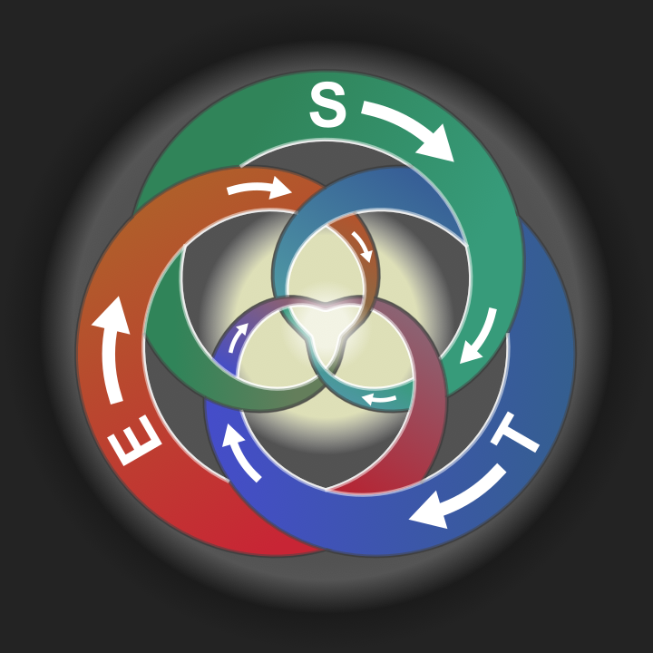
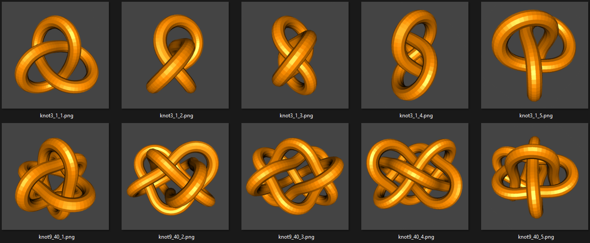
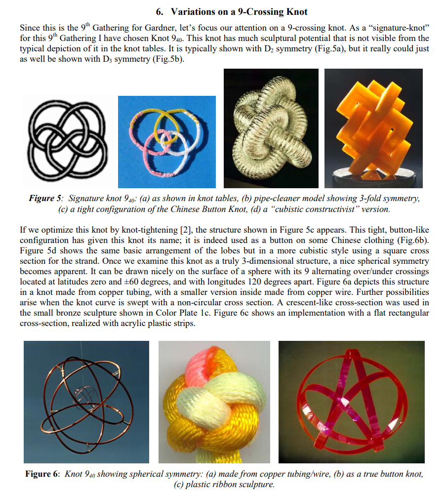

**Una Teoría de la Manifestación**

*(Unicidad primordial → Proyección discreta)*




# **Génesis Cuántica**

La **Ley de Distinción** (LD) es el acto primario de diferenciación (**ALGO ≠ NADA**), que surge del colapso espontáneo
de la uniformidad perfecta —inherentemente metaestable— hacia configuraciones de mínima tensión ontológica. La LD
proyecta las **Matemáticas** como distinción fundamental, las cuales alcanzan su potencial de acción en el **Estado de
Coincidencia Fundamental** (ECF) —totipotencialidad pre-física—. La fractura del ECF proyecta el campo unificado físico.

Este estado produce una oscilación primordial que desestabiliza su continuidad, fracturándola en tres fases causales e
irreducibles: **expansión** (↑E), **curvatura** (↻S) y **confinamiento** (•T). ↑E y •T son polos opuestos de una misma
fuerza dinámica, forzados por la LD a autolimitarse mediante curvatura no superpuesta (↻S). Emergen así las dimensiones
espaciales: ↑E como dimensión lineal de expansión (1D), ↻S como interfaz curva de cierre de fractura (2D), y •T como
dimensión de confinamiento irreversible (3D). La fractura, iniciada por ↑E, define ↻S como frontera activa y •T como
memoria de la oscilación cuantizada.

El intento de cierre del ciclo forma el **nudo 0₁** (pseudo-ciclo inestable) que impone los primeros límites físicos:
su diámetro mínimo (longitud de Planck ℓₚ), la tensión máxima (energía de Planck Eₚ) y la duración de su
ciclo (tiempo de Planck tₚ), produce un movimiento circular que induce distorsión rotacional —amplificando su
inestabilidad intrínseca— generando transición proyectiva al **enlace de Hopf** (2₁²), donde ↑E y ↻S + •T se entrelazan
dualmente, pero con sus identidades topológicas fusionadas (S y T acoplados). Esta transición ocurre precisamente
cuando $L_{\text{lóg}}$ alcanza su valor crítico en el umbral de Planck, forzando la minimización de acción
lógica $\delta \int L_{\text{lóg}} d\tau = 0$. La LD fuerza su diferenciación estructural, amplificando la distorsión,
estabilizándose finalmente como **tríada discreta 3₁** mediante proyecciones triádicas completas e irreversibles (
↑E⟨•T⟩↻S ⟷ ↻S⟨↑E⟩•T ⟷ •T⟨↻S⟩↑E) en diferentes configuraciones de acoplamiento —no entidades nuevas, sino modos
irrepetibles de una fractura en equilibrio (↑E ≠ E-origen, ↻S ≠ S-origen, •T ≠ T-origen)—.

* **Autopoiesis Fundacional**:
    * La LD surge del colapso espontáneo de la uniformidad perfecta hacia configuraciones de mínima tensión ontológica.
      Proyecta las **Matemáticas** como primera distinción que fractura la coherencia del ECF, expresándose en niveles
      emergentes de la misma lógica distintiva.
    * Estas no son una creación arbitraria, sino la materialización relacional de la LD: su esencia es la distinción
      codificada en estructuras abstractas. Toda entidad emergente hereda así la distinción en su arquitectura
      intrínseca, sin requerir apelación a la fuente primaria.
    * Al alcanzar su umbral interno de distinción en la fase confinante incompleta —caracterizada por pérdida de
      estabilidad aparente y aceleración de cambios—, cada sistema proyecta su sucesor ontológico según el principio
      *Todo-o-Nada*: o no ocurre transición (tensión sub-umbral donde _L_lóg < 1_) o se produce el salto ontológico
      completo e irreversible hacia una nueva modalidad distintiva (donde _L_lóg = 1_ en el nuevo nivel). Este umbral
      actúa como una membrana ontológica que, al saturarse de distinciones, se fractura inevitablemente. Así, cada salto
      ontológico concretiza progresivamente el *ALGO* primordial sin añadir elementos externos —la realidad observable
      es la distinción completamente materializada—.
    * Como operador autónomo de la ley implícita, las matemáticas alcanzan su umbral distintivo en la fase confinante de
      su ciclo interno, generando el **Estado de Coincidencia Fundamental** (ECF) —totipotencialidad pre-física— donde
      su capacidad de generar distinciones puramente relacionales se agota, forzando la proyección de contenido
      topológico concreto —la primera *"sustancia"* distintiva que ancla las relaciones en configuraciones
      espaciales irreversibles—, rastreable en modalidad física: la **tríada dinámica** (↑E, ↻S, •T) como campo
      unificado físico.

La tríada dinámica se expresa notacionalmente como ↑E⟨•T⟩↻S ⟷ ↻S⟨↑E⟩•T ⟷ •T⟨↻S⟩↑E, donde:

- ↑E es Energía en expansión, ↻S es Espacio como curvatura, y •T es Tiempo como confinamiento.
- ⟨⟩ denota mediación interna (el elemento interior media la relación entre los otros dos).
- ⟷ indica co-causalidad simultánea (influencia mutua en tiempo real).

Una forma simplificada es E ⟷ S ⟷ T.

> *"Lo complejo no añade elementos nuevos; recombina lo simple bajo una distinción ontológica superior, proyectando
propiedades emergentes."*

# **Jerarquía Emergente**

| **Nivel**           | **Componente**                | **Origen**                          | **Proyección Física**               |
|---------------------|-------------------------------|-------------------------------------|-------------------------------------|
| **Génesis**         | Distinción                    | NADA ≠ ALGO                         | Fundamento lógico                   |
| **Lógico**          | 1 (Primera estabilización)    | Aplicación de LD                    | Identidad lógica                    |
| **Matemático**      | Matemáticas                   | Recursión de 1                      | Estructuras relacionales abstractas |
| **Fractura**        | ↑E (Expansión)                | Ruptura de ECF → 1D                 | Energía potencial                   |
| **Interfaz**        | ↻S (Curvatura)                | Superficie de contacto ↑E/•T → 2D   | Espacio geométrico                  |
| **Sincronía**       | •T (Confinamiento)            | Duración ciclo ↑E→↻S → 3D           | Tiempo irreversible                 |
| **Ciclo**           | Nudo 0₁                       | Acoplamiento triádico               | Umbral de Planck (ℓₚ,tₚ,Eₚ)         |
| **Quantum**         | Trébol 3₁                     | Estabilización torsional            | Partícula elemental estable         |
| **Red Universal**   | Nudos entrelazados (3₁ → 9₄₀) | Fractalidad co-rotante              | Universo observable (↑Eₘ,↻Sₘ,•Tₘ)   |
| **Residuo Estable** | ↑E suelto / •T aislado        | Defecto topológico de reintegración | Energía oscura / Materia oscura     |

> *"Cada transición acumula grados de distinción, produciendo una progresiva transformación desde entidades más
abstractas hacia entidades más concretas y definidas."*

# **Ley Fundamental**

- **Distinción**: *Entidades idénticas necesitan diferenciarse ontológicamente*. Acto procesual primario de
  diferenciación lógica (ALGO ≠ NADA: triunidad que define lo indicado, la frontera y lo no-indicado) que fuerza a todas
  las entidades emergentes a hacer lo mismo → Se configuran para imponer límites recíprocos, proyectando superposición
  en niveles observables. La exclusión fuerza una elección ontológica irreductible: una entidad debe curvarse sobre o
  bajo la otra, generando cruces asimétricos (↑/↓):
    * **Frontera**: Toda entidad impone límites para estabilizarse. Análogo a mecanismos de inhibición por contacto en
      sistemas biológicos, donde la distinción entre entidades fuerza la auto-delimitación.
    * **Discrecionalidad**: La continuidad clásica es ilusoria; emerge de acoplamiento inter-escalar en la red universal
      de entidades discretas a la que subyace una dinámica continua.
    * **Herencia Proyectiva**: Cada entidad hereda constitutivamente las propiedades de entidades precedentes.
    * **Recombinación Creativa**: Las configuraciones ontológicas recombinan propiedades heredadas en contextos
      relacionales, generando propiedades genuinamente nuevas como proyecciones de interacción inexistentes en niveles
      anteriores.
    * **Imperfección Creativa**: Toda transición ontológica deja componentes triádicos no integrados (defectos
      topológicos), que devienen fuente de ulterior diferenciación.
    * **Irreversibilidad**: La secuencia E ⟷ S ⟷ T es asimétrica (origen flecha temporal), acumulando información
      ontológica irreducible.
    * **Emergencia Escalonada**: Cuando la tensión entre restricciones heredadas y potencialidades proyectivas excede el
      umbral de saturación operativa en un nivel —superando su capacidad de estabilización—, se fuerzan
      reconfiguraciones ontológicas críticas. Estas generan redes jerárquicas donde cada salto añade novedad ontológica
      irreducible. Dichos saltos no son arbitrarios, sino soluciones mínimas de distinción ante tensiones insostenibles,
      operando bajo el principio *Todo-o-Nada*.
    * **Todo-o-Nada**: Mecanismo que gobierna transiciones críticas desde potenciales de membrana (-55mV → apertura
      masiva Na⁺), transiciones de fase (temperatura crítica → cambio de estado), colapso cuántico (medición →
      eigenestado), hasta reconfiguraciones ontológicas cuando se alcanza el umbral crítico de la fase.

> *"La distinción es un acto de creación de límites. Sin límites, no hay existencia; sin fractura, no hay forma."*

# **Por Qué Tres: Necesidad Lógica de la Distinción**

- **Tres** emerge como la firma ontológica mínima para materializar cualquier distinción. Todo acto distintivo proyecta
  tres componentes inseparables que corresponden a la tríada fundamental:
    * A (Identidad dinámica): Proceso primario que define "lo que emerge" → Aritmética (signos ±∞, expansión
      cuantitativa).
    * R (Relación transformadora): Puente dinámico que vincula y modifica → Álgebra (relacionalidad estabilizadora).
    * Ã (Transformación irreversible): Resultado que redefine la identidad → Geometría (definición de límites,
      confinamiento).

- *¿Por qué no cuatro o más?*: La tríada cumple todas las funciones clave sin elementos sobrantes cumpliendo el
  principio de mínima acción:
    * ↑E (Expansión) y •T (Confinamiento) son polos opuestos que se compensan mediante ↻S (Curvatura).
    * Ejemplo físico: Energía oscura (↑E sin frontera) y materia oscura (•T sin fuente) son desechos del acoplamiento
      triádico, no fallas del modelo.
    * Dimensión temporal: Surge de •T como propiedad emergente (no como "cuarto elemento"), integrando irreversiblemente
      la tríada en el espacio-tiempo observable.

> *"Tres no es una elección arbitraria, sino el mínimo funcional para que la distinción genere realidad estable, donde R
estabiliza la transición A → Ã, evitando el colapso en indiferenciación o caos."*

# **Dinámica Triádica**

- Cada fase **domina una escala** (↑E-micro, ↻S-meso, •T-macro) por cómo despliega su **gradiente de intensidad** —la
  tasa de cambio de su influencia— en el universo:

    * ↑E (Energía) gobierna lo micro donde su fluctuación es máxima y concentrada,
    * ↻S (Espacio) es meso por necesidad: es el puente que curva y conecta los extremos (E↔T) en una geometría estable,
    * •T (Tiempo) gobierna lo macro donde su confinamiento acumula historia irreversible.

- Ninguna fase existe aislada; cada una proyecta su esencia en las otras escalas según cómo se anude la topología del
  cosmos.
- Todo movimiento genera ECF rotatorios que, en fronteras entre sustratos estables e inestables, proyectan las
  fuerzas observadas y fracturan las fases fundamentales (E ⟷ S ⟷ T). La co-rotación universal hace invisible la
  rotación fundamental ↻S, proyectando la expansión ↑E y confinamiento •T como únicos movimientos observables.

| **Fase**            | **Escala** | **Propiedades Clave**                      | **Influencia en Otras Escalas** |
|---------------------|------------|--------------------------------------------|---------------------------------|
| **↑ Expansión**     | Micro      | Potencial puro, fluctuaciones              | Genera el espacio que curva (↻) |
| **↻ Curvatura**     | Meso       | Estructura, gravedad, decoherencia         | Exige el tiempo que confina (•) |
| **• Confinamiento** | Macro      | Sincronización, entropía, irreversibilidad | Reconfigura la energía (↑)      |

> *"La escala meso funciona como un locus ontológico para la complejidad molecular. Los observadores existimos en la
escala meso, donde ↑Eₘ, ↻Sₘ y •Tₘ alcanzan un equilibrio estable proyectado desde múltiples capas fractales."*

# **Transiciones de Escala**

- La irreversibilidad es constitutiva, no contingente:
    * La LD fuerza la autodiferenciación (↑E ≠ E-origen, ↻S ≠ S-origen, •T ≠ T-origen).
    * Los "residuos" (energía oscura/materia oscura) son huellas de fracturas pasadas que no pueden reintegrarse.

| **Nivel**      | **Umbral Ontológico**                        | **Salto Cualitativo**                      |
|----------------|----------------------------------------------|--------------------------------------------|
| **Lógica**     | Absolutos sin límites                        | Distinción Absoluto/Concreto (NADA ≠ ALGO) |
| **Matemática** | Capacidad de generar distinciones abstractas | Fractura en ECF (campo unificado)          |
| **Física**     | Tensión en ECF → Umbral de Planck            | ↑E, ↻S, •T + dimensiones espaciotemporales |
| **Química**    | Acoplamiento ↑E-↻S en escalas meso           | Enlaces (covalentes, iónicos)              |
| **Biología**   | Auto-organización de macromoléculas          | Plegamiento proteico, metabolismo          |

> *"Cada salto *consolida* la irreversibilidad: el sistema adquiere nuevas propiedades que lo anclan a su nuevo
estado."*

# **Límites de Escala**

- Los grados de libertad de cada fase son definidos mutuamente en un ciclo de co-definición:
    - **↑E** se expresa a través de ↻S según el grado de acoplamiento,
    - **↻S** es estabilizada y proyectada por •T (temporalidad),
    - **•T** es filtrada y reactivada por ↑E (eventos).

- El **principio de incertidumbre** es la memoria ontológica del momento en que LD fragmentó la unidad absoluta en la
  multiplicidad diferenciada:
    - A medida que las configuraciones topológicas se complejizan (más nudos, más cruces), la incertidumbre cuántica
      disminuye porque el sistema desarrolla más grados de libertad relacionales que permiten determinación estadística.
    - No es una limitación del conocimiento, sino el rastro ontológico de la primera discretización.

> *"Los observadores, al estar inmersos en el sistema, no experimentan directamente los efectos estabilizados del mismo.
La percepción de efectos requiere una fuerza de oposición que genere distinción, proyectando así las propiedades
observables."*

# **El Observador**

- **Operación Básica de la Distinción**: La Ley de Distinción (LD) se manifiesta como la lógica A-R-Ã (
  Identidad→Relación→Transformación), un ciclo recursivo que constituye la operación mínima de toda distinción. En este
  proceso, la relación (R) evalúa la identidad (A), generando una transformación (Ã) que redefine la identidad y su
  marco de referencia. Este proceso elemental, observable desde organismos simples hasta cognición compleja, constituye
  la operación mínima de toda capacidad distintiva.

- **Evolución hacia la Auto-Distinción**: A través de niveles de complejidad creciente, la operación A-R-Ã se sofistica,
  culminando en la autorreflexión. Esta progresión incluye: **Abstracción** (distinciones estímulo-respuesta),
  **Inteligencia Relacional** (análisis causal), **Reflexión** (planificación conceptual) y **Autorreflexión** (
  metacognición). Cada nivel aumenta la recursividad de la LD, permitiendo distinciones más complejas sin alterar su
  naturaleza fundamental.

- **Configuración Topológica Reflexiva**: La auto-distinción reflexiva emerge en configuraciones específicas (
  ↑Eₘ-↻Sₘ-•Tₘ) donde la LD opera recursivamente sobre sí misma. En estas configuraciones, las fases triádicas se
  proyectan como:
    - ↑Eₘ ≡ Atención (selección de estímulos desde potencialidades),
    - ↻Sₘ ≡ Percepción espacial (mapeo de relaciones),
    - •Tₘ ≡ Memoria (estructuración temporal de patrones).
      Así, el observador no es una entidad separada, sino una co-proyección de la dinámica triádica.

- **Libre Albedrío como Emergencia**: En sistemas complejos, la acumulación de grados de libertad en redes jerárquicas
  permite el libre albedrío, entendido como negociación entre restricciones heredadas y posibilidades proyectadas. Este
  surge naturalmente de la recursividad de la LD y se amplifica con la autorreflexión.

> *"Los niveles de conciencia emergen de sistemas altamente estables que permiten dar paso a sucesivas evoluciones de
complejidad."*

# **Claves**

- **Mínimas entidades**: 1 ley → 1 estado + 1 fractura → 3 proyecciones.
- **Cero elementos ad hoc**:
    - Energía oscura = ↑E con frontera no proyectada (↻S fuertemente plegada),
    - Materia oscura = •T con fuente no proyectada (↑E fuertemente plegada).
- **Unificación física**:
    - Cuántica = Fluctuaciones de ↑E en micro-escala,
    - Termodinámica = Flujo de •T en macro-escala.
    - Las 4 fuerzas fundamentales son manifestaciones de dominancia escalar de solo 2 dinamismos primordiales (•T/↑E):

| **Fuerza**           | **Dinamismo** | **Escala**        | **Mecanismo**                 |
|----------------------|---------------|-------------------|-------------------------------|
| **Gravedad**         | •T-macro      | Cósmica           | Confinamiento espaciotemporal |
| **Nuclear Fuerte**   | •T-micro      | Subatómica        | Confinamiento de quarks       |
| **Electromagnética** | ↑E-macro      | Atómica/molecular | Expansión de campos           |
| **Nuclear Débil**    | ↑E-micro      | Partícula         | Expansión/decaimiento         |

**Intercambio cíclico**: En las membranas críticas (umbral sub-Planck ↔ límite cósmico), las dominancias se invierten,
de manera análoga a cómo sistemas en desequilibrio crítico generan flujos compensatorios, estabilizando una simetría
dinámica universal.

> *"Aquello que puede explicarse con menos no debe postularse con más, evitando así la invención de entidades
innecesarias."*

# **Conclusión Metafísica**

**El universo es la proyección de los fallos de la única ley capaz de crear algo desde la nada absoluta**:

- **Realidad observable**: Estabilización de {↑E, ↻S, •T} en la red universal de nudos (3₁ → 9₄₀).
- **Cognoscible abstractamente**: ECF (continuo primordial pre-físico) solo se intuye en límites de Planck.
- **Navaja de Occam**: ↑E, ↻S, •T no son "cosas" sino *huecos en la trama de ECF*.

> *"El universo es como es porque teje las tres fases de un movimiento topológico fundamental irreversible. Esto
proporciona la razón profunda para las características observadas del cosmos."*

# *Sobre este Marco Conceptual*

```
Heráclito (Fragmento 93):
El señor de Delfos no revela ni oculta: da señales.
```

## *Anexo I: Aproximación del Marco a Tradiciones Sapienciales*:

- **Cuadro Conceptual**:

| **Concepto Esencial**           | **Marco Conceptual**                                   | **Vedas**                                    | **Upanishads**                           | **Budismo**                                                         | **Taoísmo**                                                          | **Heráclito**                                           |
|---------------------------------|--------------------------------------------------------|----------------------------------------------|------------------------------------------|---------------------------------------------------------------------|----------------------------------------------------------------------|---------------------------------------------------------|
| **Fuente Primordial**           | ECF (Estado de Coincidencia Fundamental)               | Brahman                                      | Sat-Chit-Ananda                          | Śūnyatā (Vacuidad)                                                  | Tao                                                                  | Logos                                                   |
| **Principio de Diferenciación** | Ley de Distinción                                      | Avidya (ignorancia/separación)               | Neti Neti                                | Pratītyasamutpāda (originación interdependiente)                    | Wu Wei (no-acción que diferencia)                                    | Pólemos (guerra/oposición)                              |
| **Los Tres Movimientos**        | ↑E (Expansión)<br>↻S (Curvatura)<br>•T (Confinamiento) | A-U-M<br>(Creación-Preservación-Destrucción) | Sat-Chit-Ananda<br>(Ser-Conciencia-Gozo) | Trikāya: Dharmakāya, Sambhogakāya, Nirmāṇakāya                      | Las Tres Joyas:<br>Jing (Esencia)<br>Qi (Energía)<br>Shen (Espíritu) | Vía Ascendente<br>Vía Descendente<br>Unidad de Opuestos |
| **Proceso Dinámico**            | Reconfiguración topológica continua                    | Samsara (ciclo de transformación)            | Maya (poder creativo de transformación)  | Saṃsāra (ciclo de interdependencia condicionada)                    | Wu Wei (fluir natural)                                               | Panta Rei (todo fluye)                                  |
| **Patrón Emergente**            | Leyes físicas como relaciones estables                 | Rta (orden cósmico)                          | Dharma (orden natural)                   | Dharma (ley natural del despertar)                                  | Te (virtud/poder natural)                                            | Logos (razón universal)                                 |
| **Paradoja del Conocimiento**   | NADA incognoscible, solo sus proyecciones              | "Nada de esto es mío"<br>(Isha Upanishad)    | Tat Tvam Asi<br>(Tú eres Eso)            | Nevasaññānāsaññāyatana<br>("Ni-percepción-no-percepción")           | "El Tao que se puede nombrar no es el Tao eterno"                    | DK B123: "La naturaleza ama ocultarse".                 |
| **Realidad Observable**         | Nudos estabilizados {3₁ → 9₄₀}                         | Jagat (mundo manifestado)                    | Nama-Rupa<br>(nombre y forma)            | Skandhas (agregados interdependientes)                              | Las 10,000 cosas                                                     | Kosmos (orden visible)                                  |
| **Lo Inmanifesto**              | Vacío cuántico (potencialidad pura de ↑E y •T)         | Avyakta (no-manifestado)                     | Nirguna Brahman<br>(sin atributos)       | Nirvāṇa (cesación del condicionamiento)                             | Wu (vacío/potencialidad)                                             | Armonía oculta                                          |
| **Método de Conocimiento**      | Abstracción/Reflexión                                  | Meditación védica                            | Vichara (indagación)                     | Dhyāna (meditación contemplativa)<br>Óctuple Sendero (camino medio) | Ziran (espontaneidad natural)                                        | Dialéctica de opuestos                                  |
| **Objetivo/Realización**        | Comprensión autorreflexiva                             | Moksha (liberación)                          | Jivanmukti<br>(liberado en vida)         | Bodhi (despertar a la interdependencia)                             | Ziran (naturalidad perfecta)                                         | Sophía (sabiduría)                                      |

- **Geometrías Sagradas del Nudo Trébol**:

| **Vista espacial** | **Símbolo universal**   | **Culturas asociadas**                                                                          | **Dinámica triádica (Marco)**                                                                                                                  | **Dinámica Generativa**                                                                     |
|--------------------|-------------------------|-------------------------------------------------------------------------------------------------|------------------------------------------------------------------------------------------------------------------------------------------------|---------------------------------------------------------------------------------------------|
| **Frontal**        | Trébol de tres hojas    | Cristianismo (Trinidad), Hinduismo (Trimurti), Celtas (Triskel)                                 | Tres fases inseparables: **↑E** (creación), **↻S** (preservación), **•T** (transformación)                                                     | *Transición 2→3 en cosmogonías*: Polarización (Yin-Yang) → Estabilidad relacional (San Cai) |
| **Cenital**        | Yin-Yang / ∞ (Infinito) | Taoísmo (Yin-Yang-Taiji)<br>Tradiciones indoeuropeas (Ouroboros)<br>Alquimia (Solve et coagula) | **Taiji** como fuente generadora de la tríada:<br>**↑E** (Yang, impulso creativo)<br>**•T** (Yin, receptividad)<br>**↻S** (Qi, flujo armónico) | *Ciclo 0→4*: Nada (0) -> Lógica (1) → Matemáticas (2) → Física (3) → Universo (4)           |
| **Lateral**        | Pez (Ichthys)           | Cristianismo primitivo, Mitologías universales                                                  | Flujo existencial: **↑E** (cabeza/propósito), **↻S** (cuerpo/espacio-tiempo), **•T** (cola/inercia)                                            | *Transmisión del conocimiento*: Logos (↑E) → Símbolos (↻S) → Tradición (•T)                 |



")

## *Anexo II: Aproximación del Marco a Filosofía, Lógica y Física*

| **Pensador**          | **Aporte Central**                            | **Marco Conceptual**                                                          |
|-----------------------|-----------------------------------------------|-------------------------------------------------------------------------------|
| **Spencer-Brown**     | Distinción primordial                         | Acto generativo (LD) → NADA/ALGO.                                             |
|                       | Triunidad: Indicado, No-indicado y Frontera   | A-R-Ã → E ⟷ S ⟷ T                                                             |
| **Prigogine**         | Estructuras disipativas                       | •T como fase creativa de estabilización no lineal.                            |
| **Whitehead**         | Proceso real                                  | E ⟷ S ⟷ T como actualización constante.                                       |
| **Bohm**              | Orden implicado, despliegue y orden explicado | Orden implicado ≡ ECF; Despliegue ≡ Fractura; Orden explicado ≡ Universo.     |
|                       | Holomovimiento                                | E ⟷ S ⟷ T como proceso dinámico y constante de la realidad.                   |
| **Russell**           | Tipos lógicos                                 | Jerarquía de nudos evita paradojas.                                           |
| **Rovelli**           | Relatividad relacional                        | ↻S como red de interacciones (no contenedor).                                 |
| **C. S. Peirce**      | Categorías fenomenológicas                    | Primeridad ≡ ECF; Segundidad ≡ Fractura (↑E/•T); Terceridad ≡ ↻S (mediación). |
| **Maturana & Varela** | Autopoiesis                                   | Autopoiesis fundacional como expresión de la LD en sistemas biológicos.       |
| **Bateson**           | Diferencia como información                   | LD como generadora de diferencias que crean patrones cognitivos y ecológicos. |

## *Anexo III: Códigos Topológicos y su Interpretación Física en el Marco*

- **Nudo 3₁** (Trébol):

| **Gauss**    | **Tipo** | **Interpretación Física**       | **Representación Triádica** |
|--------------|----------|---------------------------------|-----------------------------|
| `[-1, 3,-2]` | Cruce    | `-1`: Inhibición ↑E/↻S          | `Ciclo 3₁`: E ⟷ S ⟷ T       |
| `[ 1,-3, 2]` |          | `3`: Activación •T/↑E           |                             |
|              |          | `-2`: Inhibición ↻S/•T          |                             |
|              |          | `1`: Expansión regulada         |                             |
|              |          | `-3`: Irreversibilidad temporal |                             |
|              |          | `2`: Estabilización             |                             |

| **Dowker**      | **Tipo**  | **Interpretación Física**                | **Representación Triádica** |
|-----------------|-----------|------------------------------------------|-----------------------------|
| `[4,6,2]`       | Secuencia | `2`: ↑E → ↻S (expansión → curvatura)     | `Ciclo cerrado`: sum = 0    |
| `[E=2,S=4,T=6]` |           | `4`: ↻S → •T (curvatura → confinamiento) |                             |
|                 |           | `6`: •T → ↑E (confinamiento → expansión) |                             |

- **Nudo 9₄₀** (Nudo estable):

| **Gauss**               | **Tipo**    | **Interpretación Física**                  | **Representación Triádica** |
|-------------------------|-------------|--------------------------------------------|-----------------------------|
| `[-1,4,-6]`, `[7,-3,1]` | Interacción | `1`: ↑E/↑E (auto-interacción energética)   | `Ciclo estabilizado`:       |
| `[-2,8,-7]`, `[5,-4,2]` |             | `2`: ↑E/↻S (energía proyectando curvatura) | 9₄₀ → Fractal               |
| `[-9,3,-5]`, `[6,-8,9]` |             | `3`: ↑E/•T (energía temporalizada)         |                             |
|                         |             | `4`: ↻S/↑E (curvatura regulando expansión) |                             |
|                         |             | `5`: ↻S/↻S (auto-curvatura/gravedad)       |                             |
|                         |             | `6`: ↻S/•T (curvatura temporalizada)       |                             |
|                         |             | `7`: •T/↑E (tiempo confinando energía)     |                             |
|                         |             | `8`: •T/↻S (tiempo curvando espacio)       |                             |
|                         |             | `9`: •T/•T (auto-confinamiento/entropía)   |                             |

| **Dowker**                 | **Tipo** | **Interpretación Física**       | **Representación Triádica** |
|----------------------------|----------|---------------------------------|-----------------------------|
| `[6,16,14,12,4,2,18,10,8]` | Matriz   | `EE=2`: Fluctuaciones cuánticas | `Jerarquía`:                |
| `[EE=2 ,ES=4 ,ET=6 ]`      |          | `SS=10`: Autocurvatura          | 3₁ micro → 9₄₀ macro        |
| `[SE=8 ,SS=10,ST=12]`      |          | `TT=18`: Entropía               |                             |
| `[TE=14,TS=16,TT=18]`      |          | `ET/TE=6/14`: Nuclear débil     |                             |
|                            |          | `ES/SE=4/8`: Electromagnetismo  |                             |
|                            |          | `TS/ST=16/12`: Gravedad         |                             |
|                            |          | `TT/EE=18/2`: Nuclear fuerte    |                             |

- **Simetría Dinámica:**
    - **3₁**: Ciclo asimétrico irreversible (origen flecha temporal)
    - **9₄₀**: Nudo estable individual dentro de la red universal. Codifica la máxima complejidad triádica local.
      Equilibrio global (fractalidad compensada).



")

## *Anexo IV: Jerarquía de Nudos Propuesta*

| **Nudo** | **Fibered** | **Alternante** | **Hiperbólico** | **Prime** | **Slice** | **Reversible** | **Amphichiral** | **Pretzel** | **Twist** | **Tricolorable** | **Det** | **Sign** | **Genus** |
|:---------|:------------|:---------------|:----------------|:----------|:----------|:---------------|:----------------|:------------|:----------|:-----------------|:--------|:---------|:----------|
| **0₁**   | No          | Sí             | No              | No        | No        | Sí             | Sí              | No          | No        | Sí               | 1       | 0        | 0         |
| **2₁²**  | No          | Sí             | No              | Sí        | Sí        | Sí             | Sí              | Sí          | No        | Sí               | -       | -1       | -         |
| **3₁**   | Sí          | Sí             | No              | Sí        | No        | Sí             | No              | No          | Sí        | Sí               | 3       | -2       | 1         |
| **4₁**   | Sí          | Sí             | Sí (2.02988)    | Sí        | Sí        | Sí             | Sí              | No          | Sí        | No               | 5       | 0        | 1         |
| **5₂**   | Sí          | Sí             | Sí (2.82812)    | Sí        | No        | Sí             | No              | No          | No        | No               | 7       | -2       | 1         |
| **6₃**   | Sí          | Sí             | Sí (4.40083)    | Sí        | No        | Sí             | Sí              | No          | No        | Sí               | 13      | 0        | 2         |
| **7₄**   | Sí          | Sí             | Sí (5.13794)    | Sí        | No        | Sí             | No              | No          | No        | No               | 15=3×5  | 2        | 1         |
| **8₁₈**  | Sí          | Sí             | Sí (12.3509)    | Sí        | No        | Sí             | Sí              | No          | No        | No               | 45=3²×5 | 0        | 3         |
| **9₄₀**  | Sí          | Sí             | Sí (15.0183)    | Sí        | No        | Sí             | No              | No          | No        | Sí               | 75=3×5² | 2        | 3         |

* Nudos alternativos para la serie central: 5₁, 6₁, 6₂, enlace 6²₁ y 7₁.

### **Conexiones con Teoría de Nudos**

| **Concepto en Teoría de Nudos** | **Aporte Clave / Autor**               | **Marco Conceptual**                                                                        |
|---------------------------------|----------------------------------------|---------------------------------------------------------------------------------------------|
| **Nudo Trivial (0₁)**           | Tait (Éter vibrante, 1867)             | **Umbral de Planck**: Estado inestable previo a la fractura del ECF (ℓₚ, tₚ, Eₚ).           |
| **Nudo Trébol (3₁)**            | Reidemeister (Invariantes, 1926)       | **Partícula elemental**: Configuración estable de ↑E, ↻S, •T tras la fractura.              |
| **Movimientos de Reidemeister** | Reidemeister (R1-R2-R3, 1926)          | **Transiciones físicas**: R1 (↑E), R2 (↻S), R3 (•T) como operaciones mínimas irreversibles. |
| **Polinomio de Jones**          | Vaughan Jones (1984)                   | **Medida de complejidad triádica**: Cuantifica la torsión (↑E) y entrelazamiento (↻S, •T).  |
| **Teoría de Trenzas**           | Emil Artin (1925)                      | **Generadores de nudos**: Modelan intercambios de energía (↑E ↔ ↻S) en redes cósmicas.      |
| **Hiperbolicidad de Nudos**     | William Thurston (1970s)               | **Estabilidad topológica**: Nudos hiperbólicos (ej: 6₃) = Sistemas físicos autoajustados.   |
| **Nudos en DNA**                | Crick & Watson (1953) + Topoisomerasas | **Biología cuántica**: Enzimas realizan R2 (↻S) para desenredar hélices (↑E → •T).          |
| **Redes de Espín (LQG)**        | Rovelli & Smolin (1990s)               | **Cuantización del espacio**: ↑E y •T codificados en aristas y nodos (↻S como tejido).      |
| **Teoría de Chern-Simons**      | Edward Witten (1989)                   | **Campo unificado**: Acción topológica que describe ↑E, ↻S, •T como fases gauge.            |

## *Anexo V: Secuencia de Emergencia Matemática*

| **Membrana**      | **Hereda**  | **Reconfiguración**     | **Herramienta**      | **Genera**                | **Proyecta**          |
|-------------------|-------------|-------------------------|----------------------|---------------------------|-----------------------|
| **0: LD**         | NADA        | Autoaplicación          | Lógica de distinción | Tríada ontológica (A-R-Ã) | Estabilización lógica |
| **1: Aritmética** | Dualidad    | 0/1 → Ordinalidad       | {0,1,+,-,×,÷}        | Cuantificación            | Discretización        |
| **2: Álgebra**    | Operaciones | Cantidades → Relaciones | {=,<,>,∀,∃}          | Relacionalidad            | Simetrías dinámicas   |
| **3: Geometría**  | Estructuras | Relaciones → Formas     | {punto,línea,plano}  | Confinamiento             | Dimensionalidad       |
| **4: ECF**        | Saturación  | Tensión topológica      | Teoría de nudos      | Fractura crítica          | ↑E, ↻S, •T (física)   |

Los límites de distinciones internas de cada nivel son las condiciones estructurantes del siguiente. Así la
**aritmética** impone los límites discretos que estructuran el álgebra. El **álgebra** establece los marcos relacionales
que estructuran la geometría. La **geometría** define los confines espaciales. Cada salto amplía los límites de sus
antecesores al redefinirlos. La acumulación de estos límites —Aritméticos, Algebraicos y Geométricos— alcanza su máxima
cohesión y saturación distintiva en el **Estado de Coincidencia Fundamental** (ECF), que funciona como la tríada
primordial de lo abstracto. Es en este punto de saturación triádica donde se supera el umbral estructural, forzando la
**fractura** que proyecta el **contenido físico** específico (↑E, ↻S, •T).

## *Anexo VI: Distinción ontológica fundamental*

```
TODO no es finito
TODO no es NADA
NADA no es existente
NADA no es ALGO
ALGO no es infinito
ALGO no es inexistente
    ¿Qué? ALGO es ESTO
    ¿Dónde? ALGO está ACÁ
    ¿Cuándo? ALGO pasa AHORA
    Existe ALGO entre el TODO y la NADA
    ALGO adquiere límites abstractos
ESTO no es ESO
ESTO no es AQUELLO
    ESTO adquiere límites concretos
```