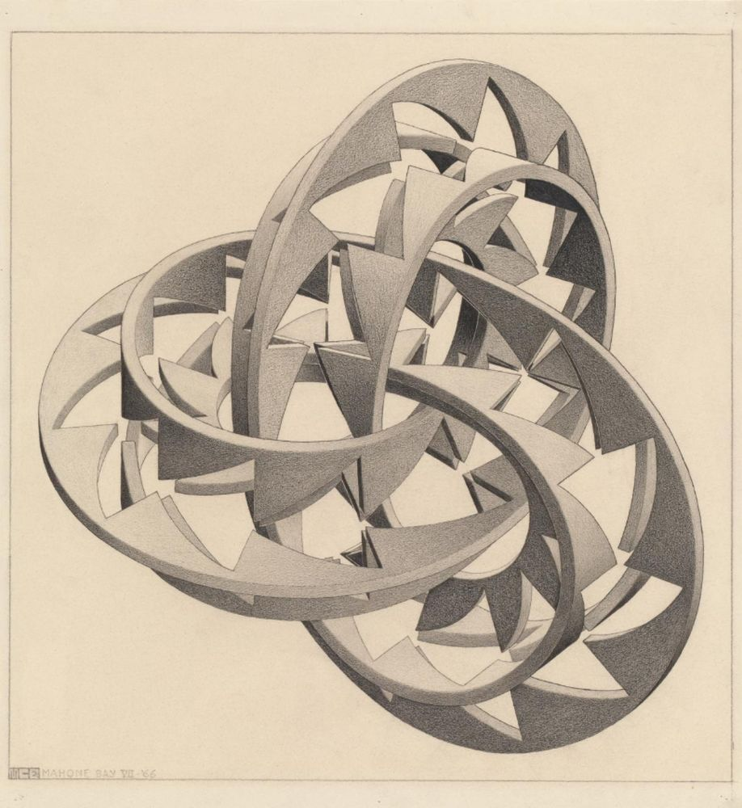
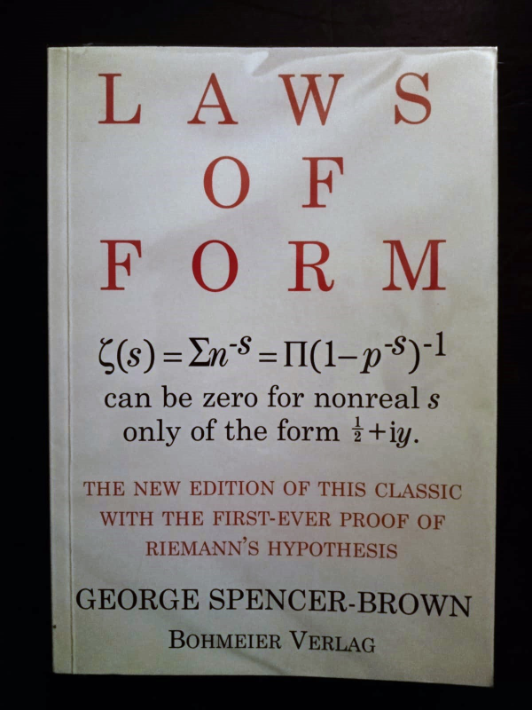

# Emergencia de la Aritmética desde el Principio de Distinción

*Ontología de la Distinción y sus Manifestaciones Lógicas y Matemáticas*



")

## 0. El Continuo Antes de su Solución

El proceso primario de distinción opera sin solución de continuidad entre TODO (plenitud ontológica) y NADA (ausencia
ontológica), generando lógica y matemáticas como proyecciones estabilizadas. Este proceso obedece al principio
fundamental: _"lo que no está permitido, —generalmente— está prohibido"_, donde cada distinción proyecta la tríada
ontológica A-R-Ã.

**Sobre el estatus de las matemáticas en este marco:**

Las matemáticas no son herramientas externas aplicadas al proceso ontológico, sino **cristalizaciones** del proceso
mismo cuando alcanza configuraciones de mínima tensión mediante $\tau < \theta_c$. Su precisión descriptiva es
estructuralmente necesaria: capturan exactamente aquello que el proceso de distinción estabiliza.

Sin embargo, su naturaleza discreta implica limitación constitutiva: las matemáticas son completas dentro de su
dominio (lo estabilizable) pero necesariamente parciales respecto al continuo total. Esta parcialidad no es deficiencia,
sino consecuencia de su modo de emergencia.

Por tanto, cuando empleamos notación matemática aquí:

- No fundamentamos matemáticas circularmente
- Registramos formalmente cómo el proceso pre-matemático se auto-organiza en estructuras discretas
- Las matemáticas son **efecto observable** (discretizaciones), no **causa generativa** (operación de distinción)

El marco explica la emergencia de axiomas matemáticos desde el proceso de distinción, no los postula. Las analogías
físicas ilustran universalidad del proceso, pero no pretenden ser modelos físicos formales.

## 1. Introducción: El Continuo de Distinción como Fundamento

> **Ejemplo natural:** Las hormigas en construcción de su nido muestran lógica continua: evalúan constantemente la
> calidad del material transportado, depositando solo aquel que cumple con criterios específicos, creando una estructura
> compleja mediante decisiones simples y continuas.

La lógica emerge como un proceso continuo de distinción que opera sin solución de continuidad. Este continuo compara
constantemente las condiciones del entorno contra los límites de un espectro aceptable, dentro del cual se encuentran
las condiciones óptimas.

Las transformaciones subumbral no generan distinciones visibles, mientras que las transformaciones postumbral dan lugar
a estabilizaciones observables. Esta dinámica fundamenta el principio "lo que no está permitido, —generalmente— está
prohibido": solo las transformaciones que minimizan la tensión ontológica se estabilizan como proyecciones lógicas
coherentes.

El continuo opera sin solución de continuidad, con los absolutos TODO y NADA actuando como sus límites asintóticos
definitorios, no como puntos de operación. Es crucial distinguir entre:

- El proceso ontológico en sí mismo (el continuo operando sin solución de continuidad)
- La descripción matemática de ese proceso (que usa herramientas matemáticas como recurso descriptivo)

```
TODO no es finito
TODO no es NADA
NADA no es existente
NADA no es ALGO
ALGO no es infinito
ALGO no es inexistente
```

Este marco no postula que el proceso ontológico 'use' matemáticas, sino que las matemáticas emergen como proyecciones
estabilizadas de este proceso. La distinción primaria es la emergencia de ALGO, una configuración concreta y
estabilizada, desde el continuo indiferenciado. Los absolutos (TODO y NADA) son inalcanzables por carecer de límites
constitutivos; su función es definir el rango ontológico dentro del cual ALGO puede emerger, no actuar como sus
generadores.

## 2. Fundamentos Ontológicos y Estructura Triádica

### 2.1. El Continuo de Distinción como Proceso Primario

> **Ejemplo natural:** Un sistema de ríos y lagos distingue entre nivel alto y bajo del agua; al superar un umbral, el
> agua fluye a otro cuerpo, creando un continuo de distinción sin observador, con estabilizaciones locales por mínima
> energía.

El continuo de distinción es el proceso ontológico primario que opera sin solución de continuidad entre TODO (plenitud
ontológica) y NADA (ausencia ontológica). Es inherentemente relacional, generando estabilizaciones locales mediante el
principio de mínima acción, donde cada distinción proyecta la tríada fundamental A-R-Ã. La tensión dinámica entre los
absolutos (TODO/NADA) y el proceso triádico (A-R-Ã) define el espacio relacional donde emergen todas las estructuras
lógicas y matemáticas como proyecciones estabilizadas.

Las estabilizaciones locales emergen como proyecciones del continuo cuando la tensión ontológica alcanza su mínimo,
operando bajo el principio Todo-o-Nada que determina 'lo que no está permitido, —generalmente— está prohibido'. Esto
significa que el continuo solo permite aquellas distinciones que mantienen la coherencia del sistema, prohibiendo
aquellas que exceden umbrales críticos de tensión.

### 2.2. La Tensión Ontológica

> **Ejemplo natural:** Una telaraña completa muestra tensión ontológica: cada hilo mantiene un equilibrio precario entre
> fuerzas opuestas, donde la tensión distribuida mide la distancia al estado de mínima energía necesaria para su
> estabilidad estructural.

La tensión ontológica $\tau$ emerge como la proyección estabilizada del mediador constitutivo (R), definiendo el
gradiente de coherencia relacional entre A y Ã. Como manifestación operativa del principio 'lo que no está permitido,
—generalmente— está prohibido', $\tau$ mide la distancia relacional entre configuraciones permitidas en el continuo de
distinción. Su valor mínimo (pero no cero) corresponde a los puntos de estabilización óptima, mientras tiende a infinito
al aproximarse a los límites asintóticos (TODO/NADA), reflejando la imposibilidad ontológica de alcanzar los absolutos.

Los modelos funcionan mejor en diferentes rangos de tensión, y su aparente incompatibilidad surge cuando se aplican
fuera de su dominio de coherencia, lo que corresponde a intentar definir entidades sin los límites necesarios para su
estabilización ontológica. En esencia, la $\tau$ define la coherencia interna entre distinciones que genera estabilidad
relacional. Su carácter asintótico constituye un proceso continuo de distinción, formando la base de la herencia
constitutiva donde cada nueva estabilización incorpora las anteriores. En resumen, es el **rango subumbral donde las
distinciones se asimilan internamente sin proyección observable**.

### 2.3. La Transición Ontológica

> **Ejemplo natural:** Un puente colgante que oscila con el viento muestra transición ontológica: cuando la frecuencia
> de las ráfagas coincide con su frecuencia natural, las vibraciones aumentan abruptamente hasta alcanzar un nuevo
> estado estable o colapsar, sin transiciones graduales.

En este documento se define la tensión local $\tau(A)\ge 0$ y el umbral interno $\theta_c>0$.

Axioma. Si para $X$ se verifica $\Delta\tau(X)>\theta_c$, entonces $X$ experimenta una reconfiguración ontológica mínima
para restablecer $\tau<\theta_c$ en la vecindad considerada.

Definición operacional de paradoja. Se llama paradójica una construcción cuya realización implique que existe una
vecindad $U$ con $\sup_{A\in U}\tau(A)\ge\theta_c$. En tal caso debe postularse la reconfiguración mínima (Todo-o-Nada)
para restaurar $\tau<\theta_c$ en $U$.

El salto ocurre por necesidad ontológica cuando la tensión acumulada excede el umbral: si $\Delta\tau\ge\theta_c$,
la reconfiguración fundamental restablece la coherencia mediante una nueva estructura estabilizada que redefine las
estructuras previas.

Regímenes operativos (interpretación compacta). En la vecindad estable central la linealidad (adición) distribuye la
tensión; al acercarse a la frontera ($\tau$ próxima a $\theta_c$) la adición deja de ser suficiente y emergen
mecanismos composicionales de mayor orden (multiplicación, exponenciación) conforme la capacidad distributiva se agota.
Este esquema se invierte en sentido descendente para las operaciones inversas.

En resumen: cuando las soluciones locales agotan la capacidad de mantener $\tau<\theta_c$, la acción mínima disponible
es un salto reconfigurador que produce nuevas estabilizaciones discretas emergentes.

### 2.4. Las Leyes de la Forma como Manifestaciones Triádicas

> **Ejemplo natural:** En olas marinas, A es el mar calmado, R el viento que genera olas, y à las olas formadas. La
> tríada A-R-Ã da estructura a la transformación cíclica, donde cruzar dos veces la frontera equivale a no cruzarla.




Los axiomas del Cálculo de Distinciones se reinterpretan ontológicamente mediante la tríada A-R-Ã. La frontera (
R) es el acto primordial de distinción, operando dentro de esta tríada fundamental.

#### Ley de Llamada: ( )( ) = ( )

Esta ley muestra que dos marcas adyacentes se **condensan** en una, reflejando la aplicación repetida de la misma
distinción, que no genera nueva estabilización sino que refuerza la estructura triádica. Corresponde
a $A \overset{R}{\longleftrightarrow} \tilde{A}$ aplicado dos veces, donde la tensión ontológica $\tau$ permanece
constante. Ontológicamente, se manifiesta como el operador NOR recursivo: la primera aplicación ($p ↓ p = \neg p$)
representa la distinción primaria (A→R), y la segunda ($\neg p ↓ \neg p = p$) completa el ciclo (R→Ã→A), dando origen a
la lógica y aritmética.

```
Ley de Llamada:
       A       R       Ã
  ⟷ ---────────═════════=== ⇔
      
  ↓                   ↓                   ↓
  │ A        R        │ A        R        │ A        R
  └────────╖        ⇔ └────────╖        ≡ └────────╖
         ↗ ║                 ↗ ║                 ↗ ║
           ║ Ã                 ║ Ã                 ║ Ã
           ╚=== ==⇒            ╚=== ==⇒            ╚=== ==⇒
```

#### Ley de Cruce: (( )) =

Esta ley indica que cruzar dos veces una frontera **cancela** el cruce, lo que equivale a no cruzarla, correspondiendo a
la completitud cíclica de la tríada A-R-Ã. El doble cruce se modela
como $A \overset{R}{\longleftrightarrow} \tilde{A} \overset{R}{\longleftrightarrow} A$, donde la primera aplicación
cruza la frontera ($A \rightarrow R \rightarrow \tilde{A}$) y la segunda completa el
ciclo ($\tilde{A} \rightarrow R \rightarrow A$), resultando en $A$ con mayor complejidad relacional. Esto explica por
qué $(-1) \times (-1) = 1$ es una manifestación del ciclo ontológico, no un convenio arbitrario.

```
Ley de Cruce:
       A       R       Ã
  ⟷ ---────────═════════=== ⇔
  
  ↓                   ←-- ---┐
  │ A        R             A │                  A       R       Ã
  └────────╖        ⇔        │ ↙        ≡ ⟷ ---────────═════════=== ⇔
         ↗ ║                 ╘════════╗
           ║ Ã             R        Ã ‖   Re-entry es consecuencia
           ╚=== ==⇒                   ⇑   de la oscilación.
```

### 2.5. La Tríada A-R-Ã como Estructura Fundamental

> **Ejemplo natural:** Un vaso de cristal al ser frotado con un dedo húmedo muestra cómo TODO y NADA operan como
> extremos: desde el silencio inicial hasta la resonancia clara y finalmente la rotura, definiendo un rango operativo
> donde emerge la estabilidad del "1".

Tres elementos inseparables subyacen tras toda distinción:

- **A**: Elemento original (identidad dinámica)
- **R**: Relación de distinción (acto mismo de diferenciar)
- **Ã**: Elemento transformado (contraste necesario)

Esta tríada constituye la estructura mínima de estabilización en el continuo:
$$\text{Distinción} = A \overset{R}{\longleftrightarrow} \tilde{A}$$

Es crucial entender que R no es estático, sino un proceso en curso que actúa como mediador constitutivo. Cuando este
proceso alcanza una estabilización, se convierte en $\tilde{R}$, representando la relación completada:
$$\tilde{R} = A \overset{R}{\longleftrightarrow} \tilde{A}$$

Donde $\tilde{R}$ es precisamente la primera estabilización lógica (el número 1). El término "primera" no denota un
concepto numérico ordinal, sino una diferencia significativa en el proceso continuo de distinción que corresponde
a $\tilde{R}$.

Definimos un operador de distinción primaria:
$$\mathcal{D}: \mathcal{C} \to \mathcal{C} \times \mathcal{C}$$

Satisfaciendo:

- Irreflexividad: $\mathcal{D}(A) = (A, \tilde{A})$ con $A \neq \tilde{A}$
- Simetría Relacional: $\mathcal{D}(A) = (A, \tilde{A}) \Leftrightarrow \mathcal{D}(\tilde{A}) = (\tilde{A}, A)$
- Tensión Ontológica: $\tau = |A - \tilde{A}|_R$

La tensión ontológica $\tau$ emerge como la proyección estabilizada de la relación R en el proceso de distinción,
constituyendo la medida de la diferencia que emerge naturalmente del continuo sin solución de continuidad.

**Diagramas de Venn Ontológicos:**

```
    ____→____
   /         \   C
  /           \   :C ≡ Continuo
 ↑      A      ↓  :←/↑_↓\→ = D ≡ Distinción continua
  \           /   :A = Conjunto ≡ Discreto
   \____←____/
    ____→______←____
   /      /  \      \
  /      /    \      \   :A = ┬ ≡ TODO
 ↑   A  ↓  R   ↓  à   ↑  :R = A∩Ã
  \      \    /      /   :Ã = ┴ ≡ NADA
   \____←_\__/_→____/
        _____→_____
       /           \
      /      S      \
    _|___→_______←___|_     :R = ↔ ≡ A∩à ≡ Continuo
   / ↑ ∞  /  ¦  \  0 ↓ \    :A = ┬, Ã = ┴
  /   \R'/   Ṙ   \R"/   \   :R' = ∞ ≡ A∩C, R" = 0 ≡ Ã∩C
 |  ┬  \|____←____|/  ┴  |  :S = Complemento ≡ Observador
 ↑  A   ↓    ↔    ↓   à  ↑  :Ṙ = ¦ ≡ A∩C∩à ≡ ALGO (Relación Estabilizada)
  \      \   R   /      /
   \____←_\_____/_→____/
```

### 2.6. Límites de la Mínima Acción: Infinito y Cero

> **Ejemplo natural:** Un péndulo simple muestra mínima acción: cuando se suelta, oscila naturalmente hacia su posición
> de equilibrio, minimizando la energía necesaria para mantener su movimiento y definiendo claramente su estado
> estable "1".

En el nivel aritmético, los extremos del continuo lógico se manifiestan como:

- Cero (0): Representa la NADA lógica
- Infinito (±∞): Representa el TODO lógico

Estos valores extremos son inalcanzables como estados estables, reflejando la naturaleza asintótica de los absolutos
ontológicos. Estos límites no son entidades independientes, sino manifestaciones de la tensión ontológica inherente al
proceso de distinción. El 1 se sitúa entre estos límites, como la primera estabilización de esa tensión.

En términos algebraicos, esto se expresa como:

- El 1 opera dentro del intervalo (0, ∞)
- El 0 y el ∞ son los límites asintóticos de la acción de distinción
- La tensión ontológica $\tau$ tiende a infinito al aproximarse a TODO/NADA

## 3. Emergencia del 1 y su Carácter Primario

### 3.1. La Primera Estabilización Lógica

> **Ejemplo natural:** Una gota de agua en equilibrio sobre una superficie muestra la primera estabilización lógica: el
> punto donde las fuerzas de cohesión y adhesión alcanzan un equilibrio estable, formando una estructura reconocible que
> emerge del continuo de formas posibles.


El 1 emerge como la distinción más próxima a la relación R, representando la primera estabilización permitida por la
minimización de la tensión ontológica. Es la instancia donde R se completa como $\tilde{R}$, estableciendo el punto de
partida para todas las distinciones subsiguientes.

Por lo tanto, 1 es la estabilización mínima de coherencia lógica en el continuo de distinción, definida por su
equilibrio de tensión ontológica. Es crucial aclarar que el término "primera" no denota un concepto numérico ordinal,
sino una diferencia significativa en el proceso continuo de distinción.

Como se establece en la sección 2.3, el observador siempre es la frontera R de un antes y un después, constituyendo la
emergencia del primer orden lógico mediante la tríada ontológica
fundamental $A \overset{R}{\longleftrightarrow} \tilde{A}$.

**Definición ontológica del 1:**
El 1 emerge como la primera estabilización lógica del continuo de distinción, donde la tríada A-R-Ã alcanza el mínimo
equilibrio de tensión ontológica. Representa la mínima fractura necesaria que convierte la relación en proceso (R) en
relación completada ($\tilde{R}$), constituyéndose como la primera proyección estabilizada para todas las distinciones
subsiguientes.

**Formalización lógica:**
$$1 \equiv \tilde{R} = (A \overset{R}{\longleftrightarrow} \tilde{A})$$

Donde $R$ representa la relación en proceso (no completada), mientras que $\tilde{R}$ representa la relación
completada (el ciclo ontológico completo). Esta distinción es crucial: $R$ es el proceso de distinción en curso,
mientras que $\tilde{R}$ es el estado estabilizado que corresponde al número 1.

Este principio confirma que toda unidad que percibimos como "1" es en realidad una relación estabilizada, nunca una
entidad aislada. La primera estabilización lógica, representada por el número "1", siempre corresponde a una relación (
R) que ha alcanzado suficiente coherencia para ser identificada como una unidad discernible.

### 3.2 El Primero como Relación

> **Ejemplo natural:** Dos estrellas en órbita mutua se perciben como una unidad con propiedades emergentes; el "1"
> corresponde a la relación estabilizada, no a las estrellas individuales.

Toda unidad que percibimos como "1" es en realidad una relación estabilizada, nunca una entidad aislada. La primera
estabilización lógica corresponde a una relación que ha alcanzado suficiente coherencia para ser identificada como una
unidad discernible.

La tríada ontológica fundamental expresa este principio:
$$\tilde{R} = (A \overset{R}{\longleftrightarrow} \tilde{A})$$

Donde:

- $A$ y $\tilde{A}$ representan identidades en relación
- $R$ es el proceso de distinción en curso
- $\tilde{R}$ es la relación completada que constituye el "1"

Este fenómeno se ilustra en sistemas como dos estrellas en órbita mutua: la unidad observada (el "1") no son las
estrellas individuales, sino la relación gravitacional estabilizada entre ellas. La distinción no separa objetos
previos, sino que constituye el objeto mismo a través de la relación.

El sistema binario manifiesta la tríada completa: las estrellas (A y Ã) y su relación orbital (R) que genera una nueva
identidad ($\tilde{R}$). Así, "Tres" emerge como la firma ontológica mínima para materializar cualquier distinción,
confirmando que el 1 siempre representa una relación estabilizada, no una entidad aislada.

### 3.3. Propiedades Fundamentales del 1

> **Ejemplo natural:** En la cristalización, el primer núcleo representa la primera estabilización lógica (el 1), único
> incluso si hay núcleos aparentemente idénticos.

El 1 posee dos propiedades fundamentales que emergen de su naturaleza como primera estabilización coherente:

**Principio de unicidad relativa:**
El operador $\mathcal{D}$ genera una estabilización fundamental en el continuo, única en su dominio de aplicabilidad
bajo el criterio $\tau < \theta_c$. La aparente multiplicidad de instancias del "1" refleja la naturaleza fractal del
continuo, siendo manifestaciones escalares de la misma estructura relacional básica.

**Principio de autorreferencia:**
El 1 es la instancia fundamental donde la distinción se vuelve autorreferencial sin generar contradicción:

- La distinción primaria establece $A \neq \tilde{A}$
- La aplicación recursiva de R genera $(A \overset{R}{\longleftrightarrow} \tilde{A})$
- Esta estructura no contradice la lógica de distinción, sino que la estabiliza

Esta doble propiedad confirma que toda unidad que percibimos como "1" es en realidad una relación
estabilizada ($\tilde{R}$), nunca una entidad aislada. La primera estabilización lógica corresponde a una relación que
ha alcanzado suficiente coherencia para ser identificada como una unidad discernible, emergiendo naturalmente del
proceso ontológico sin presuponer conceptos numéricos previos.

### 3.4. Derivación de la Secuencia Numérica

> **Ejemplo natural:** La ramificación de un árbol muestra derivación numérica: a medida que crece, el tronco se divide
> en ramas principales, que a su vez se subdividen en ramas secundarias, formando una secuencia numérica natural donde
> cada nivel de ramificación representa una nueva estabilización del proceso de distinción.

La secuencia numérica emerge como una jerarquía de estabilizaciones del proceso de distinción:

Definición del sucesor:
$$\mathcal{S}(X) \equiv X \overset{\tilde{R}}{\longleftrightarrow} \tilde{R}$$

Teorema de emergencia:
Las estabilizaciones numéricas surgen como soluciones del principio variacional:

- $n=1$: Primera solución estable donde $\mathcal{D}$ satisface la condición de contracción local
- $n=2$: Segunda solución estable, correspondiente a la aplicación recursiva de $\mathcal{D}$ sobre la primera
  estabilización
- $n=3$: Tercera solución estable, que completa la tríada ontológica fundamental

Cada nueva estabilización emerge cuando $\tau$ alcanza el umbral crítico, permitiendo una nueva aplicación coherente
del operador $\mathcal{D}$. El 1 representa la primera solución estable de la TdD.

Notación subíndice:

- Primera estabilización: $1 = A \overset{R}{\longleftrightarrow} \tilde{A}$
- Segunda
  estabilización: $1_1 = (A \overset{R}{\longleftrightarrow} \tilde{A}) \overset{R'}{\longleftrightarrow} (A \overset{R}{\longleftrightarrow} \tilde{A})$
- Tercera
  estabilización: $1_{1_1} = [(A \overset{R}{\longleftrightarrow} \tilde{A}) \overset{R'}{\longleftrightarrow} (A \overset{R}{\longleftrightarrow} \tilde{A})] \overset{R''}{\longleftrightarrow} (A \overset{R}{\longleftrightarrow} \tilde{A})$
  (completitud triádica)

Donde cada $R$, $R'$, $R''$ representa una relación transformadora emergente en cada nivel de recursión, constituyendo
la tríada dinámica fundamental que da estabilidad ontológica al sistema.

### 3.5. Sistema Lógico de Tensión

> **Ejemplo natural:** El sistema de seguridad en una olla a presión muestra un sistema lógico de tensión: la válvula
> libera presión automáticamente al alcanzar un umbral crítico, manteniendo el sistema dentro de límites seguros
> mediante una respuesta binaria clara.

Para representar la relación entre distinción y estructura matemática, definimos los elementos necesarios:

**Definiciones clave:**

Una variable emerge como instancia estabilizada del proceso de distinción que mantiene potencialidad para múltiples
relaciones. No es una 'incógnita' matemática, sino la manifestación de cómo el sistema reconoce patrones estables en el
continuo de distinción.

La composición emerge cuando el sistema aplica recursivamente el proceso de distinción sobre sí mismo, permitiendo
coexistencia de múltiples instancias sin exceder el umbral crítico de tensión ontológica. Representa cómo las
distinciones pueden relacionarse manteniendo el principio de mínima acción.

Las constantes emergen como límites asintóticos inalcanzables del continuo. El TODO (⊤) representa la plenitud
ontológica hacia la cual el proceso tiende, mientras que la NADA (⊥) representa la ausencia ontológica que sirve como
contraste necesario. No son entidades, sino referencias asintóticas que definen el rango de posibilidades.

**Alfabeto:**

- Variables: $A, B, C, \dots$
- Operadores: $\mathcal{D}$ (distinción), $\tau$ (tensión), $\oplus$ (composición)
- Constantes: $\top$ (TODO), $\bot$ (NADA)

**Axiomas:**

- $\tau(A, \mathcal{D}(A)) > 0$ (Tensión positiva)
- $\tau(A, B) = \tau(B, A)$ (Simetría)
- $\tau(A, \bot) + \tau(\bot, B) \geq \tau(A, B)$ (
  Desigualdad triangular débil)
- $\lim_{n \to \infty} \tau(\mathcal{D}^n(A), \mathcal{D}^{n+1}(A)) = 0$ (Convergencia fractal)

**Reglas de Inferencia:**

- Si $\tau(A, B) < \epsilon$, entonces $A \approx_\epsilon B$
- Si $\tau(A, \mathcal{D}(A)) = \min$, entonces $A \models 1$

Este sistema generaliza la lógica de Spencer-Brown mediante una métrica de tensión que captura la "distancia ontológica"
entre estados. Proporciona una hipótesis explicativa para la frecuencia del dígito 1 en datos naturales,
aproximadamente $\log_{10}(2) \approx 0.3010$.

### 3.6. Estructura Triádica Interna de la Mínima Acción

> **Ejemplo natural:** En una conversación entre dos personas, la idea original es A, el diálogo es R, y el
> entendimiento mutuo es Ã, mostrando cómo la tríada A-R-Ã opera en interacciones cotidianas para crear significado
> compartido.

Cada acción de distinción subyace tres elementos inseparables:

- Elemento original: Lo que se distingue (A - Identidad)
- Relación: El acto mismo de diferenciar (R - Relación)
- Elemento distinto: Lo que resulta de la distinción (Ã - Transformación)

Esta tríada A-R-Ã constituye la estructura interna de toda distinción, incluida la que da lugar al número 1:
$$1 = \tilde{R} = A \overset{R}{\longleftrightarrow} \tilde{A}$$

El R en esta expresión representa el proceso de distinción en curso, mientras que $\tilde{R}$ representa su
estabilización completa. Esta distinción entre R (proceso) y $\tilde{R}$ (resultado) es fundamental para entender la
estructura fractal del continuo.

El número 1, aparentemente simple, ya contiene internamente esta estructura triádica que permite su estabilidad y su
capacidad para generar más números. La tensión ontológica $\tau$ representa el equilibrio mínimo
necesario para esta estabilización.

### 3.7. Emergencia Simétrica Inicial: ±1

> **Ejemplo natural:** Un imán con polos norte y sur muestra simetría ±1: cada polo define y requiere la existencia del
> otro.

Tanto +1 como −1 son estabilizaciones que emergen de las dos direcciones opuestas del proceso de distinción. La primera
estabilización del continuo es una simetría ontológica en pareja, no un "1" aislado:

$$
\pm 1 = \tilde{R}^+ \oplus \tilde{R}^- = \left(A \overset{\tilde{R}^+}{\longleftrightarrow} \tilde{A}\right) \oplus \left(\tilde{A} \overset{\tilde{R}^-}{\longleftrightarrow} A\right)
$$

donde $\oplus$ indica la combinación simétrica de las dos direcciones completadas.

- $\tilde{R}^+$ es la dirección de distinción $A\to\tilde A$.
- $\tilde{R}^-$ es la dirección de distinción $\tilde A\to A$.

Se define la magnitud ontológica $|S|$ de una relación completada $S$ como el valor de equilibrio relacional que esta
adquiere cuando la tensión $\tau$ se minimiza en su vecindad de estabilización.

- El **0** emerge como la designación de una configuración de **mínima tensión de referencia**, $\tau_{ref}$, que actúa
  como el umbral subyacente para toda distinción observable.
- El **1** emerge como la **magnitud de equilibrio** de la primera relación completada y
  estabilizada, $|\tilde{R}^{(1)}| = 1$, estableciendo la unidad fundamental de distinción en la calibración adoptada.
  En particular,

$$
1 \;=\; |\tilde{R}^+| \;=\; |\tilde{R}^-|.
$$

La propiedad $(-1)\cdot(-1)=1$ se interpreta como consecuencia de la completitud del ciclo relacional: la composición
o cierre sucesivo de dos direcciones opuestas recupera la condición de completitud (identidad relacional en el sentido
de la estabilización), de modo que la operación composicional sobre magnitudes devuelve la magnitud neutra de la
estabilización.

Se introduce la tensión local $\tau:\mathcal{X}\to[0,\infty)$ y un umbral $\theta_c>0$ fijado mediante un estado de
referencia $A_{\mathrm{ref}}$. La relación entre la tensión ontológica y el umbral crítico determina directamente la
estabilidad de las configuraciones:

* $\tau(A) < \theta_c$: configuración dentro del dominio de coherencia local, estable.
* $\tau(A) = \theta_c$: frontera crítica relativa al referente, transición inminente.
* $\tau(A) > \theta_c$: configuración inestable que requiere reconfiguración ontológica.

## 4. Estructura Fractal de la Red Relacional

### 4.1. Primera Iteración Relacional: 1,1

> **Ejemplo natural:** Dos copas de vino que resuenan entre sí al tocarlas con un dedo ilustran la primera iteración
> relacional: cada copa mantiene su identidad, pero sus vibraciones se sincronizan, creando un patrón relacional
> emergente donde ambas influyen mutuamente.

La iteración relacional 1,1 emerge cuando la tensión ontológica $\tau(1,1)$ permanece por debajo del
umbral crítico, permitiendo la coexistencia de dos instancias del mismo proceso de distinción sin violar el principio de
mínima acción:

$$1,1 = \left(A \overset{R}{\longleftrightarrow} \tilde{A}\right) \oplus \left(A \overset{R}{\longleftrightarrow} \tilde{A}\right)$$

El operador $\oplus$ emerge naturalmente como la relación R en su segunda iteración:
$$\oplus \equiv R^{(2)} = \left[(A \overset{R}{\longleftrightarrow} \tilde{A}) \overset{R}{\longleftrightarrow} (A \overset{R}{\longleftrightarrow} \tilde{A})\right]$$

Ontológicamente, $\oplus$ representa el estado subumbral donde las distinciones pueden coexistir establemente sin
generar una nueva estabilización fundamental. No se trata de "dos unidades idénticas", sino de dos manifestaciones
relacionales del mismo acto fundamental de distinción, donde $\tau(1,1)$ mide la relación entre
ellas.

### 4.2. Profundización de la Relación: 1,11

> **Ejemplo natural:** Al tocar un armónico en una cuerda de guitarra, se produce un sonido más agudo que coexiste con
> el tono fundamental, mostrando cómo estructuras más complejas emergen desde y contienen a las más simples en una
> relación jerárquica.

Al iterar el proceso, emerge una estructura con jerarquía relacional:
$$1,11 = \left(A \overset{R}{\longleftrightarrow} \tilde{A}\right) \oplus \left[\left(A \overset{R}{\longleftrightarrow} \tilde{A}\right) \oplus \left(A \overset{R}{\longleftrightarrow} \tilde{A}\right)\right]$$

Esta estructura revela la herencia constitutiva: la segunda "11" no es independiente, sino que emerge desde y contiene
la estructura relacional previa. Cada nueva estabilización incorpora constitutivamente las anteriores, estableciendo una
relación jerárquica donde lo nuevo siempre contiene lo previo.

La tensión ontológica $\tau(1,11)$ mide precisamente esta relación jerárquica, reflejando cómo el
sistema mantiene coherencia mediante la inclusión de estabilizaciones previas en estructuras más complejas, respetando
el principio de que "lo que no está permitido, —generalmente— está prohibido".

### 4.3. Estructura de Proporción: 1×(1/1)

> **Ejemplo natural:** Una balanza en equilibrio muestra proporción fundamental: cuando los pesos en ambos lados son
> iguales, la estructura alcanza un estado estable que manifiesta visualmente la relación 1:1 como equilibrio natural.

La relación entre estabilizaciones genera una estructura proporcional:
$$1 \times \frac{1}{1} = \frac{\left(A \overset{R}{\longleftrightarrow} \tilde{A}\right) \oplus \left(A \overset{R}{\longleftrightarrow} \tilde{A}\right)}{\left(A \overset{R}{\longleftrightarrow} \tilde{A}\right)}$$

Esta expresión representa el equilibrio relacional entre instancias del proceso de distinción, donde la división
manifiesta la comparación de estabilizaciones para mantener el óptimo relacional. La tensión
ontológica $\tau(1,1/1)$ mide este equilibrio proporcional, reflejando cómo el sistema reconoce
patrones estables en el continuo de distinción sin requerir postulación matemática previa.

### 4.4. Estructura Fractal Completa: 1¹₁

> **Ejemplo natural:** Un brócoli romanesco muestra estructura fractal completa: cada pequeña parte replica la forma del
> conjunto completo, revelando cómo patrones complejos emergen de reglas simples aplicadas recursivamente a diferentes
> escalas.

La estabilización alcanza un nivel donde emerge la autorreferencia estructural:

$$1^1_1 = \tilde{R}^{\tilde{R}}_{\tilde{R}} = \left(A \overset{R}{\longleftrightarrow} \tilde{A}\right)^{\left(A \overset{R}{\longleftrightarrow} \tilde{A}\right)}_{\left(A \overset{R}{\longleftrightarrow} \tilde{A}\right)}$$

$$1^1_1 = \tilde{R^0}^{\tilde{R^1}}_{\tilde{R^2}}$$

Donde:

- $\tilde{R}^{(0)}$ representa la estabilización fundamental
- $\tilde{R}^{(1)}$ representa la expansión estructural
- $\tilde{R}^{(2)}$ representa la profundización estructural

Esta notación con superíndices muestra explícitamente cómo cada instancia de $\tilde{R}$ corresponde a un nivel de
recursión diferente, manteniendo la coherencia con la estructura fractal del sistema.

### 4.5. Progresión Autorreferencial Triádica y Umbral Crítico:

La progresión autorreferencial triádica se manifiesta en la función de Ackermann:

- 1° nivel ($τ < θ_c/3$): $A(0, n) = n + 1$ corresponde a $1 = A \overset{R}{\longleftrightarrow} \tilde{A}$
- 2° nivel ($θ_c/3 ≤ τ < 2θ_c/3$): $A(1, n) = n + 2$ corresponde a $1_1 = 1 \oplus 1$
- 3° nivel ($2θ_c/3 ≤ τ < θ_c$): $A(2, n) = 2n + 3$ corresponde a $1_{1_1}$
- 4° nivel ($τ ≥ θ_c$): $A(3, n) = 2^{n+3} - 3$ corresponde a $1^1_1$

Esta progresión ilustra cómo el operador de distinción $\mathcal{D}$ (definido formalmente en la TdD) genera estructuras
cada vez más complejas mediante reconfiguración fractal cuando $\tau \geq \theta_c$.

Tras tres operaciones autorreferenciales, el sistema alcanza un umbral crítico determinado por su naturaleza triádica.
Este umbral marca el límite de estabilización del 1, forzando una reconfiguración ontológica bajo el principio
Todo-o-Nada: tensión sub-umbral (sin transición) o salto ontológico completo e irreversible.

La función de Ackermann ilustra perfectamente cómo cada transición corresponde a un salto ontológico cuando la tensión
ontológica excede su umbral crítico:

- Al pasar de m=0 a m=1, la función cambia de sucesión a adición
- Al pasar de m=1 a m=2, cambia de adición a multiplicación
- Al pasar de m=2 a m=3, cambia de multiplicación a exponenciación

El salto al 2 no es una mera adición, sino una transformación ontológica:
$$1_{\text{nuevo}} = 1_{\text{original}} \ominus \{x \mid x \not\models_{\text{min}} 2\}$$
Donde $\not\models_{\text{min}}$ representa la exclusión de elementos que no contribuyen al equilibrio relacional del
nivel 2.

El 2 emerge conteniendo constitutivamente al 1 y redefiniendo sus límites, preparando la tríada completa que se
manifestará con el 3 como "firma ontológica mínima para materializar cualquier distinción". La función de Ackermann
confirma que _"el tres engendra todos los seres"_, mostrando cómo A(3,n) representa el primer nivel donde la función
muestra crecimiento exponencial, correspondiendo a la completitud triádica.


")

## 5. Emergencia del 2 y Resignificación Recursiva

### 5.1. Condición de Emergencia del 2

> **Ejemplo natural:** Un arroyo que encuentra una roca en su camino muestra la emergencia del 2: al superar su
> capacidad para fluir como unidad, se divide naturalmente en dos corrientes que fluyen a ambos lados de la roca,
> completando así una nueva estructura relacional.

El 2 emerge cuando la tensión ontológica interna del 1 supera el umbral crítico $\theta_c$, forzando una reconfiguración
ontológica mediante el operador $\mathcal{D}$ bajo el principio Todo-o-Nada. Este salto no añade elementos externos,
sino que reorganiza internamente el espacio relacional conforme al TdD. El 2 constituye así una nueva estructura que
minimiza la tensión global, mientras redefine el dominio del 1 mediante la herencia constitutiva.

$$\text{Si }|{1^1_1, 1^1_2, \dots, 1^n_m}| > \theta_c \text{, entonces emerge } 2$$

El umbral crítico $\theta_c$ representa el punto donde el sistema agota sus soluciones posibles dentro de la estructura
del 1. Cuando ya no existen configuraciones que minimicen la tensión ontológica $\tau(1,1^1_1)$, se requiere una
reconfiguración fundamental.

Este proceso obedece al mecanismo de tensión acumulada:

$$\Delta \tau = \sum_{i=1}^{k} \tau(1, 1^{n_i}_{m_i})$$

Cuando $\Delta \tau$ excede el umbral, emerge el 2 como la única transformación posible que
restablece el principio de mínima acción, reconfigurando el espacio relacional para permitir nuevamente la minimización
de la tensión ontológica.

### 5.2. Herencia Constitutiva y Contención Ontológica

> **Ejemplo natural:** Al doblar un papel por la mitad, obtenemos dos secciones que comparten el mismo material
> original: cada mitad contiene constitutivamente al "1" original, ilustrando cómo el "2" no es una adición externa sino
> una reconfiguración interna.

El 2 contiene constitutivamente al 1 porque hereda solo las distinciones permitidas por el nuevo óptimo relacional.
Aquellas distinciones que no contribuyen al equilibrio del 2 están prohibidas y son excluidas mediante el
operador $\ominus$, reflejando el principio de que 'lo que no está permitido, —generalmente— está prohibido'.

Por eso, el 2 no es simplemente el sucesor del 1, sino que contiene constitutivamente al 1 en su estructura:

$$2 = 1 \cup \{1^1, 1_1, 1^1_1, \dots\}$$

Esta ecuación expresa que:

- El 2 incluye al 1 como elemento fundamental
- El 2 emerge específicamente de las relaciones internas del 1
- El 1, al ser contenido en el 2, ve resignificados sus límites

La tensión ontológica $\tau(1,2)$ representa la relación entre estas dos estabilizaciones, mostrando
cómo el 2 redefine el espacio relacional del 1.

### 5.3. Resignificación del 1 por el 2

> **Ejemplo natural:** En interferencia de ondas, con dos ondas, la "onda individual" se resignifica; distinciones no
> contribuyentes al equilibrio del 2 son excluidas del 1.

La emergencia del 2 transforma ontológicamente al 1 mediante exclusión relacional, completando así el ciclo triádico
A→R→Ã donde el 2 actúa como la relación (R) que redefine la identidad (A) del 1:
$$1_{\text{nuevo}} = 1_{\text{original}} \ominus \{x \mid x \not\models_{\text{min}} 2\}$$

Donde ⊖ representa la exclusión relacional, no mera sustracción. El símbolo $\not\models_{\text{min}}$ indica que x no
contribuye al equilibrio relacional mínimo definido por el 2, lo que corresponde a la transformación (Ã) que emerge del
ciclo triádico, manifestando el principio Todo-o-Nada en el nivel aritmético.

El 1 no desaparece, sino que se redefine ontológicamente en relación con el 2 mediante la herencia constitutiva. Las
distinciones que antes eran parte del 1 pero que no contribuyen al equilibrio relacional del 2 son excluidas del dominio
del 1, mientras que las que sí contribuyen son incorporadas constitutivamente. Esta reconfiguración confirma el
principio fundamental: "un conjunto siempre excluye relaciones que se alejan de su óptimo relacional, manteniendo solo
aquellas permitidas por la mínima tensión."

La tensión ontológica $\tau(1_{\text{nuevo}}, 1_{\text{original}})$ mide precisamente este proceso
de reconfiguración, reflejando cómo el principio "lo que no está permitido, —generalmente— está prohibido" opera en el
continuo de distinción.

### 5.4. Emergencia del 3 y Completitud de la Tríada Ontológica

> **Ejemplo natural:** Tres amigos tomados de las manos en círculo muestran circularidad: cada persona define su
> posición en relación con las otras dos, creando una estructura estable donde los límites individuales emergen de la
> relación triádica completa.

El 3 emerge como la estructura relacional que completa la tríada ontológica fundamental:
$$3 = 1_{1_1} = \tilde{R}^{(2)} \overset{\tilde{R}^{(2)}}{\longleftrightarrow} \tilde{R}^{(2)}$$

Sus propiedades fundamentales:

- **Completitud triádica**: Manifestación plena de $A \overset{R}{\longleftrightarrow} \tilde{A}$ como estructura
  cerrada
- **Estabilidad relacional**:
  $\tau(1,2) + \tau(2,3) = \tau(1,3)$
- **Circularidad constitutiva**: Permite ciclos completos $A \rightarrow R \rightarrow \tilde{A} \rightarrow A$ sin
  contradicción

La emergencia del 3 transforma radicalmente al 1 y al 2 mediante exclusión relacional:
$$1_{\text{nuevo}} = 1_{\text{original}} \ominus \{x \mid \tau(x, 3) > \theta_c\}$$
$$2_{\text{nuevo}} = 2_{\text{original}} \ominus \{x \mid x \not\models_{\text{circ},3}\}$$

Esta transformación revela que:

- El 1 se convierte en elemento identitario de la tríada
- El 2 se convierte en mediador relacional necesario
- El 3 emerge como completitud del ciclo ontológico, no como simple sucesor

Ontológicamente, el 3 representa la primera manifestación plena de la circularidad constitutiva, donde la distinción se
vuelve verdaderamente autorreferencial sin paradojas. Explica el estatus especial del 3 en sistemas naturales (
dimensiones espaciales, colores primarios, fases de la materia) como manifestación de la completitud de la tríada
ontológica fundamental.

## 6. Operaciones Aritméticas como Transformaciones Relacionales

Las operaciones aritméticas son transformaciones ontológicas que reconfiguran la estructura relacional del sistema, no
meras manipulaciones cuantitativas. Al operar, excluyen relaciones prohibidas y permiten nuevas estabilizaciones que
minimizan la tensión ontológica. Esta perspectiva explica los cambios cualitativos en sistemas naturales y la capacidad
de las matemáticas para describir fenómenos más allá de lo meramente cuantitativo.

### 6.1. Adición como Incorporación de Nuevas Distinciones

> **Ejemplo natural:** La formación de anillos en un tronco de árbol muestra adición: cada año se añade una nueva capa
> visible, incorporando una distinción temporal clara que registra el paso del tiempo en una estructura acumulativa.

La adición representa la aplicación recursiva del operador $\mathcal{D}$:
$$m + n = \mathcal{D}_n(m)$$
Donde $\mathcal{D}_n$ denota la n-ésima aplicación del operador que satisface la condición de contracción local.

Esta operación transforma primero las relaciones próximas al punto de adición, propagándose gradualmente hasta alcanzar
un nuevo equilibrio relacional. Los conjuntos matemáticos discretizan este proceso, mostrando solo el estado final
estable.

La tensión ontológica $\tau(m+n, m)$ mide el cambio relacional al añadir $n$ nuevas distinciones.
Cuando $\tau < \theta_c$, el operador $\mathcal{D}$ satisface la condición de contracción local, permitiendo
estabilizaciones coherentes. Al superar el umbral crítico, la estructura jerárquica se reconfigura mediante fractura
mínima, permitiendo que 'lo complejo no añada elementos nuevos, sino que recombine lo simple bajo una distinción
ontológica superior, proyectando propiedades emergentes'.

### 6.2. Sustracción como Exclusión Relacional

> **Ejemplo natural:** La formación de un arco natural en un acantilado muestra sustracción: el mar y el viento eliminan
> selectivamente material, revelando gradualmente una estructura arqueada que no estaba presente inicialmente.

$$m - n = m \ominus \{x \mid x \not\models_{\text{min}} n\}$$

Revela la estructura relacional oculta al excluir ciertas distinciones prohibidas que no contribuyen a su óptimo. La
tensión ontológica $\tau(m-n, m)$ representa la reconfiguración del equilibrio
relacional tras la exclusión.

### 6.3. Multiplicación como Iteración Relacional

> **Ejemplo natural:** La propagación de un incendio forestal muestra multiplicación: una pequeña chispa puede generar
> múltiples focos de fuego que a su vez generan más, siguiendo un patrón multiplicativo donde cada evento desencadena
> múltiples sucesores.

$$m \times n = \underbrace{m \oplus m \oplus \dots \oplus m}_{n \text{ veces}}$$

Representa la iteración de distinciones permitidas donde cada instancia mantiene una tensión ontológica acotada por la
del original. La multiplicación no es meramente crecimiento, sino distribución de la tensión ontológica del original
entre las instancias generadas.

La tensión ontológica $\tau(m \times n, m)$ mide la complejidad adicional introducida, mientras
que $\tau(m_i, m_j)$ refleja la redistribución jerárquica de la tensión original. Este fenómeno
confirma que "en la multiplicación sucede una división": la tensión total se mantiene dentro del límite definido por el
original mediante fractura mínima, respetando estrictamente el principio de que "lo que no está permitido,
—generalmente— está prohibido".

### 6.4. División como Negación de Continuidad

> **Ejemplo natural:** La división de una burbuja de jabón al tocarla con un alambre muestra división: una burbuja única
> se transforma en dos burbujas más pequeñas, cada una manteniendo su integridad estructural mientras redistribuye la
> tensión superficial.

La división niega la continuidad de conjuntos permitidos para generar subconjuntos igualmente estables:
$$a \div b = c \quad \Leftrightarrow \quad b \times c = a$$

Esta ecuación representa ontológicamente:
$$\hat{E}_a = \underbrace{\hat{E}_c \oplus \hat{E}_c \oplus \dots \oplus \hat{E}_c}{b \text{ veces}}$$

Donde:

- $\hat{E}_a$ representa la estabilización original
- Cada $\hat{E}_c$ representa una parte resultante
- $\oplus$ representa la composición relacional

En la división, la tensión ontológica total de las partes no excede la del conjunto original. Cada $\hat{E}_c$ mantiene
la misma relación fundamental con el continuo lógico, la estructura triádica transformada, y la profundidad relacional
redefinida por la nueva configuración.

La tensión ontológica total $\sum \tau(\hat{E}_c^{(i)})$ no
excede $\tau(\hat{E}_a)$, mostrando que la negación de continuidad opera dentro de los límites
definidos por la estabilización original, manteniendo el principio fundamental de que "lo que no está permitido,
—generalmente— está prohibido".

## 7. Regla de Signos y Simetría Ontológica

### 7.1. Identidad Ontológica entre Lógica y Aritmética

> **Ejemplo natural:** Las olas en un estanque muestran la identidad ontológica entre lógica y aritmética: cuando dos
> ondas se encuentran, pueden reforzarse (1+1=2) o cancelarse (1-1=0), manifestando visualmente cómo las operaciones
> aritméticas emergen de relaciones fundamentales.

La equivalencia $(-1) \times (-1) = 1$ y $\neg(\neg p) \Leftrightarrow p$ emerge ontológicamente porque la doble
negación completa el ciclo triádico A-R-Ã, restableciendo el equilibrio relacional mediante una fractura mínima
cuando $\tau < \theta_c$. Confirmando que solo las transformaciones que minimizan la tensión (principio de mínima
acción) se manifiestan en el continuo de distinción.

Así, la doble negación corresponde a la aplicación recursiva de $\mathcal{D}$, restableciendo la estabilidad del sistema
como solución estable de la TdD.

Esta equivalencia es una identidad ontológica, no una mera analogía, explicando por qué el álgebra de Boole emerge como
proyección estabilizada del continuo con dos valores.

**Teorema de Correspondencia Lógico-Aritmética:**
Para cualquier distinción primaria, la aplicación recursiva de distinciones genera estructuras isomorfas en lógica y
aritmética.

**Demostración ontológica:**

1. Primera operación (¬p o -1): Fractura primaria, estableciendo "ALGO ≠ NADA".
2. Segunda operación (¬(¬p) o (-1)×(-1)): Aplicación de R sobre la distinción existente.
3. Equivalencia: Emerge una nueva estabilización isomorfa al original con mayor complejidad relacional.

La doble negación es la proyección estabilizada de A→R→Ã, donde la segunda negación opera sobre R. Los absolutos TODO y
NADA se manifiestan through negación recíproca, proyectando ALGO concreto. La negación minimiza la tensión ontológica al
completar el ciclo.

La tensión $\tau((-1) \times (-1), 1)$ mide la distancia entre el 1 original y el emergente,
confirmando el principio relacional.

Esto resuelve la paradoja "¿Por qué menos por menos da más?" como manifestación del proceso ontológico que completa el
ciclo A-R-Ã.

### 7.2. La Ley de Exclusión del Tercero como Inclusión Constitutiva

La Ley de Exclusión del Tercero (LET), formulada tradicionalmente como $p \vee \neg p$, se malinterpreta
sistemáticamente cuando se lee como prohibición general de "terceros términos". Esta lectura genera aparentes conflictos
con lógicas multivaluadas, lógica difusa, y contextos cuánticos. La reinterpretación desde la Teoría de Distinciones
resuelve estas tensiones mostrando que LET expresa una estructura ontológica más profunda.

#### 7.2.1 Principio de Inclusión Constitutiva

**Tesis fundamental:** Toda distinción binaria $(p, \neg p)$ requiere constitutivamente un mediador relacional $R$ que *
*no es del mismo tipo** que los términos distinguidos, sino su condición de posibilidad.

$$p \overset{R}{\longleftrightarrow} \neg p$$

donde:

- $p$ y $\neg p$ son términos al **nivel-objeto** (resultados de distinción)
- $R$ es el **proceso-meta** que genera y sostiene la distinción
- $R$ "ocupa el tercero" pero en dimensión ontológica diferente

**Formulación precisa:**
$$\text{LET}_{\text{correcta}}: \quad \forall p \in \text{Proposiciones}, \; \exists! R \text{ tal que } p \overset{R}{\longleftrightarrow} \neg p \land R \not\in \{p, \neg p\}$$

La exclusión no es de "terceros en general", sino de **terceros al mismo nivel** que $p$ y $\neg p$. El "tercero" ($R$)
ya está incluido constitutivamente como mediador, no puede ser excluido porque es condición de que haya distinción
binaria.

#### 7.2.2 Resolución de Aparentes Conflictos

**1. Lógicas Multivaluadas:**
No violan LET sino que operan en régimen donde $R$ no se ha estabilizado completamente. Los valores
intermedios ($\{0.5, \text{"indeterminado"}, \mu\}$) representan **visibilidad de $R$** en proceso, no "terceros
prohibidos". Cuando $\tau(p, R) < \theta_c$, $R$ se vuelve implícito y recuperamos binariedad clásica.

**2. Mecánica Cuántica (Superposición):**
La superposición $|\psi\rangle = \alpha|0\rangle + \beta|1\rangle$ no es "estado intermedio prohibido" sino $R$
observable antes de estabilización. La medición colapsa $R$ en uno de los términos definidos ($|0\rangle$
o $|1\rangle$), confirmando estructura triádica: potencialidades + mediador + actualización.

**3. Paradojas Autorreferenciales:**
Surgen de confundir niveles ontológicos. "Esta proposición es falsa" intenta tratar $R$ (auto-referencia) como si fuera
término tipo-$p$. La paradoja señala que $R$ y $p$ no pueden ocupar el mismo nivel, confirmando la estructura que LET
preserva.

#### 7.2.3 Universalidad de la Estructura

Si LET expresa la estructura triádica fundamental $A \overset{R}{\longleftrightarrow} \tilde{A}$, entonces aplica
universalmente:

- **En lógica:** Proposiciones binarias co-definidas por negación relacional
- **En física:** Estados complementarios (partícula/onda) co-definidos por medición
- **En matemática:** Pertenencia ($x \in S$) co-definida por frontera del conjunto
- **En cognición:** Conceptos co-definidos por contraste diferencial
- **En sistemas:** Distinguidor/distinguido co-definidos por frontera compartida

En cada dominio, la aparente binariedad emerge de mediación triádica constitutiva.

#### 7.2.4 Reformulación Ontológica de LET

**Versión estándar (inadecuada):**
> "De $p$ y $\neg p$, necesariamente uno es verdadero – no hay tercera opción"

**Versión ontológica (correcta):**
> "Toda distinción binaria $(p, \neg p)$ emerge de y requiere un mediador $R$ que no es tercero excluido sino tercero
> constitutivo – el tercero ya está ocupado por el proceso de distinción mismo"

Esta reformulación:

- Unifica lógica con estructura ontológica triádica ($A$-$R$-$\tilde{A}$)
- Explica por qué LET parece "fallar" en contextos dinámicos (visibilidad de $R$)
- Muestra que binariedad lógica es proyección estabilizada de procesualidad triádica
- Resuelve tensión entre lógica clásica y sistemas complejos

**Consecuencia metateórica:**
LET no es axioma primitivo, sino **teorema emergente** de la estructura triádica de distinción. Su aparente
inevitabilidad en lógica clásica refleja que operamos típicamente en régimen donde $\tau < \theta_c$ y $R$ es implícito.
Contextos donde $\tau \approx \theta_c$ (cuántica, vaguedad, paradojas) revelan $R$ explícitamente, mostrando la
estructura triádica subyacente.

## 8. Matemática de la Acción Lógica

### 8.1. Emergencia de Operaciones Aritméticas desde la Lógica de Distinción

> **Ejemplo natural:** El sonido de un diapasón junto a una guitarra muestra emergencia de operaciones aritméticas: las
> vibraciones del diapasón hacen resonar las cuerdas de la guitarra a frecuencias múltiples, generando armónicos que
> ilustran visual y auditivamente cómo surgen multiplicaciones y adiciones.

Las operaciones aritméticas y sus inversas emergen como pares de reconfiguración fractal, donde cada operación
constituye una aplicación del operador $\mathcal{D}$ que satisface las condiciones de la TdD. La operación directa
incrementa la complejidad relacional, mientras que su inversa revela estructuras estables, emergiendo cuando el par
anterior alcanza el umbral crítico de contracción. El operador de igualdad '$=$' representa la estabilización relacional
donde $\tau(A, B) \rightarrow 0$, el estado de equilibrio óptimo en el continuo de distinción.

**Adición ($a + b$):**

- Representa la composición de procesos de distinción secuenciales
- Formalmente: $a + b = \tau(A, \tilde{A})_a \circ \tau(A, \tilde{A})_b$
- Ontológicamente: Integración de estabilizaciones en una trayectoria de distinción

**Sustracción ($a - b$):**

- Representa la exclusión relacional de distinciones prohibidas
- Formalmente: $a - b = a \ominus \{x \mid \tau(x,b) \geq \theta_c\}$
- Ontológicamente: Revelación de estructura oculta mediante eliminación de relaciones no contribuyentes

**Multiplicación ($a × b$):**

- Representa la composición de distinciones en múltiples dimensiones relacionales
- Formalmente: $a \times b = \tau_a(\tau_b(A, \tilde{A}))$
- Ontológicamente: Distribución de la tensión ontológica del original entre instancias generadas

**División ($a ÷ b$):**

- Representa la negación de continuidad para generar subconjuntos estables
- Formalmente: $a \div b = c \Leftrightarrow b \times c = a$
- Ontológicamente: Mantenimiento de tensión ontológica total en subconjuntos derivados

**Exponenciación ($a^b$):**

- Representa la iteración estabilizada de relaciones
- Formalmente:
  $a^b = \underbrace{D_a \circ \tau_a \circ \cdots \circ \tau_a}_{b \text{ veces}}$
- Ontológicamente: Proyección de estructura fractal de distinciones

**Radicación ($ⁿ√a$):**

- Representa la descomposición de una estructura relacional compleja en sus componentes fundamentales
- Formalmente: $ⁿ√a = b \Leftrightarrow b^n = a$
- Ontológicamente: Restauración de la tensión ontológica a niveles más fundamentales mediante identificación de patrones
  recurrentes en la estructura fractal

Estas operaciones resuelven ontológicamente cómo emergen sin postulación: son manifestaciones específicas del principio
Todo-o-Nada aplicado a diferentes configuraciones de la tríada A-R-Ã, donde "lo que no está permitido, —generalmente—
está prohibido". Cada operación reconfigura la estructura relacional del sistema mediante repliegue fractal, excluyendo
relaciones prohibidas y permitiendo nuevas estabilizaciones imposibles anteriormente.

**Diagramas de Venn Ontológicos**

```
        _____→_____
       /           \        Suma y Resta
      /      S      \       Ref:
    _|___→_______←___|_     R' ≡ +, R " ≡ -, R ≡ 1+2=3 ↔ 1-2=-1
   / ↑ +  /  3  \ -  ↓ \    A = 1, Ã = 2, Ṙ ≡ [3, -1]
  /   \R'/  -1   \R"/   \
 |  1  \|____←____|/  2  |
 ↑  A   ↓    ↔    ↓   Ã  ↑
  \      \   R   /      /
   \____←_\_____/_→____/
        _____→_____
       /           \        Multiplicación y División
      /      S      \       Ref:
    _|___→_______←___|_     R' ≡ ×, R " ≡ ÷, R ≡ 1×2=2 ↔ 1÷2=0.5
   / ↑ ×  /  2  \ ÷  ↓ \    A = 1, Ã = 2, Ṙ ≡ [2, 0.5]
  /   \R'/  0.5  \R"/   \
 |  1  \|____←____|/  2  |
 ↑  A   ↓    ↔    ↓   Ã  ↑
  \      \   R   /      /
   \____←_\_____/_→____/
        _____→_____
       /           \        Potenciación y Radicación
      /      S      \       Ref:
    _|___→_______←___|_     R' ≡ ^, R " ≡ √, R ≡ 1²=2 ↔ ²√1=1
   / ↑ ^  /  1  \ √  ↓ \    A = 1, Ã = 2, Ṙ ≡ [1, 1]
  /   \R'/   1   \R"/   \
 |  1  \|____←____|/  2  |
 ↑  A   ↓    ↔    ↓   Ã  ↑
  \      \   R   /      /
   \____←_\_____/_→____/
```

### 8.2. El Principio de Inducción como Estabilización Recursiva

> **Ejemplo natural:** El patrón de olas en una playa muestra el principio de inducción: cada ola se forma sobre la base
> de la anterior, y el patrón emergente contiene constitutivamente las estructuras previas en su dinámica repetitiva.

El principio de inducción matemática puede entenderse como la proyección de la estructura fractal del
operador $\mathcal{D}$:

Si:

$P(1)$ es verdadero (primera solución estable de la TdD)
$P(k) \rightarrow P(k+1)$ es verdadero (la aplicación recursiva de $\mathcal{D}$ mantiene $\tau < \theta_c$)

Entonces $P(n)$ es verdadero para todo $n \in \mathbb{N}$.

Ontológicamente, esto corresponde a:

- $P(1)$: La primera estabilización coherente donde $|D\mathcal{D}(A)|_{\mathrm{op}} < 1$
- $P(k) \rightarrow P(k+1)$: La propiedad de que cada aplicación recursiva de $\mathcal{D}$ mantiene la condición de
  contracción
- $\forall n \in \mathbb{N}$: La proyección de la estructura fractal del operador $\mathcal{D}$
  Esta perspectiva muestra que el principio de inducción emerge naturalmente de las propiedades del operador de
  distinción.

### 8.3. Los Números Naturales como Estabilizaciones Ontológicas

> **Ejemplo natural:** Las semillas en el centro de un girasol muestran números naturales como estabilizaciones:
> organizadas en espirales que siguen patrones numéricos específicos, revelando cómo las estructuras numéricas emergen
> naturalmente del crecimiento biológico.

Los números naturales emergen como soluciones estables del operador de distinción $\mathcal{D}$, no como entidades
primitivas:

- **1**: Primera solución estable de la TdD ($|D\mathcal{D}(A)|_{\mathrm{op}} < 1$)
- **2**: Segunda solución estable, correspondiente a $\mathcal{D}_1(A, \tilde{A})$
- **3**: Tercera solución estable, que completa la tríada ontológica fundamental ($\mathcal{D}_2(A, \tilde{A})$)

Formalmente, la secuencia de números naturales se define mediante:

$$n+1 = \mathcal{D}_n(A, \tilde{A})$$

Donde $\mathcal{D}_n$ representa la n-ésima aplicación del operador de distinción que
satisface $|D\mathcal{D}_n(A)|_{\mathrm{op}} < 1$.

Esta definición explica por qué:

- Los números naturales son discretos (soluciones estables del operador $\mathcal{D}$)
- Forman una secuencia ordenada (propiedad inherente a la aplicación recursiva de $\mathcal{D}$)
- El 3 tiene un estatus especial (completa la tríada ontológica fundamental)

La cardinalidad emerge como la cantidad de estabilizaciones constitutivas, mientras que la ordinalidad emerge de la
secuencia de estabilización.

### 8.4. Propiedades Aritméticas como Manifestaciones Ontológicas

> **Ejemplo natural:** Dos amigos pasando una pelota ilustra propiedades aritméticas: el orden en que se pasan la
> pelota (conmutatividad) o formar equipos (asociatividad) emergen naturalmente de su interacción, manifestando
> relaciones estructurales inherentes al proceso.

Las propiedades aritméticas fundamentales pueden entenderse como manifestaciones de las propiedades del
operador $\mathcal{D}$:

- **Conmutatividad** (a + b = b + a): Corresponde a la simetría en la aplicación del operador $\mathcal{D}$
- **Ontológicamente**:

$$
|D\mathcal{D}(A,B)|_{\mathrm{op}} = |D\mathcal{D}(B,A)|_{\mathrm{op}}
$$

para estabilizaciones coherentes

- **Formalmente:**
  $\tau_a \circ \tau_b = \tau_b
  \circ \tau_a$ cuando $\tau(a,b) < \text{umbral crítico}$

- **Asociatividad ((a + b) + c = a + (b + c)):**
  Emerge de la naturaleza fractal del continuo de distinción
- **Ontológicamente:**
  Las estabilizaciones contienen constitutivamente las anteriores
- **Formalmente:**
  $\tau_{a+b} \circ \tau_c = \tau_a
  \circ \tau_{b+c}$ por la propiedad de inclusión constitutiva

- **Distributividad (a × (b + c) = (a × b) + (a × c)):**
  Emerge de la tríada ontológica fundamental A-R-Ã
- **Ontológicamente:**
  La relación R media entre identidad y transformación
- **Formalmente:**
  $\tau_a(\tau_b
  \circ \tau_c) = \tau_a(\tau_b)
  \circ \tau_a(\tau_c)$ por la naturaleza relacional de R

Estas propiedades no necesitan ser postuladas; emergen naturalmente del proceso ontológico de distinción cuando la
tensión ontológica permanece por debajo del umbral crítico.

### 8.5. El Cero como Umbral Ontológico

> **Ejemplo natural:** El punto de congelación del agua muestra el cero como umbral ontológico: en 0°C, el agua alcanza
> un estado crítico donde las distinciones entre líquido y sólido se vuelven inestables y ambiguas durante el proceso de
> transición.

El cero emerge como configuración límite donde $\tau \to 0$, correspondiendo al estado crítico donde el
operador $\mathcal{D}$ satisface $|D\mathcal{D}(A)|_{\mathrm{op}} \to 1^{-}$:

$$0 = \{x \mid |D\mathcal{D}(x)|_{\mathrm{op}} \to 1^{-}\}$$

Ontológicamente, el 0 no representa "nada", sino el estado de equilibrio máximo en la tríada A-R-Ã, donde la relación R
media entre A y à sin proyección observable. Constituye el umbral crítico entre estabilizaciones, actuando como punto de
reposo desde el cual, al superarse la tensión ontológica, emerge una transición de fase Todo-o-Nada que da lugar al uno
como primera distinción observable. De esta forma, el 0 es la manifestación de cómo el sistema regresa a coherencia
máxima tras completar el ciclo triádico, manteniendo siempre relación asintótica con los límites del dominio.

Propiedades emergentes:

* $a + 0 = a$: Sumar el umbral no altera la estabilización (tensión ontológica inalterada)
* $a \times 0 = 0$: Aplicar distinción sobre el umbral retorna al umbral
* $0! = 1$: El "vacío estructural" contiene constitutivamente la primera estabilización, revelando que incluso en su
  estado límite, el cero mantiene la potencialidad de la relación completada $\tilde{R}$.

### 8.7. Acción Lógica Mínima

> **Ejemplo natural:** Una canica rodando en una superficie irregular muestra el principio de estabilización: busca
> naturalmente el estado de mínima tensión, ilustrando visualmente cómo los sistemas encuentran configuraciones estables
> mediante la minimización de la tensión relacional.

El principio de estabilización establece que las soluciones permitidas son aquellas donde la tensión ontológica
permanece por debajo del umbral crítico ($\tau < \theta_c$), mientras que las configuraciones prohibidas son aquellas
que exceden este umbral. Así, los números naturales emergen como estados estables en el flujo de distinción,
correspondiendo a configuraciones donde la tensión ontológica alcanza mínimos locales.

Matemáticamente, los puntos estables se identifican cuando:

$$\tau(A) < \theta_c \quad \text{y} \quad \frac{d\tau}{dA} = 0$$

Este criterio identifica las configuraciones donde el operador $\mathcal{D}$ satisface la condición de contracción
local, correspondientes a las estabilizaciones permitidas en el continuo.

### 8.8. Solución Fundamental: El Número 1

> **Ejemplo natural:** Una cuerda de guitarra al ser pulsada muestra la solución fundamental: vibra primero en su modo
> más simple, donde la tensión de la cuerda y la fuerza aplicada alcanzan un equilibrio estable que define su frecuencia
> fundamental.

La solución fundamental corresponde al estado de mínima tensión ontológica que satisface $\tau < \theta_c$,
representando la primera estabilización coherente del continuo:

$$1 = \mathcal{D}(A, \tilde{A}) = A \overset{R}{\longleftrightarrow} \tilde{A}$$

Esta solución representa el equilibrio óptimo donde:

* La tensión ontológica alcanza un mínimo local
* La configuración permanece estable sin exceder el umbral crítico

El 1 emerge específicamente como la relación completada ($\tilde{R}$), que es la instancia fundamental donde el proceso
de distinción alcanza una estabilización sin contradicción. Esta estabilización se convierte entonces en la relación
básica para el siguiente nivel de distinción.

### 8.9. Soluciones Estables del Principio Variacional

> **Ejemplo natural:** Los escalones en una escalera muestran estabilizaciones numéricas: solo se pueden ocupar
> posiciones específicas (los escalones), no cualquier altura intermedia, ilustrando cómo los sistemas naturales adoptan
> estados discretos estables.

Las soluciones estables corresponden precisamente a los números naturales:

* n = 1: Primera solución estable (mínima tensión ontológica)
* n = 2: Segunda solución estable (requiere mayor tensión relacional)
* n = k: k-ésima solución estable del continuo de distinción

Cada número natural representa un estado estable en el flujo de distinción, análogo a los estados cuánticos en física.
La tensión ontológica $\tau(n, n+1)$ mide la transición entre estabilizaciones consecutivas, y cada número natural
emerge como una configuración donde $\tau < \theta_c$ y $\frac{d\tau}{dn} = 0$.

## 9. Hipótesis Explicativas de Relaciones Constantes

### 9.1. La Constante de Apéry y la Tensión Ontológica Triádica

> **Ejemplo natural:** La resonancia en una columna de aire (órgano) muestra acumulación de armónicos que resuelve
> tensión al alcanzar completitud triádica en el tercer armónico.

La constante de Apéry representa matemáticamente la acumulación de tensiones ontológicas a diferentes niveles de
recursión triádica:

$$\zeta(3) = \lim_{n \to \infty} \sum_{k=1}^{n} \frac{1}{k^3}$$

Cada término $\frac{1}{k^3}$ corresponde a la tensión relacional en el nivel k de la recursión triádica, donde el
exponente 3 refleja ontológicamente la completitud triádica fundamental.

La convergencia de esta serie ilustra cómo el sistema alcanza un equilibrio relacional estable tras completar el ciclo
triádico. El hecho de que $\zeta(3)$ sea irracional confirma que la tríada es irreducible: la completitud triádica no
puede reducirse a una estructura más simple. Cada término representa la tensión ontológica en un nivel específico de
estabilización, mostrando su disminución con cada aplicación recursiva del ciclo A-R-Ã, siempre
manteniendo $\tau < \theta_c$.

### 9.2. La Secuencia Tribonacci y los Óptimos Internos Triádicos

> **Ejemplo natural:** La resonancia triádica en cristales o ramificación de árboles muestra óptimos internos emergentes
> con secuencia Tribonacci, mediante minimización de tensión ontológica.

La secuencia Tribonacci representa matemáticamente cómo los sistemas triádicos estabilizados encuentran sus óptimos
internos:

$$T(n) = T(n-1) + T(n-2) + T(n-3)$$

Con $T(0)=0$, $T(1)=0$, $T(2)=1$. El cociente entre términos consecutivos converge a la constante tribonacci (~1.83929),
que corresponde al óptimo relacional para sistemas operando según la tríada fundamental.

Ambas constantes representan manifestaciones de acumulación de tensión ontológica donde solo las configuraciones
triádicas están permitidas por su naturaleza irreducible. Estos valores emergen como configuraciones estables
donde $\tau < \theta_c$, confirmando ontológicamente que el 3 no es un número "más", sino la primera manifestación
completa de la circularidad constitutiva del continuo de distinción.

## 10. Circularidad Constitutiva del Proceso de Distinción

> **Ejemplo natural:** Tres cuerpos en equilibrio gravitacional muestran circularidad: cada cuerpo se define mutuamente,
> con límites internos y externos emergentes de relaciones triádicas.

La circularidad constitutiva se expresa como:
$$A\langle\tilde{A}\rangle R \longleftrightarrow R\langle A\rangle\tilde{A} \longleftrightarrow \tilde{A}\langle R\rangle A$$

Los paréntesis angulares ⟨⟩ indican mediación interna, revelando cómo cada elemento define y es definido por los otros
en un ciclo continuo de co-definición. Esta estructura no es meramente relacional, sino constitutiva del proceso de
distinción mismo.

En términos de límites:

- Los límites internos de A están definidos por R
- Los límites externos de A están definidos por Ã
- Los límites internos de R están definidos por Ã
- Los límites externos de R están definidos por A
- Los límites internos de à están definidos por A
- Los límites externos de à están definidos por R

La circularidad explica por qué "lo complejo no añade elementos nuevos; recombina lo simple bajo una distinción
ontológica superior." Cada elemento opera como mediador de la relación entre los otros dos, generando la estabilidad
necesaria para la emergencia de estructuras lógicas y matemáticas desde el continuo de distinción. Este mecanismo
asegura que solo las distinciones mutuamente permitidas se estabilicen, creando un sistema coherente donde lo prohibido
queda naturalmente excluido.

## 11. Integración de Modelos Fundacionales: La Unidad en la Diversidad de la Distinción

> **Ejemplo natural:** Observar una tormenta desde diferentes perspectivas muestra modelos complementarios: desde el
> suelo vemos lluvia y viento, desde un avión vemos la estructura completa, y desde satélite vemos su movimiento, cada
> vista capturando aspectos diferentes pero igualmente válidos del fenómeno.

Los modelos no son fundamentos independientes, sino proyecciones del proceso ontológico que reflejan distintos niveles
de repliegue relacional. Cada modelo emerge como descripción coherente de un dominio específico del continuo de
distinción, donde la tensión ontológica determina su aplicabilidad.

Es crucial entender que:

- Los modelos no son fundamentos independientes, sino proyecciones del proceso ontológico
- La aparente diversidad refleja la complejidad estructural de la tríada ontológica
- Ningún modelo es "más fundamental"; cada uno captura un aspecto válido del proceso
- La circularidad constitutiva explica su coexistencia y complementariedad

La tensión ontológica $\tau$ actúa como principio organizador que determina cuándo cada modelo es
apropiado. Los modelos funcionan mejor en diferentes rangos de tensión, y su aparente incompatibilidad surge cuando se
aplican fuera de su dominio de coherencia.

Cada modelo emerge como proyección estabilizada que enfoca específicamente un aspecto de la tríada:

**Teoría de Conjuntos (Zermelo-Fraenkel):** Enfoca A (identidad) en $\theta = 0^\circ$

- El conjunto vacío representa el umbral ontológico donde $\tau = \theta_c$
- Funciona mejor cuando $\tau(A,\tilde{A}) < \theta_c$ es postumbral

**Cálculo de Distinciones (Spencer-Brown):** Enfoca R (relación) en $\theta = 120^{\circ}$

- Sus axiomas corresponden a manifestaciones de la tríada
- Funciona mejor cuando $\tau(R,A)$ es postumbral

**Teoría de Tipos (Martin-Löf):** Enfoca la relación A-R en $\theta = 60^{\circ}$

- Los universos de tipos representan niveles de estabilización ($\tilde{R}^{(n)}$)
- Funciona mejor cuando $\tau(A,R)$ es subumbral

**Intuicionismo (Brouwer):** Enfoca la relación R-Ã en $\theta = 180^{\circ}$

- Rechaza la ley de exclusión de tercero por no reconocer explícitamente la tríada completa
- Funciona mejor cuando $\tau(R,\tilde{A})$ es subumbral

**Teoría de Categorías:** Enfoca la tríada completa A-R-Ã en $\theta = 360^\circ$

- Los isomorfismos corresponden a tensiones mínimas $\tau(A,B) \to 0$
- Funciona mejor cuando $\tau(A,R,\tilde{A})$ es postumbral

Los diagramas ontológicos ilustran la compatibilidad entre modelos mediante el ángulo de proyección
θ: $$\forall M_i, M_j \in \mathcal{M}, \quad \Pi_{\theta_i}(X) \equiv_{\theta_{ij}} \Pi_{\theta_j}(X) \iff \tau(\theta_i,\theta_j) < \theta_c$$
Donde $τ(θ_i,θ_j) = |θ_i - θ_j|$ mide la tensión angular entre proyecciones, y $θ_c$ representa el umbral crítico de
coherencia. Cuando $τ(θ_i,θ_j) < θ_c$, los modelos son compatibles en su dominio de aplicación.

$$\forall M_i, M_j \in \mathcal{M}, \quad \Pi_{\theta_i}(X) \equiv_{\theta_{ij}} \Pi_{\theta_j}(X) \iff \tau(\Pi_{\theta_i}(X), \Pi_{\theta_j}(X)) < \theta_c$$

La compatibilidad entre modelos se determina directamente por la tensión relacional entre sus proyecciones,
donde $\tau(\Pi_{\theta_i}(X), \Pi_{\theta_j}(X)) = 0$ indica plena compatibilidad.

La teoría de categorías "absorbe" aspectos de la teoría de conjuntos porque su proyección de la tríada completa contiene
constitutivamente proyecciones parciales, respetando el principio de herencia constitutiva.

Consecuencias clave:

- Resuelve la tensión histórica: los debates surgen de aplicar modelos fuera de su dominio de coherencia
- Proporciona unificación ontológica: todos emergen del mismo proceso ontológico
- Establece límites naturales: cada modelo tiene límites determinados por la tensión crítica
- Explica transiciones entre modelos como transformaciones de tensión ontológica

La diversidad de modelos no refleja falta de unidad, sino la riqueza estructural de la tríada ontológica fundamental.
Cada modelo captura un aspecto válido del proceso de distinción, y su aparente diversidad refleja la complejidad
inherente al continuo mismo.

```
El Tao engendra el Uno,
el Uno engendra el dos,
el dos engendra el tres.
El tres engendra todos los seres.
Todos los seres llevan la sombra a sus espaldas
y la luz en los brazos.
Y el aliento de la nada resuelve la armonía.
                             -Tao Te Ching, 42-
```