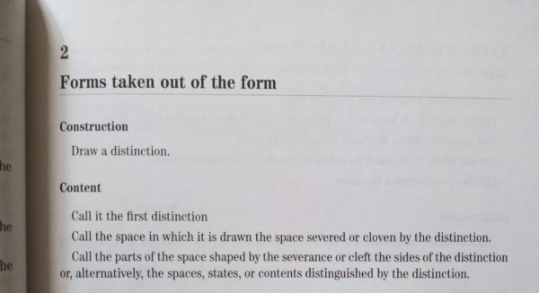

# Teoría de Distinciones — Formalización A–R–\widetilde{A}

**Nota**. En lo que sigue trabajamos con *frames* entendidos como complete Heyting algebras; por tanto la implicación
interna $(-\to-)$ existe y $a^*:=a\to\bot$ define el pseudo-complemento. Si algún resultado no requiere $(-\to-)$, se
indicará explícitamente.

---

")

## 1. Objetivo y Postura Fundamental

Este documento presenta una formalización lógico-matemática de las reflexiones ontológicas originales sobre la
emergencia de estructura finita a partir de distinciones en el continuo. El marco se desarrolla en el lenguaje de
frames/locales, retículas y filtros primos, manteniendo rigor matemático mientras se preserva la interpretación
ontológica de los conceptos fundamentales. En particular, la existencia de filtros primos que separen imágenes requiere
hipótesis adicionales sobre el frame (por ejemplo que $\mathcal L$ sea spatial o tenga suficientes puntos). Si no se
asume la existencia de puntos, la afirmación puede rehacerse en términos internos usando núcleos o congruencias que
realizan la separación sin recurrir a puntos.

La postura es fundamentalmente lógica y ontológica: se busca una formalización mínima y coherente que permita razonar
acerca de cómo emerge una entidad finita ("ALGO") a partir de la tensión entre extremos ontológicos ("TODO" y "NADA")
mediante la aplicación de una Distinción. No se asumen resultados computacionales ni experimentales; los enunciados
especifican hipótesis técnicas cuando son necesarias.

## 2. Vocabulario y Desambiguaciones Conceptuales

**Continuo `C`**. Se modela por un frame (o locale) denotado $\mathcal{L}$. Es la estructura algebraica sobre la cual
actúan los operadores de distinción. Se asume que $\mathcal{L}$ es un **marco débilmente regular**, es decir, existe una
relación $\prec_w$ (bien dentro débil) que generaliza la noción de aproximación regular.

**Distinción `D`**. Se modela por una triada de operadores sobre $\mathcal L$: un operador interior $A$ (tipo interior),
un operador de cierre $\widetilde{A}$ (tipo closure, que puede ser un *nucleus* si preserva meets finitos) y un operador
frontera $R$. Precisamente:

- $A:\mathcal L\to\mathcal L$ es monótono, deflacionario ($A(x)\le x$) e idempotente (operador interior).
- $\widetilde A:\mathcal L\to\mathcal L$ es monótono, inflationario (
  $x\le\widetilde A(x)$
  ) e idempotente; si además preserva meets finitos se denomina *nucleus* (en el sentido de la teoría de locales) y
  genera un sublocale.
- $R(x):=\widetilde A(x)\wedge (A(x)\to\bot)$, donde $\to$ denota la implicación interna del frame; recordamos que la
  fórmula que usa $\to$ requiere la existencia de implicación interna en la estructura (es decir, trabajamos con el
  residual/implicación del frame cuando se aplica).

Esta formulación distingue con claridad la naturaleza interior/closure de los operadores y permite una versión
punto‑libre (empleando núcleos/congruencias) cuando no se asuman puntos suficientes.

### Lema (existencia de congruencia / nucleus mínima separadora)

Sea $\mathcal L$ un *frame* y sean $p,q\in\mathcal L$. Supongamos que existe al menos una congruencia $\theta$
sobre $\mathcal L$ tal que

$$
[p]_\theta \neq [q]_\theta \text{.}
$$

Entonces la intersección

$$
\Theta := \bigcap\{\theta'\mid \theta'\text{ es congruencia y }[p]_{\theta'}\neq[q]_{\theta'}\}
$$

es una congruencia (la menor) que separa $p$ y $q$; es decir,

$$
[p]_\Theta\neq[q]_\Theta \text{.}
$$

Por la correspondencia estándar entre congruencias y núcleos (nuclei) en la teoría de locales, existe asimismo un
*nucleus* $j_\Theta$ mínimo tal que
$j_\Theta(p)\neq j_\Theta(q)$.

**Prueba.** La intersección de cualquier familia de relaciones de equivalencia que son congruencias vuelve a ser una
relación de equivalencia que respeta las operaciones de retícula (meet, join) —es decir, una congruencia— porque las
propiedades que definen una congruencia se verifican componente a componente y se conservan por intersección.
Sea

$$
\mathcal C:=\{\theta'\mid [p]_{\theta'}\neq[q]_{\theta'}\} \text{, }
$$

no vacía por hipótesis; entonces $\Theta=\bigcap \mathcal C$ es una congruencia.

Si por absurdo

$$
[p]_\Theta=[q]_\Theta \\
\text{ entonces para todo } \\
\theta'\in\mathcal C \\
\text{ tendríamos } \\
[p]_{\theta'}=[q]_{\theta'}
$$

(pues la identificación en $\Theta$ implicaría identificación en cada
congruencia que contiene a $\Theta$), lo cual contradice la definición de $\mathcal C$. Por tanto,

$$
[p]_\Theta\neq[q]_\Theta \\
\text{ y } \\
\Theta
$$

es la menor congruencia con esa propiedad por construcción.

Finalmente, la correspondencia entre congruencias y núcleos (véase la literatura estándar sobre locales / frames)
establece un isomorfismo orden-preservante entre el retículo de congruencias de $\mathcal L$ y el retículo de núcleos
de $\mathcal L$. Bajo esa correspondencia, a $\Theta$ le corresponde un nucleus $j_\Theta$ y la propiedad de
separar $p$ y $q$ se traslada a $j_\Theta(p)\neq j_\Theta(q)$. Esto concluye la prueba.

**Triada A–R–Ã**: Tres fases irreductibles que componen la acción de una distinción:

- $A$: Apertura/expansión — interpretada como un operador interior $A: \mathcal{L} \to \mathcal{L}$ con $A(x) \leq x$.
- $\widetilde{A}$ ("Ã"): Cierre/confinamiento — interpretada como un nucleus o
  closure $\widetilde{A}: \mathcal{L} \to \mathcal{L}$ con $x \leq \widetilde{A}(x)$.
- $R$: Curvatura/frontera/tensión — región intermedia definida algebraicamente
  como $R(x) := \widetilde{A}(x) \wedge (A(x) \to \bot)$.

**Punto emergente**: Un filtro primo $\mathfrak{p} \subseteq \mathcal{L}$ que satisface condiciones de separación
respecto de $A,\widetilde{A},R$ y modela la resolución finita de la tensión.

**Valuación $\mu$**: Una continuous valuation en el sentido de la teoría de locales, compatible con la estructura del
frame bajo hipótesis de regularidad débil. La racionalidad de $\mu$ se justifica mediante su extensión a marcos
booleanos y el Argumento del Dutch Book para álgebras distributivas.

Además, la extensión de una valuación continua a una medida de Borel suele requerir hipótesis concretas (por ejemplo:
base contable/spatialidad, σ-finitud o condiciones de soporte). Los desarrollos técnicos que permiten estas extensiones
están tratados en la literatura domain-theoretic (p. ej. Edalat; Lawson & Lu) y en trabajos sobre extensiones de
valuaciones.

**Medida de información estructural ($I$)**: Función $I: \mathcal{L} \to \mathbb{R}$ que cuantifica la complejidad
estructural basada en la posición en la retícula y los operadores $A$ y $\widetilde{A}$.

Conviene dejar explícito que los argumentos que usan distributividad, pseudo-complementos o implicación interna
pertenecen al régimen de frames/locales; en contextos cuánticos (retículos ortomodulares) hay que reformular dichos
argumentos en lenguaje de proyecciones/ortogonalidad y estados, ya que muchas identidades distributivas dejan de
sostenerse.

## 3. Estructura Formal Básica

**Definición 3.1 (Frame débilmente regular)**. Sea $\mathcal{L}$ un frame (completo: admite joins arbitrarios y meets
finitos; si se requiere cerradura frente a uniones contables indíquese explícitamente) con una relación $\prec_w$ (bien
dentro débil) tal que:

1. $y \prec_w x \Rightarrow y \leq x$.
2. Si $y \prec_w x$ entonces existe $z$ con $y \prec_w z \prec_w x$.
3. Para todo $x \neq \bot$, $\bigvee \{ y : y \prec_w x \} = x$.
4. La relación es compatible con los operadores: $y \prec_w x \Rightarrow A(y) \prec_w A(x)$.

(Nota: si en alguna parte se usa implicación interna $\to$, se asume que el frame admite dicha operación —esto es
estándar en marcos/Heyting frames; cuando no se dispone de implicación interna, las fórmulas que la requieren deben
reinterpretarse o reemplazarse por operaciones apropiadas del régimen en cuestión, p. ej. ortogonalidad en retículos
cuánticos.)

**Definición 3.2 (Operadores $A$ y $\widetilde{A}$)**. Defínense dos operadores monótonos sobre $\mathcal{L}$:

- $A: \mathcal{L} \to \mathcal{L}$ tal que para todo $x \in \mathcal{L}$, $A(x) \leq x$ y $A$ es
  idempotente: $A(A(x)) = A(x)$.
- $\widetilde{A}: \mathcal{L} \to \mathcal{L}$ tal que para todo $x \in \mathcal{L}$, $x \leq \widetilde{A}(x)$
  y $\widetilde{A}$ es idempotente. Si $\widetilde{A}$ preserva meets finitos lo llamaremos *nucleus*.

Se exige la relación ordenada $A \leq \text{Id}_{\mathcal{L}} \leq \widetilde{A}$.

**Definición 3.3 (Frontera/Curvatura $R$)**. Para todo $x \in \mathcal{L}$ definimos

$$
R(x) := \widetilde{A}(x) \wedge (A(x) \to \bot),
$$

donde $A(x) \to \bot$ es el pseudo-complemento de $A(x)$ en $\mathcal{L}$ cuando existe el residual. En frames booleanos
esto coincide con el complemento clásico y $R(x)$ es la diferencia entre $\widetilde{A}(x)$ y $A(x)$.

## 4. Axiomas de la Distinción y Propiedades Fundamentales

**Axioma D1 (Acción sobre el continuo)**. La Distinción se expresa por el par $(A,\widetilde{A})$ actuando
sobre $\mathcal{L}$ con $A \leq \text{Id}_{\mathcal{L}} \leq \widetilde{A}$ y $R$ definido como en 3.3.

**Axioma D2 (No‑colapso triádico, versión realizable).**

Existe $x\in\mathcal L$ **y** existe una congruencia no trivial $\theta$ sobre $\mathcal L$ (equivalente: existe un
nucleus no trivial que induce un sublocale propio) tales que

$$
[A(x)]_\theta \neq [\widetilde A(x)]_\theta \qquad\text{y}\qquad [R(x)]_\theta \neq [\bot]_\theta.
$$

**Comentario**. Esta formulación evita la cuantificación excesiva "para toda congruencia" que resultaba demasiado fuerte
e, en la práctica, no requerida para capturar la idea de separación realizable por la Distinción. Si se desea una
versión más fuerte (robusta frente a una familia de colapsos), hay que especificar explícitamente la clase de
congruencias considerada (p. ej. congruencias que provienen de núcleos que preservan meets finitos), y justificar la
necesidad de tal fortaleza.

**Axioma D3 (Separación puntual — formulación condicionada)**. Sea $\mathcal L$ un frame débilmente regular.

- (Versión espacial) Si $\mathcal L$ es **espacial** (por ejemplo, si es sober y posee una base contable que permita las
  construcciones de representación), entonces: si existe $x\in\mathcal L$ con $R(x)\neq\bot$, existe un filtro
  primo $\mathfrak p$ tal que $\widetilde A(x)\in\mathfrak p$ y $A(x)\notin\mathfrak p$.

- (Versión punto‑libre) Si no se asume spatialidad, la propiedad equivalente se puede expresar en términos de
  congruencias/núcleos: existe una congruencia no trivial $\theta$ (o un nucleus que induce un sublocale propio) con

$$
[\widetilde A(x)]_\theta \neq [A(x)]_\theta.
$$

(Comentario: la versión que invoca filtros primos requiere hipótesis adicionales sobre $\mathcal L$ —sobriedad, base
contable, o condiciones que garanticen la existencia de suficientes puntos—; la formulación punto‑libre evita dicha
hipótesis al trabajar con núcleos/congruencias.)

**Axioma D4 (Valuación cuántica)**. Para sistemas cuánticos, $\mu(x) = \mathrm{Tr}(\rho P_x)$ donde $P_x$ es el
proyector asociado a $x \in \mathcal{L}$, y $\rho$ es el estado del sistema. En el caso clásico, $\mu$ es una valuación
continua estándar. La función $\mu$ puede verse como una extensión de una función de creencia definida intrínsecamente
en $\\mathcal{L}$, y su racionalidad se deduce de su capacidad de extenderse a un marco booleano.

**Axioma D5 (Medida de información estructural $I$)**. La medida de información $I: \mathcal{L} \to \mathbb{R}$ asigna a
cada elemento $x \in \mathcal{L}$ un valor que representa su complejidad estructural, respetuosa con la estructura de la
retícula y los operadores $A$ y $\widetilde{A}$.

**Axioma D6 (Regularidad débil del Continuo)**. El continuo C está representado por un locale/frame $\mathcal{L}$ que es
débilmente regular.

## 5. Teoremas y Estructura Emergente

**Lema 5.1 (Tensión y no trivialidad)**. Si existe $x \in \mathcal{L}$ con $R(x) \neq \bot$, entonces la aplicación de
la distinción produce una región no trivial donde la apertura y el cierre discrepan.

*Prueba.* Por definición $R(x) = \widetilde{A}(x) \wedge (A(x) \to \bot)$. Si esto no es $\bot$, por definición de meet
y pseudo-complemento, la apertura y cierre no se solapan en ese elemento.

**Teorema 5.2 (Emergencia aproximada — versión condicionada espacial)**. Sea $\mathcal L$ un frame débilmente regular y
espacial (por ejemplo sober con base contable adecuada). Sea $\mu$ una valuación continua sobre $\mathcal L$ que
satisface las condiciones de regularidad necesarias (p. ej. regularidad interna y acotamiento por compactos cuando
corresponda). Entonces, para todo $\epsilon>0$ existe un filtro primo (o un filtro $\epsilon$-primo en la versión
medible) $\mathfrak p_\epsilon$ tal que:

$$
\mu(\{x : \widetilde{A}(x) \in \mathfrak p_\epsilon \wedge A(x) \notin \mathfrak p_\epsilon\}) > 1 - \epsilon.
$$

*Esbozo de prueba.* Bajo spatialidad y base numerable, la valuación continua se aproxima por joins de abiertos que
admiten puntos que separan las imágenes. Aplicando la representación puntual y tomando un ultrafiltro/Zorn en la familia
de conjuntos que contienen $\widetilde A(x)$, pero evitan $A(x)$, se construye un filtro primo $\mathfrak p_\epsilon$
que satisface la desigualdad anterior. La versión punto‑libre se obtiene mediante congruencias/nuclei y valuations sobre
sublocales (ver Apéndice técnico).

**Teorema 5.3 (Extensión probabilística racional)**. Sea $\mathcal{L}$ un frame débilmente regular finito y $\mu$ una
valuación continua en $\mathcal{L}$. Entonces $\mu$ se extiende a una función de probabilidad $\mathbb{P}$ en un álgebra
booleana $\mathfrak{B}$ que contiene a $\mathcal{L}$. Esta extensión es racional en el sentido del Argumento del Dutch
Book para álgebras distributivas.

*Prueba (esquema).* Por resultados estándar sobre extensión de creencias en álgebras distributivas y aplicaciones de
Teoremas tipo Narens/Edalat en contextos finitos, se construye la extensión y se aplica el argumento de racionalidad.

## 6. Interpretación Ontológica: TODO, NADA y ALGO

")

Los extremos $\top$ y $\bot$ del frame representan las nociones formales de TODO y NADA. La acción $(A,\widetilde{A})$
crea regiones intermedias; la emergencia (ALGO) se interpreta como un elemento o filtro finito/definido dentro de esa
región intermedia. La tensión entre extremos, mediada por la distinción, es la fuente formal de generación de
entidades "finito‑definibles".

## 7. Medida de Información Estructural

**Definición 7.1 (Axiomas para $I$)**. Para que $I: \mathcal{L} \to \mathbb{R}$ sea matemáticamente bien definida, se
proponen:

- **I1 (No-negatividad)**: $I(x) \geq 0$ para todo $x \in \mathcal{L}$
- **I2 (Minimalidad)**: $I(\bot) = 0$
- **I3 (Monotonía)**: Si $x \leq y$, entonces $I(x) \leq I(y)$
- **I4 (Subaditividad)**: $I(x \vee y) \leq I(x) + I(y)$
- **I5 (Invariancia)**: Si $\phi: \mathcal{L} \to \mathcal{L}'$ es un isomorfismo, entonces $I(\phi(x)) = I(x)$

**Definición 7.2 (Construcción basada en valuación)**. Cuando $\mu$ es una valuación continua, se
define $I(x) = \underline{E}(f_x, \mu)$ donde $f_x(y) = \frac{\mu(R(y) \wedge \uparrow x)}{\mu(\uparrow x)}$
para $\mu(\uparrow x) > 0$, y $\underline{E}$ es la integral inferior de Edalat.

**Definición 7.3 (Construcción geométrica)**. En frames débilmente regulares, se puede
definir $I(x) = \sup \{ -\log \mu(y) : y \prec_w x, \mu(y) > 0 \}$, capturando la resolución local mediante elementos
bien dentro.

**Definición 7.4 (Medida de información cuántica)**. Para sistemas cuánticos:

$$
I_Q(x) = S(\rho_x) - S(\rho_{\widetilde{A}(x)}) + S(\rho_{A(x)}),
$$

donde $S$ es entropía de Von Neumann, capturando información de entrelazamiento.

## 8. Formalización Algebraica Universal

### 8.1 Firma y Estructuras

La firma algebraica es $\Sigma = (\bigsqcup_I, \sqcap_{\text{fin}}, \top, \bot, A, \widetilde{A}, \prec_w)$,
donde $\prec_w$ es la relación "bien dentro débil". Las $\Sigma$-álgebras de interés son frames débilmente regulares con
los operadores triádicos.

### 8.2 Núcleos y Congruencias

**Proposición 8.1**. Sea $\mathcal{L}$ un frame débilmente regular y $j: \mathcal{L} \to \mathcal{L}$ un núcleo. La
relación $\theta_j$ definida por $(a,b) \in \theta_j \iff j(a) = j(b)$ es una congruencia que
satisface $\mathcal{L}/\theta_j \cong \mathrm{Fix}(j)$.

### 8.3 Formalización del Axioma D2

**Axioma D2 (versión realizable)**. Existe $x\in\mathcal L$ y una congruencia no trivial ($\theta$)
sobre ($\mathcal L$) (equivalente a un núcleo no trivial que induce un sublocale propio) tales que

$$
[A(x)]*\theta \neq [\widetilde A(x)]*\theta \quad\text{y}\quad [R(x)]*\theta \neq [\bot]*\theta.
$$

Si se requiere una variante más fuerte que exija separación frente a una familia concreta de congruencias, esa familia
debe describirse explícitamente.

## 9. Extensiones Measure‑Teóricas y Probabilísticas

### 9.1 Valuaciones en Frames Débilmente Regulares

**Definición 9.1 (Valuación continua)**. Una valuación continua en $\mathcal{L}$ es una
función $\mu: \mathcal{L} \to \mathbb{R}^+$ que satisface:

- $\mu(\bot) = 0$
- Monotonía: $x \leq y \Rightarrow \mu(x) \leq \mu(y)$
- Modularidad: $\mu(x) + \mu(y) = \mu(x \vee y) + \mu(x \wedge y)$
- Continuidad: Para todo conjunto dirigido $D \subseteq \mathcal{L}$, $\mu(\sup D) = \sup_{d \in D} \mu(d)$

**Teorema 9.2 (extensión única de una valuación continua a medida de Borel)**. Sea $\mathcal L$ un *frame* espacial (
óptimamente: sobrio) con base numerable y sea $\mu$ una valuación continua sobre $\mathcal L$ que sea regular y
σ‑finita. Denotando por $X:=\mathrm{pt}(\mathcal L)$ el espacio puntual asociado y por $\mathcal B(X)$ la σ‑álgebra de
Borel en $X$, la valuación $\mu$ se extiende de forma única a una medida σ‑aditiva regular $\overline{\mu}$ definida
sobre $\mathcal B(X)$ tal que para toda apertura $u\in\mathcal L$ (vista como abierto de $X$) se
tiene $\overline{\mu}(u)=\mu(u)$.

### 9.2 Integral de Edalat y Medida de Información

**Definición 9.3 (Integral de Edalat)**. Para $f: \mathcal{L} \to \mathbb{R}$ acotada y $\mu$ valuación, la integral
inferior es $\underline{E}(f, \mu) = \sup_{\mathcal{P}} \sum_{P \in \mathcal{P}} (\inf f(P))\, \mu(P)$
donde $\mathcal{P}$ recorre particiones finitas por elementos regulares.

### 9.3 Computabilidad y Efectividad

**Definición 9.4 (Frame efectivamente dado)**. Un frame débilmente regular $\mathcal{L}$ es efectivamente dado si tiene
una base contable $\{b_n\}_{n\in\mathbb{N}}$ con relaciones $b_m \prec_w b_n$ decidibles.

**Teorema 9.5**. Si $\mathcal{L}$ es efectivamente dado y los operadores $A$, $\widetilde{A}$ son computables,
entonces $\mu$, $I$ y la probabilidad condicional son computables (en el sentido Type‑2). Se incluye en el apéndice el
detalle sobre representaciones Type‑2 y referencia a la literatura pertinente (Edalat, Weihrauch).

## 10. Ejemplos Canónicos

### 10.1 Frame de un Espacio Métrico Compacto

Sea $X$ un espacio métrico compacto, y $\mathcal{L} = \Omega(X)$ su frame de abiertos. $\mathcal{L}$ es débilmente
regular pues $X$ es métrico.

**Operadores triádicos**:

- $A(U) = \text{int}(U)$ (operador interior topológico)
- $\widetilde{A}(U) = \text{cl}(U)$ (operador clausura topológica)
- $R(U) = \widetilde{A}(U) \wedge (A(U) \to \bot) = \text{cl}(U) \setminus \text{int}(U)$ (frontera topológica)

**Valuación**: $\mu(U)$ = medida de Haar o Lebesgue restringida a $X$

**Medida de información**: $I(U) = \underline{E}(f_U, \mu)$ con $f_U(V) = \frac{\mu(R(V) \cap U)}{\mu(U)}$

### 10.2 Sistema Cuántico de Espín

**Frame**: $\mathcal{L} =$ Subespacios cerrados de $\mathbb{C}^2$ (retículo ortomodular)

**Operadores triádicos**:

- $A(S) = \text{span}\{|0\rangle\}$ si $S$ contiene $|0\rangle$, si no $\bot$
- $\widetilde{A}(S) = \text{clausura de evolución temporal de } S$
- $R(S) = \widetilde{A}(S) \wedge A(S)^\perp$

**Valuación cuántica**: $\mu(S) = \text{Tr}(\rho P_S)$ donde $P_S$ es el proyector sobre $S$

**Medida de información**: $I_Q(S) = S(\rho_S) - S(\rho_{\widetilde{A}(S)}) + S(\rho_{A(S)})$

**Punto emergente**: El filtro primo correspondiente a la medida de spin +Z que emerge de la decoherencia.

### 10.3 Paradigma Conductual entre-Sujetos

Sea $\mathcal{P}$ un paradigma experimental con sujetos $\mathcal{S}$ y experimentos disjuntos. El frame $\mathcal{L}$
se construye como el retículo de proposiciones determinables, que resulta ser ortomodular. La valuación $\mu$ se define
mediante frecuencias contrafácticas, y la emergencia de elecciones específicas corresponde a filtros primos
en $\mathcal{L}$. Este ejemplo conecta con la construcción de Narens (2016) y muestra cómo la contextualidad genera
estructuras no booleanas.

## 11. Triada Cuántica y Conexión con Emergentismo

**Definición 11.1 (Triada Cuántica)**. Para un sistema cuántico con espacio de Hilbert $\mathcal{H}$:

- $A(\rho) = \Pi_{\text{clásico}}(\rho)$: proyección al subespacio clásico
- $\widetilde{A}(\rho) = \mathcal{E}(\rho)$: evolución unitaria + decoherencia
- $R(\rho) = \widetilde{A}(\rho) - A(\rho)$: superposición coherente residual

Donde la emergencia de propiedades clásicas corresponde a puntos en el frame de subespacios.

**Proposición 11.2 (Emergentismo cuántico)**. En el límite de decoherencia, $R(\rho) \to 0$ y emerge un filtro primo
estable que corresponde a una propiedad clásica definida. Este proceso modela la transición cuántico-clásica como un
caso particular de emergencia triádica.

**Teorema 11.3 (Información de entrelazamiento)**. Para sistemas bipartitos, $I_Q(S)$ captura la información de
entrelazamiento entre los subsistemas cuando $S$ representa el estado conjunto y $A(S)$ proyecta a los estados
separables.

## 12. Conclusiones y Direcciones Futuras

El marco presentado unifica conceptos de topología sin puntos, teoría de medidas constructiva, teoría cuántica y álgebra
universal para formalizar la Teoría de Distinciones. La transición a frames débilmente regulares:

1. **Amplía** la aplicabilidad a espacios métricos, cuánticos y de medida
2. **Preserva** los resultados fundamentales de emergencia puntual
3. **Mantiene** el rigor ontológico y algebraico
4. **Conecta** con fenomenología física contemporánea y ciencias conductuales

Trabajo futuro incluye desarrollar:

- Técnicas de normalización para valuaciones en frames no booleanos
- Principios de razonamiento formal para equivalencia entre programas
- Aplicaciones a modelos físicos y de computación cuántica
- Estudio de la relación entre entropía de Von Neumann y medida de información estructural
- Desarrollo de marcos computacionales para emergencia en sistemas complejos
- Integración explícita con teorías de probabilidad generalizada en ciencias conductuales y económicas

El marco resultante proporciona una base rigurosa para estudiar la emergencia de estructura finita a partir de
distinciones en el continuo, conectando ontología, matemáticas, física cuántica y computación mediante un formalismo
general y topológicamente natural.

## Referencias

- Edalat, A. "A generalisation of Henstock–Kurzweil integral to compact metric spaces" (preprint, 2025).
- Di Gianantonio, P. & Edalat, A., "A Domain-Theoretic Framework for Conditional Probability and Bayesian Updating in
  Programming" (2025).
- Lawson, J. D. & Lu, B., "Riemann and Edalat integration on domains" (2003).
- Alvarez-Manilla, M.; Edalat, A.; Saheb-Djahromi, N., "An extension result for continuous valuations" (2000).
- Narens, L., "Probabilistic frames for non-Boolean phenomena", Phil. Trans. R. Soc. A 374:20150102 (2016).

---

## Apéndice técnico: definiciones, lemas y referencias

## Definiciones clave

**Frame / Locale**. Un *frame* $\mathcal L$ es una retícula completa que admite joins arbitrarios y meets finitos,
satisfaciendo la distributividad infinita: $x \wedge \bigvee_i y_i = \bigvee_i (x \wedge y_i)$. Un *locale* es la misma
noción tomada en el contexto punto‑libre.

**Nucleus**. Un *nucleus* en un frame es un operador monótono $j:\mathcal L\to\mathcal L$ que es
inflationario (
$x\le j(x)$
), idempotente (
$j(j(x))=j(x)$
) y preserva meets finitos. Los núcleos corresponden a sublocales.

**Operador interior (tipo A)**. Un operador $A$ que satisface $A(x)\le x$ e $A(A(x))=A(x)$ se interpreta como un
interior o apertura efectiva.

**Implicación interna**. En marcos/Heyting frames existe un operador residual $\to$ tal
que $a\wedge b \le c \iff a \le (b\to c)$. Cuando se usa la expresión $A(x)\to\bot$ se emplea este residual.

**Valuación continua**. Una valuación $\mu$ sobre un frame es una función monótona que satisface additividad modular
para joins dirigidos y cuya continuidad se refiere a conservar ciertos límites dirigidos; bajo hipótesis de spatialidad
puede corresponder a medidas de Borel mediante la representación de valuations.

**Filtro $\epsilon$-primo**. En este documento usamos "filtro $\epsilon$-primo" para denotar, de forma informal, un
filtro $\mathfrak p$ que capta con medida mayor que $1-\epsilon$ el conjunto de elementos que separan $\widetilde A(x)$
y $A(x)$. En la versión estricta: un filtro $\mathfrak p$ tal que $\mu(\{y: y\in \mathfrak p\})>1-\epsilon$ y que
satisface propiedades de primalidad relativas (si $a\vee b\in\mathfrak p$ entonces $a\in\mathfrak p$
o $b\in\mathfrak p$).

**Relación $\prec_w$ (bien dentro débil)**. Dada en la Def.3.1: expresa aproximación interior y es la herramienta
técnica que garantiza que todo elemento es el join de "buenas aproximaciones" desde dentro.

## Lemas y teoremas auxiliares (referencias y notas de uso)

- **Stone duality y representación para locales/espectros**. La representación puntual (es decir, asociar
  puntos/ultrafiltros a elementos del frame) exige hipótesis: espacialidad o sobriedad y condiciones de base contable
  cuando se desea una representación medible. Consulte Johnstone, *Stone Spaces*, y trabajos sobre Stone–Zariski para
  locales.

- **Extensión de valuaciones a medidas**. La extensión de valuaciones a medidas (teorema tipo Carathéodory /
  representación de valuations) requiere hipótesis de regularidad y, en general, condicionales como spatialidad o bases
  contables y, para medidas σ‑aditivas, hipótesis tipo σ‑finitud. Véanse trabajos de Edalat sobre valuations y Lawson &
  Lu sobre representación de measures en dominios.

- **Gleason (1957)**. La representación de medidas cuánticas por trazas (estado density matrices) está garantizada, bajo
  las hipótesis clásicas de Gleason, para espacios de dimensión mayor o igual a 3. En dimensión 2 (qubits) existen
  excepciones y construcciones peculiares; tenga esto en cuenta en los ejemplos cuánticos.

- **Filtro $\epsilon$-primo.**

1. **Definición (versión espacial)**. Sea $\mu$ una valuación continua representable por una medida $\overline{\mu}$
   en el espacio puntual $X=\mathrm{pt}(\mathcal L)$. Dado $x\in\mathcal L$ y $\epsilon>0$, un filtro
   primo $\mathfrak p\subseteq\mathcal L$ se denomina
   $\epsilon$-primo relativo a
   $(A,\widetilde A)$ si

$$
\overline{\mu}(\{\,p\in X:\ \widetilde A(x)\in p \ \quad\text{y}\quad A(x) \notin p\,\})>1-\epsilon.
$$

Esta formulación utiliza la representación puntual y mide la porción de puntos que distinguen las imágenes.

2. **Versión punto‑libre (alternativa)**. En ausencia de spatialidad, llamaremos
   $\epsilon$-primo punto‑libre* a una congruencia/nucleus
   $\theta$ (o a un conjunto de núcleos) que separa

$$
[\widetilde A(x)]_\theta
$$

y $[A(x)]_\theta$ y para la cual existe una valuation/masa sobre el retículo de sublocales que asigna valor mayor que
$1-\epsilon$ a la clase de sublocales que contienen la imagen de
$\widetilde A(x)$ y evitan la de
$A(x)$. (Aquí se reinterpreta la noción de medida en términos de valuations sobre sublocales; ver Edalat y Lawson &
Lu para detalles sobre esta transición.)

- **Lema (congruencia ⇄ núcleo separador).**
  Sea $\mathcal L$ un frame y $x\in\mathcal L$. Las siguientes afirmaciones son equivalentes:

1. Existe una congruencia no trivial $\theta$ sobre $\mathcal L$ tal que

$$
[\widetilde A(x)]*\theta \neq [A(x)]*\theta.
$$

2. Existe un núcleo no trivial $j:\mathcal L\to\mathcal L$ tal que $j(\widetilde A(x)) \neq j(A(x))$.

*Prueba (esbozo).* Si $j$ es un núcleo, la relación $\theta_j$ definida por $(a,b)\in\theta_j\iff j(a)=j(b)$ es una
congruencia y la desigualdad entre imágenes bajo $j$ se traduce inmediatamente en desigualdad de clases en $\mathcal
L/\theta_j$. Recíprocamente, si $\theta$ es una congruencia que separa, la proyección canónica $\pi:\mathcal
L\to\mathcal L/\theta$ admite un núcleo inverso (el núcleo que calibra la inclusión del sublocale identificado
con $\mathcal L/\theta)$; aplicando ese núcleo se obtiene la separación requerida.

**Proposición (existencia de núcleo mínimo separador — bajo hipótesis).**
Supón que la retícula (orden) de núcleos en $\mathcal L$ es completa y satisface la propiedad de que intersecciones
arbitrarias de núcleos que separan vuelven a separar (esto ocurre, por ejemplo, si el poset de núcleos es algebraico o
satisface DCC/condiciones de compacidad apropiadas). Entonces, si existe alguna congruencia/núcleo que
separa $\widetilde A(x)$ de $A(x)$, existe un núcleo $j_{\min}$ que separa y es mínimo para la relación de orden entre
núcleos (es decir, es menor o igual que cualquier otro núcleo separador).

*Prueba (esbozo).* Tomar la familia $S$ de núcleos que separan; bajo las hipótesis la intersección (infimo) de $S$ es un
núcleo y por la hipótesis de estabilidad de la intersección respecto a la propiedad de separación conserva la
desigualdad entre las imágenes, por lo que es el mínimo.