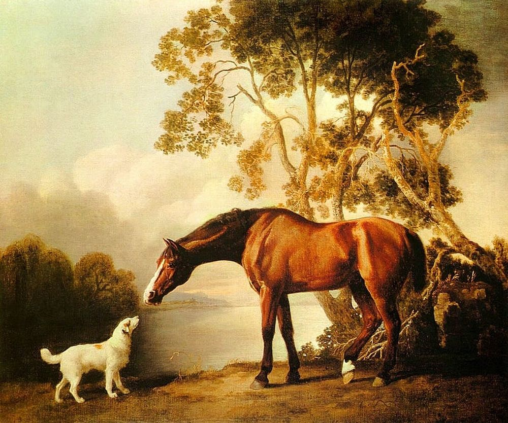
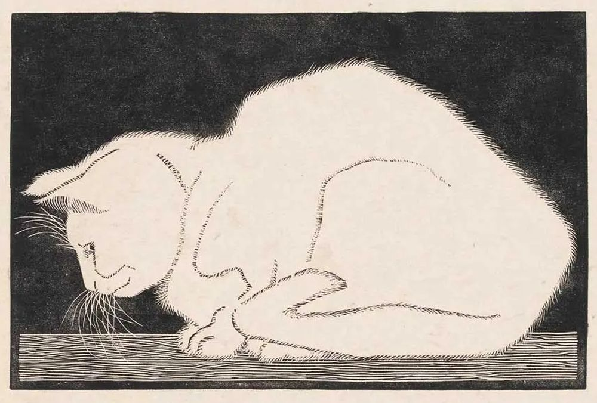

# Sobre perros y caballos

> *«Un viaje de mil millas comienza desde debajo de los pies.»* Tao Te Ching, Capítulo 64. Lao-Tse (571 a.C.-470 a.C.).

")

# La distinción inicial

> Me puse a pensar en la diferencia entre un perro y un caballo. Me pregunté: *¿Cómo distinguía que no eran lo mismo?*

Los imaginé y observé que el perro apoya sus patas sobre almohadillas suaves, mientras el caballo levanta polvo con
cascos duros, dedos transformados por la evolución en armadura. Noté que el perro tiene colmillos afilados para
desgarrar, mientras el caballo mordisquea hierba con incisivos planos, como palas de hueso. Así reflexioné que puedo
separarlos por sus **rasgos**.

> Me cuestioné entonces: *¿Son estas solo diferencias físicas, o hay algo más?*

Pensé en el perro, diseñado para cazar en manada; el caballo, para huir en praderas abiertas. Sus formas no son
accidentes, sino respuestas a desafíos que la vida les ha planteado durante milenios. Así, entendí que distinguir cosas
no es un juego de comparar detalles, sino de **leer historias**. Cada rasgo —una garra, un casco, un diente— es una
página en un libro escrito por necesidades concretas, y en esas páginas hasta lo más pequeño guarda la clave para
diferenciar lo que parece similar. Son **particularidades esenciales**: huellas únicas talladas por el tiempo, la
función y el entorno.

# Hacia lo abstracto

# El límite de las particularidades

> Me pregunté: *¿Esas particularidades siempre bastan para distinguirlos?*

Desde una colina lejana, ambos se convierten en siluetas de cuatro patas, moviéndose como sombras sobre la tierra; sus
colmillos y cascos, sus almohadillas y crines, se funden en una mancha borrosa. Las particularidades que los separaban
—tan claras a mi escala— se vuelven irrelevantes a gran distancia. Reflexioné que, si me alejo lo suficiente, las
diferencias entre el perro y el caballo se desdibujan.

> Entonces me cuestioné: *¿Significa eso que las diferencias son una ilusión?*

A media distancia, el perro y el caballo recuperan sus rasgos únicos, pero si sigo alejándome, incluso esos detalles se
pierden, revelando **nuevas similitudes**: ambos son mamíferos, vertebrados, seres vivos. la escala revela nuevos
límites, nuevas categorías. Entendí que las particularidades solo tienen sentido en ciertas escalas.

> Pero luego invertí el camino: *¿Y si me acerco más?*

Bajo una lupa, la piel del perro y el pelaje del caballo muestran texturas distintas; pero al mirar a través de un
microscopio, esas diferencias vuelven a desvanecerse: células, moléculas, átomos… Ambos se reducen a lo mismo. Las
particularidades que los separaban a simple vista son solo capas de capas infinitas, donde cada nivel revela
similitudes más profundas. Lo que distingue al perro del caballo depende de dónde yo esté parado: lejos, cerca, o
inmerso en lo microscópico. Así, comprendí que las diferencias no son absolutas, sino **escalares**. La realidad,
concluí, es un juego de perspectivas: cada respuesta genera nuevas preguntas, y cada escala revela un nuevo acto en la
obra interminable de lo existente.

# La búsqueda de lo común

> Me cuestioné entonces lo opuesto: *¿En qué se parecen?*

Observé al perro y al caballo juntos, uno meneando la cola, el otro relinchando, y busqué más allá de sus formas. *Ambos
respiran*, pensé; *ambos tienen sangre caliente, huesos bajo la piel, ojos que parpadean bajo el mismo sol.*

> Avancé un paso más: *¿Qué los une más allá de lo evidente?*

Son mamíferos: paren crías vivas, las alimentan con leche, y sus cuerpos guardan el eco de un ancestro común perdido en
el tiempo. Deduje que comparten atributos esenciales tallados por la evolución, pero incluso eso es solo el principio.

> Me pregunté: *¿Hasta dónde llega esta cadena de similitudes?*

Pensé en escalar categorías como peldaños: especies, géneros, familias. El perro y el caballo se funden en “mamíferos”,
luego en “vertebrados”. Cada vez que ascendemos, abarcamos grupos que no teníamos en cuenta al principio. Así, sin
proponérnoslo, al generalizar **descubrimos que alcanzamos más de lo que buscábamos:** cuando juntamos “animales” y
“plantas” en “seres vivos”, de repente incluimos también hongos, bacterias y otros organismos. Hasta que, al final,
todo —desde una rosa hasta una montaña— puede agruparse bajo la palabra “algo”. Cada grupo superior diluye sus
diferencias en un mar de semejanzas.

> Pero entonces reflexioné: *¿Es válido ignorar las particularidades para crear un marco común?*

Al borrar detalles —el aullido del perro, el galope del caballo—, el mundo se vuelve una representación simplificada.
Sin embargo, a costa de esa abstracción, se revela un orden oculto: una pirámide donde cada capa de similitud sostiene a
la siguiente. Así, comprendí que **buscar lo común negando las diferencias, era la herramienta para encontrar el hilo
que une la madeja**. El perro y el caballo, en su esencia más cruda, son pulsos de vida dentro de un mismo ritmo
cósmico, y en ese ritmo hasta las piedras y las estrellas tienen su lugar.

# La abstracción hacia el TODO

Mediante esta **inducción**, al eliminar todas las particularidades —las patas del perro, las crines del caballo,
incluso conceptos como “vida” o “materia”—, solo queda el **TODO**. Reflexioné que este no es un grupo ni una
categoría, sino la totalidad de todo lo existente: animales, plantas, galaxias, átomos, pensamientos, recuerdos… y hasta
el acto mismo de reflexionar sobre él.

> Me pregunté entonces: *¿Cómo definir los límites de algo que lo abarca todo?*

Si cada cosa se entiende al contrastar sus rasgos con lo que no es —un perro no es un caballo por sus almohadillas
frente a cascos, una planta no es una roca porque crece mientras esta permanece estática—, el TODO carece de ese
contraste. No existe un *“afuera”* para compararlo, ningún otro conjunto que lo delimite. Es como intentar medir el
universo con una regla hecha de su propia sustancia: cualquier unidad sería parte de lo que se busca medir.

> Clave seguía siendo la misma: *Su definición no depende de lo que incluye, sino de lo que excluye.*

El TODO solo puede definirse negando su opuesto absoluto: TODO no es NADA. La NADA no es un reflejo ni una sombra: es la
ausencia total de existencia, el vacío incapaz de contener siquiera un átomo. No es parte del TODO ni su reverso: es su
antítesis pura, el límite que lo delimita. Así llegué a la **NADA**.

> Pero esto genera una paradoja: *¿No es la NADA, como concepto, parte del TODO?*

El TODO solo cobra sentido porque la NADA traza una frontera invisible: una frontera que nunca se cruza, pero que marca
el fin de lo pensable. Mientras el TODO contiene incluso nociones como “vacío” o “ausencia”, la NADA es la imposibilidad
radical de todo lo existente. El TODO, al carecer de rasgos únicos, solo puede afirmar: *“Soy todo lo que existe, y por
eso, no soy la ausencia”*. En esa negación mutua, ambos encuentran su razón de ser: el TODO como plenitud, la NADA como
su silencio eterno. La NADA no es un concepto ni una idea: es la ausencia absoluta de cualquier cosa. Entendí que los
absolutos nunca pueden definirse por lo que son, sino por lo que rechazan.

# La dinámica de los opuestos

Es como si, al nombrar *“todo”*, automáticamente se creara un vacío a su alrededor —la NADA—, porque definir lo que
*es* exige, inevitablemente, señalar lo que *no es*. Al definir el TODO, no necesito buscar fuera de él para crear la
NADA: el propio TODO, al ser absoluto, contiene en su esencia la semilla de su negación. Reflexioné que los opuestos no
surgen sin causa, sino que cada concepto lleva dentro de sí todo lo necesario para engendrar a su contrario.

> Me pregunté: *¿Por qué ocurre esto?*

Pensé que, para existir, un concepto necesita fronteras, y esas fronteras solo pueden trazarse negando lo que está
fuera. Pero en el caso del TODO, no hay un *“afuera”*. Por eso, su límite no puede ser externo: tiene que ser interno.
La respuesta está en la necesidad de límites. El TODO, en su plenitud, lleva dentro la raíz de la NADA, porque sin esa
ausencia, su *“totalidad”* carece de sentido. Es una paradoja íntima: la existencia del **TODO depende de su capacidad
para autogenerar su opuesto desde dentro**.

# La semilla interna

Al decir *«NADA no ES TODO»*, el verbo *ES* es creador, actuando como un puente que une ambos conceptos en un proceso de
negaciones. La NADA no es un invento arbitrario: es la consecuencia lógica de definir el TODO. Reflexioné que incluso
las palabras más simples —como *«ser»* o *«no ser»*— esconden esta dinámica. Los conceptos absolutos, como **causa y
efecto**, solo existen en relación mutua y no existen en soledad.

> Me pregunté: *¿Causas y efectos pueden ocurrir al mismo tiempo?*

Observé que lo que parecía una aparición automática al evocar TODO o NADA, no era inmediato: escondía un movimiento
donde uno se transforma en el otro mediante la negación.

Si el TODO es la causa, la NADA es su efecto inevitable. Pero no había un principio claro: era un **ciclo sin inicio ni
fin**, donde cada uno se convertía en el otro al girar la rueda del tiempo. Me di cuenta de que este giro no era
caótico, sino que seguía un ritmo triple: algo se expande, se curva en su camino, y finalmente se confina en una nueva
forma, para luego comenzar de nuevo. Era como ver el mismo pulso cósmico en tres tiempos distintos.

> Me pregunté: *¿Qué mantiene unido lo que parece dividido?*

Al principio vi solo dos polos: el TODO y la NADA. Pero pronto entendí que sin el movimiento que los conecta, serían
conceptos aislados sin relación posible. La verdadera esencia no estaba en los extremos, sino en el "_no es_" que une
"_TODO_" y "_NADA_", en el ciclo continuo donde uno se transforma en el otro al proyectar sus límites, manteniendo la
unidad del conjunto. Reflexioné que un sistema binario nunca puede existir sin una **relación** que conecte sus partes.

> Me pregunté: *¿Cómo escapo de este ciclo abstracto y regreso al mundo real?*

Pensé que la respuesta tenía que seguir implícita en este ciclo eterno. Este ciclo contenía el TODO, y el TODO
engendraba la NADA, y la NADA debería poder producir todas las cosas nuevamente, empezando por algo concreto. Así, la
NADA —al no ser algo— reveló su paradoja: **NADA no es ALGO**.

Comprendí entonces que este **primer ALGO** no pertenecía al TODO ni a la NADA, sino que emergía de su tensión como un
acto de distinción pura. La primera entidad concreta, definida por una doble negación: **ALGO no es TODO** (porque es
finito) y **ALGO no es NADA** (porque existe). Estos signos, opuestos y absolutos, definen el marco donde todas las
cosas encuentran su lugar. En la tríada **TODO-ALGO-NADA**, el ALGO era el mediador que convertía esas fuerzas
opuestas en realidad.

El primer ALGO, un algo nuevo que al ser el único existente, se convierte en un todo concreto por sí mismo. Por lo
tanto, pensé, debería contener todo lo necesario para reconstruir, no solo el perro y el caballo, sino toda la realidad
que me rodea. Reflexioné que, en esencia, **todas las cosas para existir deben distinguirse de todas las otras**,
comenzando por este primer acto de distinción que da origen a todo lo tangible.

# Sobre gatos, plantas y luz

")

# Hacia lo concreto

# El universo observable

> La última reflexión me devolvió al punto inicial. Me pregunté: *¿Cómo resurge la diversidad desde la unidad
fundamental?*

Pensé que la respuesta tenía que estar materializada frente a mí. La realidad que me rodea, aun siendo compleja, debía
poder reducirse a componentes **irreductibles** y **no intercambiables**, como piezas de distinta naturaleza que al
ensamblarse tejen lo visible. Identificarlos sería la clave para reconstruir el mundo sin perderme en abstracciones
absolutas.

> Me pregunté: *¿Puedo hallar esos elementos sin abandonar lo concreto?*

Mi propósito era explorar estas dinámicas en lo tangible. Por eso, para responder la pregunta, decidí observar mi
entorno y **deducir** cómo lo general contenía lo particular.

Mi habitación es pequeña. Tiene una cama contra una pared y una ventana por donde entra la luz del sol. Por las mañanas,
esa luz baña las hojas de una planta que, hace meses, era la mitad de alta. Ahora, cada amanecer, orienta sus hojas
hacia los rayos como si siguiera un antiguo ritual, y al anochecer, sus hojas se pliegan, como si durmieran. El gato
elige su rincón: por la mañana descansa sobre la cama, pero cuando el sol de la tarde desplaza sus rayos hacia el centro
del cuarto, se traslada allí, siguiendo el prisma dorado que el sol dibuja en el piso. La luz misma no es estática: se
desliza lentamente, marcando horas que son ciclos dentro de **ciclos**.

Todo aquí —la planta que crece, el gato que sigue la luz, las hojas que se mueven— ocupa un lugar y un momento. La
cama no es solo un mueble: es el punto donde confluyen historias. Cada mañana, al despertar, veo cómo la planta ha
girado milimétricamente hacia la ventana, cómo el gato ha dejado su pelo sobre la sábana, cómo el polvo flota en los
rayos de un sol que nunca llega igual. Nada permanece, pero nada se rompe. La habitación es un escenario donde cada
detalle —desde el crecimiento de la planta hasta la siesta del gato— revela que lo aparentemente simple es una **red
de movimientos**.

La planta tiene una rutina diaria, imperceptible sin una observación atenta. El gato no busca el sol por casualidad,
sino porque su cuerpo sabe que ese rastro de luz durará lo justo para su descanso. Y yo, al observar, me pregunto:
*¿cómo los rayos de sol pueden ordenar rutinas, sostener vida, o dibujar patrones en el polvo?*

# Las formas de la energía

> *Pensé en las particularidades de las cosas.*

La energía se manifiesta en la luz que alimenta a la planta, en el calor que busca el gato, en la electricidad que
ilumina la habitación al anochecer. Comprendí que la energía no es una idea abstracta sino algo concreto.

Reflexioné que incluso la materia —la cama, la maceta, el cuerpo del felino— es energía condensada en estados
distintos: sólido, líquido, gaseoso, pero no toda energía es material (ej: fotones). Hasta el plasma, ese cuarto estado
que brilla en las estrellas, es parte del mismo proceso. La energía no se crea ni se destruye; solo muta, adoptando
formas que pueden tocarse, verse o sentirse.

# El espacio como tejido vivo

> *Luego, pensé en los lugares.*

Observamos tres dimensiones, sí, pero el espacio no es un vacío estático. La maceta ocupa un volumen, la planta extiende
sus raíces en la tierra y sus hojas hacia el aire, y el gato reclama su rincón bajo la ventana.

La planta no solo crece en el espacio, sino que lo modifica a través de su presencia. Del mismo modo, la materia
—energía densa— curva el espacio, como una piedra curva la superficie de un lago. Reflexioné que el espacio, lejos de
ser un contenedor neutro, se modifica con lo que habita en él.

# El tiempo como testigo y motor

> *Finalmente, pensé en el tiempo.*

Lo percibimos como una flecha imparable: las hojas de la planta se abren al amanecer, el gato envejece sin prisa, y
hasta la luz del sol dibuja sombras que se alargan con las horas.

El tiempo no solo permite el cambio: es el marco donde la energía y el espacio pintan la realidad. Sabía, por ejemplo,
que cerca de un objeto masivo —como la Tierra— el tiempo se ralentiza, y que cada transformación, desde la
fotosíntesis hasta el latido de un corazón, ocurre dentro de él. Reflexioné entonces que el tiempo no es un reloj
externo: se entrelaza con el espacio y la energía.

# La tríada inseparable

La planta necesita luz para crecer en un espacio determinado y dentro de un tiempo específico. El gato
gasta energía para moverse en el espacio, y su existencia misma mide el tiempo en ronroneos y siestas. Hasta yo, al
reflexionar, consumo energía neuronal, ocupo un lugar en la habitación y avanzo en el tiempo. Estos tres elementos no
solo sostienen el universo: son las raíces de lo vivo, la esencia de todo lo que existe. Sin energía, no habría
movimiento ni acción; sin espacio, no habría un lugar para que algo ocurriera; sin tiempo, no habría transformación ni
evolución. Y en esa **red de interdependencias**, hasta el acto más simple revela que la realidad no es una máquina,
sino un organismo vivo. La realidad, comprendí, se estructura en tres pilares: energía, espacio y tiempo.

# La danza eterna de Energía, Espacio y Tiempo

> Me pregunté: *¿Cómo se relacionan estas tres cosas?*

Para entenderlo, intenté cambiar algunas cosas en mi mente. Pensé en mi cama: hace meses recibía más luz al amanecer, y
quería sentir eso otra vez al despertar. Pero al imaginar moverla, vi un problema: la planta que ahora crecía en ese
rincón soleado, y el gato que usaba el espacio libre para dormir. Ambos se habían acostumbrado a cómo estaban las cosas,
como si el tiempo los hubiera anclado ahí.

Todo cambio comienza con energía —una idea—, que transforma el espacio —mover la cama—, y con el tiempo aparecen
consecuencias —la planta estirándose hacia la luz, el gato buscando su lugar—. La energía no solo mueve cosas: cambia
las reglas del espacio, y el espacio, a su vez, decide cómo el tiempo avanza. Así funciona el ciclo: cada acción lleva a
la siguiente, y hasta lo más pequeño, como mover una cama, muestra que el universo entero se mueve en silencio.

Entendí entonces que mover la cama no es solo un acto físico: es una puerta para ver cómo energía, espacio y tiempo
bailan juntos, sin parar, en cada rincón de la realidad.

# Desde la Energía hacia el Espacio y el Tiempo

> Me pregunté: *¿Por qué es necesaria la energía para cambiar el espacio?*

Al imaginar mover la cama hacia la ventana, pensé en el esfuerzo físico que requeriría. Este acto no solo altera el
espacio físico, sino que revela un juego de fuerzas: la energía que gasta para mover la cama (como un músculo que se
tensa) se enfrenta a la resistencia del espacio ocupado por otros objetos. Incluso mover la cama hacia la ventana
depende de quitar la maceta antes. El espacio ocupado necesita desocuparse antes de ser ocupado nuevamente.

Si no uso energía, el espacio permanecería inmutable, pero al aplicarla, el los efectos se manifiestan con el tiempo:
días después, la planta —ahora desplazada a un rincón oscuro— torcería sus hojas buscando luz, gastando su propia
energía para adaptarse. Así, la energía **inicia el cambio**, el espacio lo contiene, y el tiempo muestra cómo ese
cambio se desplegaba.

# Desde el Espacio hacia el Tiempo y la Energía

> Me cuestioné: *¿Es el espacio realmente un escenario pasivo?*

Si mi habitación estaba ordenada para que la planta recibiera luz y el gato tuviera su rincón soleado, mover la cama
implicaba fracturar ese equilibrio. Cada objeto —la planta, la cama, incluso el polvo flotando en el aire— ocupa un
lugar que interactúa con la energía disponible. Esa energía no es estática: cambia de posición y se transforma con el
tiempo. Un lugar determinado solo existe en el tiempo. Por ejemplo, al mover la cama, altero la distribución de la
materia en el espacio de la habitación, y con ello, modifico los espacios vitales de la planta y el gato.

El espacio no es un escenario vacío, sino un **mapa de reglas invisibles**. Actúa como un guía: sus límites definen cómo
la energía debe fluir (iluminando la planta por la mañana, calentando el suelo del gato por la tarde) y cómo el tiempo
debe medirse (en el crecimiento de las hojas, en la duración de las siestas felinas). La armonía no es casual: es la
interacción constante entre lo que el espacio permite, lo que la energía ofrece y lo que el tiempo exige.

# Desde el Tiempo hacia la Energía y el Espacio

> Pensé: *¿Cómo une el tiempo la energía y el espacio?*

Si dejo la cama frente a la ventana, semanas pasarían mientras la planta, en su nuevo rincón sombrío, gastaría energía
en estirar sus hojas hacia la luz. Pero si luego quiero revertir el cambio, el tiempo se vuelve un juez implacable: cada
día de demora haría más difícil devolverla a su lugar original, porque la planta ya habría gastado sus reservas en
adaptarse. El tiempo no es un reloj, sino un **flujo unidireccional** entre la energía y el espacio: lo que hoy es
un movimiento rápido (mover la cama), mañana podría ser una tarea imposible (recuperar la planta marchita). El espacio
interactúa con el tiempo cuánta energía debe invertirse para mantener el equilibrio.

# La interdependencia circular

> Me pregunté: *¿Qué ocurre si separamos energía, espacio y tiempo?*

Al mover la cama (energía), el espacio cambia, y ese espacio modificado demanda tiempo para que la planta y el gato se
ajusten. La planta, al buscar luz, gasta energía; el gato, al explorar nuevos rincones, ocupa otro espacio. Cada acto es
una causa que genera **efectos en cadena**: energía → espacio → tiempo → energía. Si intentáramos separar estos tres
elementos, el ciclo se rompería. Una cosa no puede existir sin la otra. No hay un inicio ni un final, solo un flujo
constante donde cada elemento depende de los demás. Es como si las cosas fuesen el *«qué»*, los lugares el *«dónde»* y
el tiempo el *«cuándo»*, y la respuesta se autogenera por la necesidad de ser *«esto»*, *«aquí»* y *«ahora»*.

No son elementos aislados. Cada uno adquiere formas distintas según la escala. La energía neuronal, como una idea, se
transforma en energía muscular para mover la cama; ese movimiento altera el espacio, cambiando la luz que recibe la
planta; y ese cambio, a su vez, desencadena adaptaciones microscópicas en sus células y movimientos visibles en sus
hojas. Así, una chispa de pensamiento se convierte en acción, la acción en consecuencias espaciales, y las consecuencias
en nuevos **ciclos** donde el tiempo marca el ritmo de la vida.

> Me pregunté: *¿Qué implica esta interdependencia?*

Cada cambio —por pequeño que sea— altera el equilibrio de todo lo demás. Cada instante es único porque el espacio, en
ese preciso momento, guarda una **configuración irrepetible**: la dirección de la luz al filtrarse por la ventana, la
posición de la planta inclinada hacia el sol, hasta el polvo flotando en el aire. Nada volvería a estar exactamente así.

Los lugares, como los recuerdos, solo existen en un tiempo determinado. El tiempo mismo depende del movimiento: si no
hubiera energía transformándose —la planta creciendo, el gato moviéndose—, el tiempo sería un reloj detenido. Y esa
energía, a su vez, moldea el espacio: la materia ocupa lugar, bloquea la luz, curva el vacío. Desde una montaña hasta
una cama, todo lo que existe redefine el espacio que habita, y ese espacio redefine cómo la energía fluye y el tiempo
avanza.

Así, todo está entrelazado: la energía cambia el espacio, el espacio dicta el ritmo del tiempo, y el tiempo permite que
la energía siga transformándose. Cada disposición de objetos (una cama aquí, una planta allá) configura nuevas
condiciones para el próximo instante. Así, el universo no se repite: cada momento es un eslabón en una **cadena de
causas y efectos** que jamás se desenreda.

# La atención a las necesidades

> Entonces, me pregunté: *¿Qué enseñan las señales de la planta y el gato?*

La planta inclinándose hacia la luz y el gato buscando su rincón perdido no son casualidades, sino señales de una ley
universal: **la vida se mueve hacia lo que necesita**, usando energía en un espacio y dentro de un tiempo. Cada
elección —mover un mueble, reubicar una maceta— es un paso en una danza donde energía, espacio y tiempo se entrelazan.
Estos detalles no son accesorios: son la prueba de que la vida exige ser considerada. La energía, el espacio y el tiempo
no son conceptos: son las herramientas con las que la vida —desde una planta hasta un gato, pasando por mí mismo— teje
su existencia, siempre hacia aquello que necesita.

# El recorrido de la reflexión

> Finalmente, reflexioné: *¿Qué enseña este proceso de observar y actuar?*

Descubrí que cada cambio, por pequeño que parezca, es como una piedra arrojada a un estanque. Al mover la cama, no solo
reordené un mueble: alteré la luz que recibía la planta, el espacio que habitaba el gato y hasta mi propia rutina al
despertar. La planta, al quedar en sombra, no se limitó a languidecer: sus hojas se torcieron buscando el sol, sus
raíces absorbieron más agua para compensar, y sus tallos se alargaron en un esfuerzo silencioso. El gato, al perder su
rincón cálido, no se resignó: exploró nuevos sitios, ajustó sus siestas al nuevo flujo de luz y modificó sus horarios de
juego. Y yo, al verlos adaptarse, comprendí que cada acción desata una **cadena de ajustes**.

Estos cambios no ocurren de golpe, sino como olas que se expanden. La planta no se transforma en un día: sus células
responden una tras otra, guiadas por la luz que ya no llega. El gato no reinventa sus hábitos de inmediato: prueba,
observa y decide paso a paso. Hasta mi cuerpo, al cargar la cama, activó músculos que dormían, aceleró el pulso para
compensar el esfuerzo y sudó para regular su temperatura. Todo se mueve en un **flujo continuo**, donde cada ajuste en
un rincón del sistema provoca reajustes en otros, como engranajes que se empujan entre sí.

Así, la realidad se teje con estos **hilos invisibles**: fuerzas que nacen de necesidades concretas, se propagan de
sistema en sistema y se multiplican en escalas cada vez más íntimas. La planta, el gato y yo somos parte de una misma
red, donde mover una cama no es solo un acto físico, sino un gesto que afecta a todo lo vivo. Y aunque podría analizar
cada detalle hasta el infinito, la vida cotidiana ya me muestra lo esencial: el universo entero late en estos
intercambios, pequeños y grandes, que nos obligan a adaptarnos, crecer y, en el intento, revelar cómo todo está
conectado.