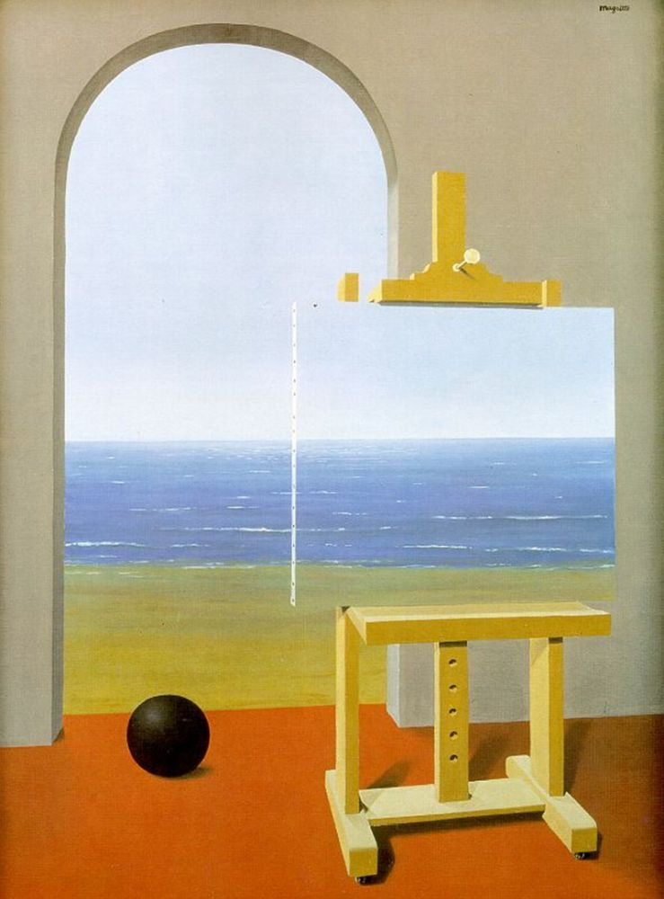

# Nuestra ventana al mundo

")

# La subjetividad de la percepción

> Me pregunté: *¿Es la realidad única y absoluta?*

Observé que los **recuerdos** y **emociones** influyen en mi percepción, como un filtro que transforma lo mismo en
distinto para cada persona. Cada encuentro con las cosas —objetos, lugares, momentos— teje una red de significados
basada en experiencias pasadas.

La **subjetividad** emerge precisamente de esta combinación entre el presente y los recuerdos que ese presente evoca.
Esos recuerdos llevan consigo la huella de lo que fue, dónde fue y cuándo fue, elementos que configuran nuestra
interpretación del momento actual. Nuestra mente procesa estos recuerdos con las herramientas disponibles en el momento
de la experiencia, por eso la subjetividad está fuertemente relacionada con el contexto en que vivimos.

Por ejemplo, una ventana abierta no es solo un marco con aire: para mí, es el sitio donde el gato duerme al
sol; para otro, un riesgo de frío. Estos significados, acumulados como capas, forman los **marcos de referencia** que
usa mi mente para definir la realidad.

Incluso las palabras, al ser transmitidas, mutan: lo que para mí es *«sombra»* puede ser *«refugio»* para otro.
Comprendí que nuestra relación con las cosas no es neutral. La dinámica de estas relaciones se manifiesta al transformar
el presente, creando la realidad que observo.

> Pero entonces surgió una paradoja: *¿Cómo percibimos algo desconocido, sin un marco previo?*

Al enfrentar lo desconocido, la mente crea un nuevo marco: una hoja nunca vista se vuelve *«planta tropical»* al
relacionarla con lo conocido. Así, cada observación es un diálogo entre lo aprendido y lo descubierto, entre el
pasado que filtra y el presente que exige reinterpretación. Ininterrumpidamente, en la mente se produce una **adaptación
frente a lo desconocido**.

La realidad, concluí, no es un espejo objetivo, sino un tejido de interacciones. Y en ese collage, hasta la ventana más
común guarda mil versiones distintas, tantas como miradas la hubieran vivido.

# Marcos referenciales únicos

> Al entender que cada marco de referencia es único, me pregunté: *¿Ser observadores únicos nos condena al
malentendido?*

Imaginé mover la cama frente a la ventana. Para la planta, eso significa perder la luz que necesita para crecer. Para el
gato, implica abandonar su rincón soleado donde duerme. Para mí, es ganar espacio disponible en la habitación. La acción
de *«mover la cama»* une estas perspectivas, pero cada una la define desde su necesidad: supervivencia, comodidad,
orden.

Al decir *«ventana»*, un jardinero piensa en horas de luz para sus plantas, un carpintero en el tipo de madera del
marco, y el gato en el calor del sol en el piso. Las palabras crean sentidos compartidos, pero también esconden mundos
privados. Reflexioné que el lenguaje actúa como un **puente imperfecto**.

> Pero había una paradoja: *¿Por qué, incluso entre expertos, las diferencias se amplían?*

Un poeta y un biólogo pueden discutir sobre la *«planta»* sin entenderse: uno ve simbolismos y metáforas, el otro ve
fotosíntesis y polinización. La especialización, aunque útil, crea barreras entre marcos.

Pensé que decir *«la planta necesita de luz y riego para vivir»* en lugar de *«hay que mantenerla viva»* acorta
distancias entre perspectivas. La clave no es unificar visiones, sino elegir palabras que, como escalones, permiten
ascender juntos, aceptando que cada uno ve un paisaje distinto desde la misma ventana. Entonces comprendí que, así como
mover la cama exige considerar la planta, el gato y la luz, comunicarse requiere escalar hacia términos concretos.

# Sistemas y límites del entendimiento

> Reflexioné: *¿El entendimiento está autolimitado?*

Pensé en la dinámica que tiene un concepto una vez que es interiorizado. Tanto lo desconocido como lo conocido **adoptan
formas** delimitadas por el observador. Por ejemplo, un neurólogo interpreta un dolor de cabeza como redes neuronales, y
un teléfono convierte ondas de sonido en datos binarios. Estos sistemas definen sus propios límites: lo que puede ser
procesado, entendido o comunicado.

Reflexioné que cada sistema —una mente, una disciplina, incluso una máquina— interpreta las señales externas a un
**lenguaje interno coherente**. Dos sistemas pueden comunicarse solo si sus lenguajes internos encuentran puntos de
traducción: el *«dolor»* para un médico y un paciente, o el *«código»* para un programador y una computadora. Pero
incluso en la traducción perfecta, algo siempre se pierde: el marco del otro nunca es idéntico al propio. Así, los
marcos de referencia no solo filtran la realidad, sino que limitan el alcance del entendimiento.

# Comunicar una reflexión

# La elección de las palabras

> Me pregunté: *¿Cómo comunicar correctamente lo que quiero decir?*

Las reflexiones anteriores me enseñaron que la comprensión depende del marco de referencia del otro. Si necesito
explicar cómo mover una cama, necesito evitar términos como *«traslación de mobiliario»* y preferir frases simples: *«La
cama estaba contra la pared ayer, hoy la puse frente a la ventana»*. Las palabras cotidianas reducen malentendidos
porque se anclan en experiencias compartidas. Reflexioné que todo comienza con **palabras conocidas**.

Pero también descubrí límites: para un niño, *«cama»* es donde descansa su peluche; para un carpintero, un objeto de
roble y clavos. Las mismas palabras pintan paisajes distintos. Por eso, elegirlas ya no es solo cuestión de claridad,
sino de **puentes entre marcos**: usar términos que resuenen en el mundo del otro, incluso si eso significa perder
precisión técnica. La comunicación perfecta es imposible, pero la **empatía** acorta distancias.

# El sentido: el camino de la idea

> Me pregunté: *¿Cómo transmitir las relaciones entre las cosas?*

Pensé en el **camino lógico** que las conectaba. Por ejemplo, al explicar por qué moví la cama, no me limito a decir
*«ahora está frente a la ventana»*, sino que detallo: *«Quería más luz al despertar. Ayer, cuando el sol entraba por la
ventana, la cama quedaba en sombra. Al moverla hoy, la luz cae directamente sobre ella»*.

Así, el otro no solo ve la acción, sino **la red detrás**: la necesidad inicial (más luz), la acción concreta (mover la
cama) y las consecuencias lógicas (luz directa al despertar). El sentido es como tejer una trama con **motivo, acción y
resultado**, formando una imagen completa y en movimiento.

Reflexioné que las palabras solas no bastaban. Comprendí que el **sentido** es la brújula que guiaba al receptor,
mostrando los hilos que unían las cosas entre sí.

# La simpleza: la escala de lo cotidiano

> Me pregunté: *¿Por qué hablar de «energía» o «espacio» abstractos si puedo usar ejemplos como una cama, una habitación
o la luz del sol?*

La realidad que todos compartimos —objetos que ocupan lugares, acciones que llevan tiempo— es el **terreno común**. Si
menciono *«mover la cama depende de quitar la maceta antes»*, cualquiera puede visualizarlo. Pero si digo *«calcular
los movimientos necesarios según cómo están dispuestos los objetos en el espacio»*, solo unos pocos entienden.

La simpleza consiste en usar la **escala humana**: aquella donde las cosas se ven, se tocan y se transforman sin
necesidad de teorías. Reflexioné que la simpleza no era simplismo, sino anclaje en lo conocido mutuamente.

# El tiempo: la síntesis en la mente del otro

> Me cuestioné: *¿Qué pasa si voy demasiado rápido para que las ideas se asienten?*

Imaginé el proceso: al decir *«moví la cama frente a la ventana»*, el otro necesita recordar cómo era la habitación
antes, luego entender el motivo, después visualizar el movimiento y finalmente ver las consecuencias desde su propia
perspectiva. Si acelero el ritmo, ese proceso mental se atropella, como intentar correr sobre arena suelta.

A medida que el otro acumula comprensiones parciales —como cuando se empuja una cama que estaba quieta o se giran las
hojas de una planta hacia la luz—, las nuevas ideas fluyen con más velocidad. Ya no tropezamos, porque pisamos sobre
un suelo firme de significados compartidos. Dar el ritmo correcto no es frenar, sino **sincronizar**: permitir que cada
paso construya el siguiente, hasta que el mensaje entero cobrara vida en la mente del otro.

Finalmente, entendí que incluso con palabras claras y ejemplos sencillos, falta un ingrediente: el **ritmo adecuado**.

# La interdependencia de los cuatro pilares

> Me pregunté: *¿Hay materiales para construir el entendimiento?*

Las palabras son los ladrillos, el sentido el diseño que los ordena, la simpleza la base que asegura su legibilidad, y
el tiempo el cimiento que permite construir el edificio mental paso a paso. La comunicación correcta, comprendí, es un
equilibrio: tan precisa como la energía necesaria para mover una cama, tan tangible como el espacio que ocupa, y tan
paciente como el tiempo que tarda en caer la luz de la ventana sobre ella. Al final, vi que estos elementos no pueden
funcionar por separado.

# El mito: vehículo narrativo de la reflexión

> Me pregunté: *¿Es el narrador como observador pasivo?*

Reflexioné sobre esta misma historia y su narrador. Todo autor forja una abstracción continua que entrelaza el proceso
reflexivo. Pero al transmitirla, debe concretarla: convertirla en conceptos, palabras, relatos. En esa transformación
—al elegir qué contar y cómo— materializa su pensamiento en un vehículo que transporta solo una síntesis de la reflexión
original.

Así emerge la **autoridad**: en el puente entre el pensamiento abstracto y su concreción narrativa. Quien decide el qué
y el cómo del relato, impone un filtro sobre cómo los demás internalizan el mundo. Comprendí que el **mito** nace de
esta necesidad: ser el instrumento que la autoridad usa para persuadir, revistiendo verdades con ropajes de
inevitabilidad histórica.

Las palabras contienen mundos, y esos mundos se organizan en un árbol de significados en nuestra mente. Por eso,
reflexioné, la autoridad se apropia de las palabras que necesita usar para transmitir sus conceptos. La liberación
está en la re-abstracción. La abstracción **facilita** la observación para leer entre líneas y extraer los conceptos
fundamentales. Esos conceptos abstractos son semillas que regeneran el árbol del conocimiento en nuestra mente,
despejando el bosque de **dogmas** que el mito había sembrado.

Si las palabras y su transmisión no son inocentes, este mismo texto —al denunciar mitos mientras teje su relato— debe
exponerse al mismo desmontaje. El **proceso reflexivo** es la herramienta ideal para alcanzar el pulso fundamental de
cualquier relato.

# El peso de la reflexión honesta

# Futuros y consecuencias

> Me pregunté: *¿Por qué reflexionar con honestidad cambia lo que hacemos?*

Si mi intención es mover la cama frente a la ventana, no me limito a pensar *«quedará bien allí»*, sino que indago:
*¿Modificará la cantidad de luz que recibe mi planta? ¿Limitará el espacio donde mi gato suele descansar? ¿Gastaré
energía que podría usar para regar el jardín?* Esa honestidad me lleva a confrontar no solo el acto, sino sus
consecuencias en la vida de otros seres. Concluí que un **camino reflexivo honesto** no omite preguntas incómodas ni
salta a conclusiones fáciles, sigue cada paso, incluso cuando revela verdades difíciles o que confrontan con mis deseos.

# La honestidad como brújula hacia futuros predecibles

> Me pregunté: *¿Cómo reconozco la honestidad entre las opciones que tengo?*

Al reconocer que mover la cama desplazará la maceta a un rincón oscuro, puedo anticipar que la planta se debilitará. Si
admito que mi gato prefiere dormir bajo la ventana, debo buscar un lugar que no invadiera su espacio. Cada verdad
aceptada es un paso hacia decisiones que respetan las necesidades de todos. La seguridad no viene de adivinar, sino de
construir el futuro con empatía. Entendí que la **empatía** no es un sentimiento, sino un acto lógico: solo entendiendo
las necesidades de otros, las propias pueden ser comprendidas. Al evitar autoengaños, la reflexión traza futuros más
precisos. La opción honesta es la que surge de poner las necesidades de los otros al mismo nivel de las propias.

# Las consecuencias como espejo y maestro

> Me cuestioné: *¿Por qué algunas acciones nos sorprenden con resultados negativos?*

Si, al decidir mover la cama, ignoro que la planta necesita esa luz para florecer, meses después enfrentaría hojas
marchitas. Pero si durante el análisis considero ese detalle, puedo elegir: moverla y rotar la maceta diariamente, o
buscar otro lugar. Reflexioné que parte de la respuesta está en la **reflexión incompleta**.

La profundidad del análisis determina cuántos escenarios podemos prever, pero siempre habrá factores imprevistos.
Incluso tras una decisión cuidadosa, la planta puede sufrir consecuencias negativas. Pero eso no es un fracaso: es una
lección. Quizás necesita más humedad, menos corrientes de aire, o simplemente tiempo para adaptarse. Así, cada
consecuencia —esperada o no— se convierte en una oportunidad de aprendizaje. No son castigos, sino señales: un eco de lo
que hemos pasado por alto y una guía para ajustar el cuidado. El ciclo continúa: observar, calcular, transformar,
comparar, y volver a empezar, con nuevas preguntas. Descubrí que **nunca controlamos todas las variables** en un sistema
tan complejo como la vida.

# Dos líneas temporales

> Imaginé: *La misma habitación separada en el tiempo por el mismo acto de reflexionar*

En una línea temporal, moví la cama **sin reflexionar**. El sol dejó de bañar las hojas de la planta, que lentamente
perdió su verdor. Mi gato, al no encontrar su rincón soleado, comenzó a dormir en el sofá, lejos de la ventana que antes
amaba. Yo, ocupado en mis tareas, no noté los cambios hasta que la planta casi murió y el felino dejó de ronronear al
atardecer.

En otra línea, antes de mover la cama, me detuve. Observé cómo la luz entraba por la ventana y cuánto tiempo permanecía
en cada rincón. Noté que la planta inclinaba sus hojas hacia el sol de la mañana, y que el gato se estiraba justo donde
los rayos calentaban el piso. Entonces, moví la maceta para que recibiera luz y dejé un espacio libre bajo el vidrio
para él. La planta siguió creciendo, el gato mantuvo su ritual, y llegué a entender que mover la cama no es solo un acto
físico: es un ajuste en una **red invisible de necesidades**.

# La abstracción como puente

> Reflexioné: *¿La abstracción es la herramienta para reflexionar honestamente?*

Las cosas —la planta, el gato, incluso la luz— tienen sus propias direcciones, sus propias urgencias. La planta se
mueve hacia el sol, el gato hacia el calor, y mis pensamientos deben moverse hacia ellas, no al revés. Este proceso me
enseñó que la reflexión honesta requiere **alejarme de mis propios deseos**. No se trata de lo que yo quiero, sino de
cómo mis actos resuenan en otros. La abstracción realiza esta tarea de forma automática, es su propósito, separar las
cosas de sus capas superficiales para comprender su esencia.

# La paradoja de la seguridad

> Reflexioné: *¿La reflexión despeja las opciones de nuestros actos?*

Al reflexionar honestamente, identifico riesgos inevitables: tal vez la planta tardará en adaptarse, o el gato
necesitará días para aceptar el cambio. Aceptar esos límites me permite actuar con claridad: *«Haré esto, acompañando
sus procesos»*. La seguridad es, en el fondo, respeto por los tiempos ajenos. Descubrí que la seguridad no nace de
controlarlo todo, sino de **reconocer qué no puede ignorarse**.

# La reflexión como brújula entre futuros y espejismos

> Reflexioné: *¿La reflexión nos permite reconocer las consecuencias de nuestras acciones antes de realizarlas?*

Al observar cómo la planta inclina sus hojas hacia la luz que mi cama bloquea, o cómo el gato busca en vano su rincón
soleado ahora ocupado, mis elecciones dejan de ser impulsos ciegos para volverse puentes hacia futuros posibles. Estos
futuros no son sueños vacíos: se construyen con la luz que la planta necesita para respirar, el espacio que el gato
exige para descansar, y el tiempo que ambos requieren para adaptarse sin ser fracturados. La reflexión honesta no es una
carga, sino un **diálogo con lo real**.

La planta busca el sol, se adapta a su espacio y lo hace en un ritmo temporal que anticipa un futuro mejor. Este no es
un proceso externo al sistema, sino la expresión más pura de que la **causalidad fundamental** es la misma dinámica del
sistema en busca de sus necesidades.

Si imagino mundos donde la planta florece en la oscuridad, el gato renuncia a su rincón sin protestar, y el espacio se
adapta a mis deseos, esos mundos se desvanecen al primer contacto con la realidad: la planta, privada de luz, marchita
sus hojas; el gato, desplazado, busca refugio lejos de mí; y el espacio, lejos de obedecer, revela su naturaleza: un
entramado de límites y equilibrios que no negocia con fantasías.

Entendí que la reflexión deshonesta —aquella que omite preguntas o silencia las necesidades ajenas— solo alimenta
**espejismos**. La mente, al proyectar consecuencias, puede navegar en dos aguas. Si sigue el cauce de la honestidad,
anticipa **efectos en cadena**: hojas que se tuercen buscando supervivencia, hábitos que se quiebran, ciclos que exigen
ajustes lentos. Si se hunde en la deshonestidad, inventa un teatro efímero donde las cosas callan y los seres se
someten, hasta que el telón se abre y la realidad entra en escena.

La deshonestidad es un laberinto de espejos que reflejan solo mi propia voz, hasta que el cristal se quiebra y quedo
frente a lo que había ignorado: un mundo que existe independientemente de mis deseos. Por el contrario, la reflexión
honesta es un **viaje hacia futuros** donde humanos, plantas y animales coexisten sin anularse.

# La condición humana: Reflejo de los sistemas cósmicos

# Hacia una síntesis

Las reflexiones anteriores me mostraron los límites que enfrentamos al intentar comprender y comunicar lo que nos rodea.
Quería encontrar una forma sencilla de explicar cómo la **Energía**, el **Espacio** y el **Tiempo** se relacionan, no
como conceptos aislados, sino como partes de un mismo tejido.

# Los límites y las características específicas

Comencé pensando en sus fronteras: imaginé que el Espacio contiene los **límites externos** de la Energía, como un
recipiente que limita su expansión. A su vez, el Tiempo parece marcar los confines del Espacio, como si su paso
constante definiera los límites de lo existente. Y, finalmente, la Energía actúa como una barrera para el Tiempo,
determinando la duración antes de transformación.

Luego invertí la perspectiva: pensé que el Tiempo, **desde dentro**, moldea la expresión de la Energía, definiendo su
ritmo y su intensidad. La Energía, a su vez, modifica las propiedades del Espacio, como su densidad o su curvatura. Y el
Espacio, desde su interior, influye en el flujo del Tiempo, acelerándolo o ralentizándolo según su propia geometría.

Entonces recordé la cama que había movido en mi habitación. Un acto aparentemente trivial, pero que alteró el Espacio
disponible, modificó la distribución de la luz y el calor —la Energía—, y alteró los ritmos cotidianos —el Tiempo—
de la planta, el gato y hasta mis propias rutinas. Era como tirar una piedra a un estanque: las **ondas** se expanden,
chocan con las paredes y regresan al centro, modificadas. Cada cambio, por pequeño, desencadena ajustes en los sistemas
que habitan la habitación. La planta gira sus hojas hacia la nueva luz, el gato busca otro rincón cálido, y hasta el
polvo flotante se desplaza en remolinos invisibles. Todo responde, no por obediencia, sino por esa **interconexión**
silenciosa que une lo que existe.

# La estructura de la realidad

Al ver estas interdependencias, como hilos que se entrelazan sin principio ni fin, donde la mínima acción sobre una
parte afecta a las otras en una cadena de efectos, me vino a la mente la imagen de un **nudo**. No cualquier nudo, sino
uno específico: el nudo trébol, el más simple de los nudos no triviales. Tres lóbulos (Energía, Espacio y Tiempo) unidos
en un centro común, cada cuerda pasando por encima y debajo de las otras, formando un **ciclo cerrado** donde ninguna
domina, pero todas se sostienen.

Entendí que la realidad no es un agregado de partes, sino un equilibrio dinámico. Como el nudo trébol, cada elemento
—Energía, Espacio, Tiempo— se define mutuamente al cruzarse con los otros. Y en esos cruces, incluso lo más cotidiano
refleja una ley universal: **nada ocurre sin resonar en todo lo demás**.

# La ventana de observación

Los **marcos de referencia**, útiles al principio para ordenar el mundo, terminan creando barreras cuando se vuelven
**absolutos**. Lo que inicialmente ayuda a comprender, después limita, reduciendo la realidad a los **confines** de sus
propias reglas, como un faro que primero ilumina lo desconocido, y luego limita al prohibir mirar más allá de su haz de
luz. Cuando los datos desbordan un marco, se inventan necesariamente explicaciones sacralizadas por consenso para
explicar las paradojas emergentes.

# Las escalas de la realidad

Las escalas, por su parte, no son solo medidas: limitan lo que podemos percibir y lo que queda oculto. Decidí explorar
mentalmente otras escalas de lo real, buscando sus elementos esenciales: energía, espacio y tiempo. Observé cómo sus
interacciones internas se transmiten como **pulsos** que generan **resonancias**, y cómo cada acto, por mínimo,
desencadena **transiciones** que reverberan en todas las escalas. Así entendí que incluso lo imperceptible afecta al
todo: un gesto aquí transforma patrones allá, como una vibración que viaja por los hilos invisibles de lo existente.

Cada pulsación se transmite a través de todas las escalas, donde niveles inferiores y superiores, invisibles a nuestra
observación, reproducen el mismo patrón dentro de sus límites. Así como estas escalas me escapaban, también me escapan
en el tiempo de sus efectos las **consecuencias** de mis acciones. Reflexioné que es por ello que a menudo no
relacionamos nuestros actos con sus efectos, incluso cuando estos se **manifiestan** ante nosotros.

# Los mecanismos de la realidad

La semilla que dio origen a mi planta no solo creció: **atravesó escalas**. En meses, duplicó su tamaño, modificando el
espacio que ocupa y la energía que gestiona. Detrás de este cambio visible, hubo reacciones químicas íntimas. En cada
hoja, la clorofila atrapó fotones con una estructura en forma de anillo (clorofila), convirtiendo la luz en energía
química. Esa energía, transportada como glucosa, transportó y utilizó para reorganizar células y tallos. Si miramos más
cerca, cada salto de electrones —desde niveles atómicos altos a bajos— liberó ondas de energía residual, como ecos de
un pulso inicial. Y ese pulso comenzó mucho antes: el fotón que capturó la planta nació en el núcleo del Sol, donde
fusiones atómicas lo impulsaron hacia el espacio. Viajó 150 millones de kilómetros hasta interactuar con un electrón en
la Tierra, activando una cadena que hoy sostiene cada hoja. Así, lo que llamamos “crecer” es un diálogo entre escalas:
lo **subatómico** se vuelve químico, lo **químico** se hace visible, y lo **cósmico** se manifiesta en lo **cotidiano**.

# Un flujo continuo

Reflexioné sobre aquel pulso formando **un flujo continuo**. Un mismo ritmo que resonaba al adentrarme en las cosas
o alejarme de ellas, tomando formas distintas en todas las escalas y tiempos. Un único mecanismo que regula cómo E, S y
T interactúan y se equilibran.

Al mover la cama gastas energía al moverla (E) que altera la luz en la habitación (modificando S). Con el tiempo (T), la
planta se inclina hacia la ventana y el gato busca nuevos rincones. Lo que parece desorden aparente es este movimiento
convirtiendo un acto simple en una cadena de **ajustes** triádicos. De igual manera, al encender una lámpara (E), la luz
atrae insectos que modifican su vuelo (S), mientras las plantas ajustan su crecimiento según las nuevas horas de luz (
T). Cada gesto —desde un interruptor hasta regar una maceta— desencadena redes donde estas tres fuerzas se compensan
**sin pausa**.

# Transiciones entre escalas

Reflexioné sobre cómo los distancias entre escalas revelan **puentes** que transforman sistemas. Cambios mínimos
reconfiguran sistemas enteros cuando saltan de nivel.

Una supernova libera energía colosal (E) que curva el espacio-tiempo, dispersando elementos para nuevos planetas.
Esa muerte estelar da lugar a futuros cósmicos. Mientras tanto, una mutación en una bacteria (cambio en la energía
local) le permite resistir antibióticos. Con tiempo suficiente (T), domina ecosistemas (S), alterando cadenas
alimentarias y afectando especies mayores. En otro lugar, una semilla (E) germina. Tras décadas (T), crea un bosque (S)
que modifica el clima regional. Lo que nació en centímetros termina **modificando kilómetros de territorio**.

# Uniendo el Nudo

Mover una cama, cultivar un bosque o fundar una civilización son variaciones de la misma patrón, escrita con las
notas *E*, *S* y *T*. El *nudo primordial* no es una metáfora: es la estructura oculta que une lo cotidiano y lo
cósmico. Cada gesto, por mínimo que parezca, es un nudo en la red primordial de la realidad: modifica un hilo, y **el
universo entero responde**.