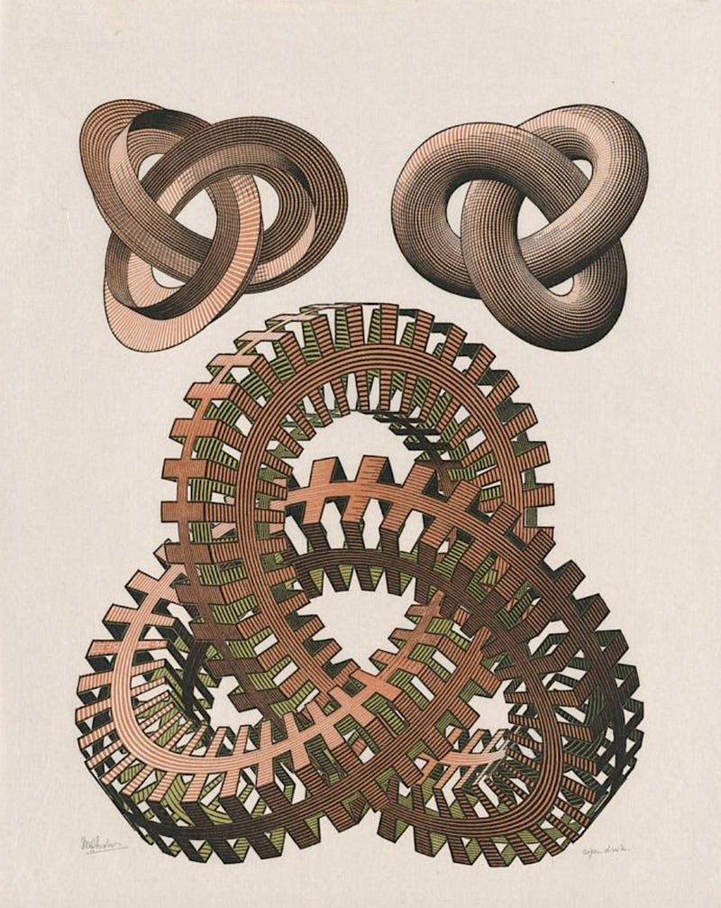

# Nuestra existencia es un juego de espejos en múltiples dimensiones

")

# Espejos dentro de espejos

> *Me pregunté: -¿Somos limitados por nuestra escala?*

Reflexioné que siempre buscamos **romper los marcos** que limitan nuestra visión. Explorar un sistema implica explorar
hasta los límites de sus fronteras. En ese recorrido hay largos periodos de aparente **monotonía**, pero
allí se acumulan cambios que luego emergen como **diversidad**.

Recordé que no podemos ver diferentes escalas simultáneamente. Volví al perro y al caballo, cómo perdían la diferencia
entre ellos al alejarse y las recuperaban al acercarse. Pero en mi pensamiento podía alejarlos y acercarlos a voluntad,
observando cómo ese **juego de escalas** se repetía sin fin.

Imaginé la Tierra desde lejos: una esfera azul uniforme. Esa uniformidad ocultaba por completo la actividad frenética
que la conforma. Al acercarme mentalmente, los colores se separaban: verdes y amarillos se distinguían de los rojos, el
azul los envolvía a todos, mientras el blanco de las nubes giraba en remolinos. La esfera revelaba entonces
características ocultas —profundidades, montañas, ríos— y sobre todo, **movimiento**. Todo en perpetuo movimiento.

Pensé que podía aplicar este mismo enfoque a los fenómenos físicos en sus escalas extremas. Imaginé un núcleo atómico:
protones cargados positivamente que se repelen, pero contenidos por fuerzas invisibles durante fracciones mínimas de
tiempo. Luego imaginé una galaxia: estrellas que tienden a dispersarse, unidas por gravedad durante eones.

Comprendí entonces que las reglas no cambian. Solo la **escala**.

> *Me pregunté: ¿Entonces, las escalas no separan los sistemas, cuando en realidad los conectan?*

Pensé cómo la física se convierte en química al cambiar la escala del espacio. En las estrellas, el hidrógeno —como
manifestación del Espacio (S)— se comprime hasta fusionarse, liberando Energía (E) en forma de luz durante millones de
años, un Tiempo (T) cósmico. En las plantas, esa misma luz (E) es capturada por la clorofila (S) y convertida en glucosa
en fracciones de segundo (T). Así comprendí que fotosíntesis y fusión estelar son manifestaciones de una misma
**transición entre escalas**. La estrella y la hoja no son opuestas: son eslabones de una cadena cósmica donde los
límites entre físico y químico se desdibujan al cambiar la escala.

> *Me pregunté: ¿Qué dinámica subyace a esta conexión entre escalas?*

Reflexioné que toda acción se inicia en niveles profundos del pensamiento —estimulado por los sentidos y experiencias—.
Este impulso genera acciones que ascienden desde lo **particular** hacia sistemas cada vez más **generales**,
transformando la realidad en mi escala. La transformación continúa luego en sistemas próximos, avanzando desde lo
**superficial** hasta lo **profundo**, lo que finalmente provoca una respuesta al cambio. Así, mi escala se revela como
un **punto de conexión** entre niveles de realidad que **trascienden los sentidos**.

> *Me pregunté: ¿Estas etapas se reflejan internamente en los sistemas?*

Observé cómo la física se convierte en biología al alterar la escala del tiempo. Las presiones ambientales —sequías,
depredadores, como Energía (E)— modelan rasgos (S) durante millones de años (T), igual que la gravedad (E) modela
galaxias (S). Los saltos evolutivos —alas de aves, cerebros humanos— son transiciones de fase: mutaciones (E) que
modifican cuerpos (S) en tiempos (T) ecológicos. Finalmente, reflexioné que el pico de un pinzón y el brazo de una
galaxia espiral son modelados por el mismo proceso dinámico, solo que en escalas distintas: cósmica, biológica, atómica.

> *Me pregunté: ¿Las mismas dinámicas gobiernan los sistemas humanos?*

Reflexioné sobre las civilizaciones como **transiciones de fase** en sistemas complejos humanos. Pequeños cambios
acumulados que, al alcanzar un umbral crítico, provocan saltos cualitativos reconfigurando el escenario para el próximo
ciclo. Visualicé ese impulso primordial expandiéndose hasta su apogeo, para luego disolverse progresivamente en el
tiempo y el espacio: contrayéndose, colapsando, dispersando sus componentes hacia nuevas configuraciones sociales.

Tomemos Roma: su ascenso nació de gestionar recursos agrícolas (E), tejer redes de caminos (S) y **sincronizar** ciclos
políticos (T). Su ocaso replicó el fin estelar: agotó recursos (E), fragmentó su territorio (S) y perdió coordinación en
el tiempo (T).

Así comprendí que calzadas y acueductos no eran simple infraestructura. Eran transformaciones creativas que
transformaron aldeas en un organismo interdependiente, igual que la gravedad condensa polvo cósmico en estrellas. Y su
caída resultó tan **inevitable** —y predecible en su patrón de colapso— como el colapso de una gigante roja agotando su
combustible.

# El espejo infinito

Desde el núcleo de un átomo hasta el corazón de un imperio, transformaciones creativas y saltos de escala convierten el
**caos en patrones**, y los patrones en nuevos caos fecundos. No somos testigos ajenos a este juego: somos la superficie
donde se reflejan —y que a su vez refleja— las reglas que tejen el cosmos. Fusionar hidrógeno, organizar átomos en
enzimas o gobernar civilizaciones no son actos separados: son variaciones de una misma partitura escrita con las notas
de energía, espacio y tiempo, donde cada nivel canta la melodía primordial en un registro distinto.

La realidad no es un mosaico de fenómenos aislados, sino un tejido de reflejos encadenados. En cada escala —de lo
cuántico a lo cósmico, de lo biológico a lo social— los mismos principios resurgen como patrones en un caleidoscopio
infinito, girando sobre sí mismos para crear nuevas simetrías.

# La paradoja de los marcos de referencia

# La perspectiva

> *Me pregunté: ¿Cómo puede el mismo universo ser tan distinto según desde dónde lo miremos?*

Reflexioné que nuestras categorías —lo pequeño, lo cotidiano, lo infinito— dividen el mundo en compartimentos que
parecen aislados. Pero ¿y si esas **fronteras** fueran espejismos de nuestra mirada? Surgía una paradoja: cuanto
más definimos la realidad desde un marco, más olvidamos que todo sigue un mismo ritmo. Así inicié un viaje donde
cambiar de lente dejó de ser ejercicio imaginativo para convertirse en revelación: el mismo ritmo que gobierna el giro
de un electrón gobierna el movimiento de las galaxias, y hasta tus pasos por la ciudad llevan ese compás cósmico.

# Tres perspectivas, una misma sinfonía

> *Imaginé usar tres tipos de lentes, cada par revelando una capa distinta de la realidad.*

Con las lentes microscópicos, observé electrones danzando como chispas de energía (E) alrededor de núcleos atómicos,
mientras el espacio (S) se desdibujaba en probabilidades y el tiempo (T) se medía en attosegundos. Un mundo donde la
materia era pura incertidumbre cuántica.

Al cambiar a los lentes humanos, vi ciudades vivas: personas fluyendo como corrientes energéticas (E) por calles que
tejían redes espaciales (S), todas sincronizadas por ciclos circadianos (T). Madrugadores llenando cafeterías al alba,
noctámbulos iluminando avenidas con luces artificiales.

Finalmente, con los lentos telescópicos, descubrí galaxias donde estrellas —cúmulos de energía pura (E)— giraban en
espirales espaciales (S) durante milenios (T), arrastradas por fuerzas invisibles como hojas en un río cósmico.

Reflexioné que cada lente mostraba una "realidad" distinta, pero todas obedecían al mismo ritmo fundamental: la energía
**transformándose**, el espacio **estructurándose**, el tiempo **sincronizando**. El problema no estaba en lo observado,
sino en el marco: creer que un átomo es solo partículas o una ciudad solo cemento, nos impide ver la sinfonía unitaria
que entrelaza escalas.

# La clave es cambiar de escala

> *Me pregunté: ¿Reflexionar entre escalas permite revelar patrones ocultos?*

Pensé en aplicar cambios en la escala a mis propios pensamientos, saltando entre perspectivas para descubrir lo que
subyace entre ellas. Sistemas complejos, comprendí, guardan capas de significado entrelazadas, y solo la abstracción
permite reconocer los hilos que las unen.

Recordé a Einstein transformando la gravedad: saltó del escenario estático newtoniano (espacio inmóvil) a un
espacio-tiempo donde la energía (E) curva el espacio (S) y redefine el flujo temporal (T). Así reveló que la manzana
cayendo y los planetas orbitando eran variaciones de un mismo movimiento cósmico.

Observé a Darwin en las Galápagos: en aquellas islas (S fragmentado) vio cómo recursos limitados (E) y tiempo profundo (
T) modelaban picos de pinzones adaptados. Lo que parecía diseño local era en realidad el ritmo universal de la evolución
manifestándose en escala íntima.

Finalmente, la mecánica cuántica nos enseñó que las partículas en el espacio (S) existen como potencialidades (E) hasta
que el acto de medir (T) las define. Medir no es observar pasivamente: es participar en la coreografía donde
**observador y observado crean realidad** en conjunto.

# Cambio cualitativo

# El arte de cambiar la escala de la mirada

> *Me pregunté: ¿Los grandes cambios se producen cuando se conectan escalas?*

Reflexioné que Einstein, Darwin y los pioneros cuánticos no fueron visionarios por ver más, sino por ver a través de
escalas. Esa transición —attosegundos a milenios, átomos a galaxias— no es una ilusión: es la llave que desvela
paradojas. Un electrón, una ciudad y una espiral estelar no son reinos aislados; son la misma tríada resonando en tres
escalas: vértigo cuántico, ritmo humano y paciencia cósmica. Cambiar de lente no es negar la realidad, sino
**descubrir** su textura profunda —aquella donde todos los hilos vibran en la misma red viva.

> *Me pregunté: ¿Por qué observamos distancia entre las escalas?*

Al mover mi cama esta mañana, noté que la planta giraba sus hojas hacia la nueva luz y el gato buscó otro rincón cálido.
Me di cuenta de que no percibimos como **significativo** aquello que permanece uniforme en la escala del observador: la
velocidad constante del viento, el olor familiar de mi habitación, incluso mis propias rutinas. Estos elementos, por su
estabilidad, se vuelven invisibles para mí, como si fueran inexistentes. Así acepto comportamientos como normales e
incluso dogmas sin cuestionarlos, hasta que **algo** los interrumpe y revela los **límites** que antes no veía.

> *Me pregunté: ¿Es posible ignorar el impacto de un cambio cualitativo?*

Reflexioné que las grandes revoluciones humanas nunca son solo avances técnicos: son cambios en la escala que redefinen
cómo vemos y habitamos el mundo. Cada una es una alquimia perceptual donde movimientos cercanos se recombinan para
**convertir lo imposible en inevitable**. Y una vez ocurrido, ese salto se convierte en el nuevo marco desde el que
observamos.

Todo sistema, comprendí, se defiende de cambios externos. Traduce y filtra lo que entra en él para mantener su
equilibrio. Pero cuando una transformación supera sus límites —cuando altera la escala misma— ningún sistema puede
preservar su estabilidad sin adaptarse a los **nuevos horizontes** que ese salto ha forjado.

> *Me pregunté: ¿Es posible un cambio cualitativo sin superar los límites del sistema?*

Pensé en los cambios en la escala —esos saltos que redefinen lo real— como señales de un **marco superado**.
Cuando un límite es superado, se revela en una capa superior de comprensión. Solo emergen de su escala aquellos
cambios cuyas tensiones acumuladas (energía) ya no pueden contenerse en los moldes autoimpuestos (S) forzando una
reconfiguración en el ritmo temporal (T). Así, superar los preceptos del marco anterior no es destrucción, sino el
único camino para que lo **incoherente** vuelva a **coherencia**, y del caos creativo surja un nuevo equilibrio que
concretiza y expande lo abstracto.

> *Me pregunté: ¿El salto cualitativo empieza en un lugar concreto?*

Reflexioné que todo comienza en las fronteras donde se **acumulan las **tensiones** (energía). Allí, en los **límites
del sistema** (S), las contradicciones alcanzan su máxima intensidad, como fisuras que anuncian una transformación
inminente** (T). Observé que estas tres fuerzas siempre trabajan juntas, como las tres cuerdas de una guitarra que,
aunque tocan notas distintas, crean una sola melodía. No son independientes, sino tres aspectos de un mismo fenómeno
cósmico. Estas fuerzas producen un **gradiente de fuerza**, por eso un observador deja de percibir sus efectos
mientras se aleja de la fase transformadora. Quien mira los mismos fenómenos desde las proximidades de la frontera ve
cómo lo establecido **se rompe** para dar paso a lo nuevo. Así las transiciones no emergen en el núcleo estable, sino
en los márgenes donde el sistema negocia su cambio, igual que un neologismo nace cuando el lenguaje ya no puede
contener el mundo que debe nombrar.

# Revoluciones como cambios de fase: Cambiar las reglas del juego

> *Me pregunté: ¿Cuán profundos pueden ser los cambios que redefinen lo humano?*

Hace doce mil años, el cazador enterró su lanza. Al cambiar energía inmediata (energía en presas fugaces) por espacio
gestionado (S) en ciclos estacionales (T), no solo sembró semillas: domesticó el tiempo. Convirtió la incertidumbre del
acecho en calendario de surcos, transformándose de depredador en jardinero cósmico donde las estaciones (T) **ordenaron
el caos en patrones**.

En el siglo XVI, el mito se desvaneció ante el compás. Tras cambiar energía mística (energía en dioses caprichosos) por
espacio matemático (S) verificado en tiempo experimental (T), Galileo no midió caídas: midió nuestra capacidad para
traducir relámpagos en números. Donde antes veíamos el rayo de Zeus, ahora representamos relámpagos con el álgebra.

Hoy, nuestros dedos acarician pantallas. Al intercambiar energía física (energía en fábricas) por espacio virtual (S)
regido por tiempo algorítmico (T), un clic ya no mueve moléculas: **transfiere identidades**. Las manos que un día
moldearon barro ahora **codifican realidades**, redefiniendo lo que significa habitar.

# Evolución del movimiento: Reconfigurando lo real

> *Me pregunté: ¿Por qué son tan profundos estos cambios de escala?*

Primero, lo que considerábamos "natural" se volvió "relativo". La gravedad dejó de ser fuerza para revelarse como
curvatura: espacio (S) deformado por energía (E) y tiempo (T). Un planeta ya no orbita; sigue el pliegue del
espacio-tiempo.

Luego, lo "imposible" se hizo "contextual". Los agujeros negros dejaron de ser monstruos devoradores de luz para
convertirse en laboratorios de gravedad cuántica. Su radiación prueba hasta qué punto el vacío intercambia información,
como un cortafuegos cósmico donde E, S y T pactan nuevas reglas.

Finalmente, el "caos" se transformó en "patrón". El clima dejó de ser capricho divino para mostrarse como sinfonía de
vientos, donde transiciones entre escalas escriben partituras en las nubes.

Un marco se vuelve obsoleto cuando ya no puede explicar la realidad que intenta describir. Estas revoluciones no son
peldaños en escalera, sino puntos de conexión en la red cósmica. Cada transición —agrícola, científica, digital— es un
cruce donde **Energía**, **Espacio** y **Tiempo** se entrelazan, tejiendo nuevos hilos de lo posible. La próxima
revolución no nacerá de una herramienta, sino de quien mire la arena y reconozca en cada grano la estructura del cosmos.

# El nudo fundamental

# Descripción del nudo

> *Me pregunté: ¿Cómo contiene el nudo trébol la dinámica que observo?*

Imaginé nuevamente el nudo. Tres arcos surgen desde el centro —**Energía**, **Espacio** y **Tiempo**— curvándose hacia
la periferia y luego regresando al núcleo. Similar a la curva que describe un objeto cuando se arroja al
aire. En cada caída, al pasar por el centro, surge un nuevo despliegue. Un ciclo sin principio ni fin visible, sin
jerarquías entre ellos. Tres interacciones: E/S, S/T, T/E.

Entonces visualicé un pulso viajando por la cuerda. Avanzaba sin interrupciones hasta que, al pasar sobre otra,
necesitaba saltar. Más adelante, al encontrar una nueva traba, se adaptaba para deslizarse bajo ella. Saltar no es lo
mismo que agacharse (o pasar por debajo), reflexioné. Comprendí que el nudo era solo la sombra simultánea —como cuando
me alejaba y confundía al perro con el caballo— de un único latido viajero que, según desde dónde se mirara, adoptaba *
*formas distintas** pero nunca arbitrarias.

> *Me pregunté: ¿Cómo serían esas interacciones no observables?*

Reflexioné cómo los conceptos se convierten en peldaños, permitiéndonos asomarnos a escenarios más profundos. Entonces,
sin buscarla, surgió la clave: los cambios de escala son la llave para contemplar el laberinto desde las alturas.
Necesitaba imaginar la escala.

Imaginé las cuerdas del nudo como túneles donde aquel pulso viajaba. Yo estaba bajo el puente donde cruzaría. Del
silencio surgió un temblor leve, creciendo sin origen aparente, expandiéndose suavemente por todas direcciones. Una
vibración constante y ascendente, que parecía nacer en **ninguna parte** y en todas a la vez. Poco a poco, el temblor se
**concentró** en un segmento del túnel. Sentí entonces cómo recorría el techo, descendía por las columnas, penetraba el
suelo y trepaba por mis piernas. Pasó sobre mí, sacudiendo mis huesos como si fueran hojas al viento, y se alejó
arrastrando consigo el eco del universo. Solo quedó el silencio, ahora cargado con la **memoria del paso**.

> *Me pregunté: ¿Ese temblor refleja las propiedades del pulso que lo generó?*

Reflexioné que aquella vibración poseía **características definidas**, no casuales ni azarosos, sino **consecuencias
directas** del pulso original. Por eso, en su eco debían estar reflejadas las características de lo que había cruzado
sobre mí.

Entonces pensé en analizar el temblor para reconocer al viajero invisible. Recordé primero cómo la intensidad alcanzó su
máximo al pasar sobre mí, **transformándose** sin pausa durante su trayecto. Ese movimiento fluctuante, comprendí, era
el alma energética del pulso manifestándose. Mayor energía no solo sacudía con más fuerza, sino que al encontrarse con
el espacio, prolongaba su efecto como una campana que suena.

Observé mentalmente cómo la vibración se propagaba en el aire, dinámica y cambiante, espejo del **tamaño y forma** del
pulso que la creó. Un pulso largo produciría **duraciones distintas**, uno ancho repartiría su fuerza de otro modo por
el
espacio, uno uniforme bailaría diferente a uno oscilante. Cada patrón espacial contaba secretos del cuerpo ausente.
Consideré después la duración del temblor, ligada a la velocidad del pasajero etéreo, pero también a aquella energía que
alimentaba la vibración desde el principio hasta su desvanecimiento final.

Así descubrí que las propiedades del pulso —energía, espacio, tiempo— se fundían en un único movimiento vibrante. Esta
mezcla con sus matices permitían leer, entre líneas de oscilaciones, la esencia oculta del viajero original. Su
identidad se podía descifrar indirectamente en las sombras que **proyectaba** sobre mi mundo.

> *Me pregunté: ¿Cómo puedo, en mi propia escala, percibir lo inobservable?*

Pensé en el **silencio**, y que aquel túnel era el lugar adecuado para percibirlo. Cerré los ojos, ralentizé mi
respiración y esperé. **El silencio tenía textura**, no era vacío. Noté mis propios sonidos internos: los latidos, el
aire en mis pulmones. Reflexioné sobre ellos, pero la quietud del túnel seguía **oscilando**.

Abrí los ojos. Miré el techo, las columnas y el suelo. Comprendí que eran los límites de mi universo, separando lo
interior de lo exterior. Apoyé el oído en una columna y dejé de observar. Un murmullo persistía en la piedra. Si no
provenía de adentro, tenía que ser el sonido del afuera. Así como el paso de aquel pulso definía las propiedades del
temblor hace unos momentos, me di cuenta de que el **universo completo resonaba en ese murmullo irreductible**: la
dinámica de un universo reducida a un susurro constante. Reflexioné que en los bordes de mi mundo, siempre resuena el
sonido del universo que me rodea.

> *Me pregunté: ¿Cómo me afectaría el paso de ese pulso mientras cruzaba el puente?*

En lugar de permanecer quieto, entré rápidamente por el túnel. Como en un nudo de trébol, sentí una leve curvatura en mi
trayectoria. Al avanzar dentro de mi propio pulso, no percibía vibración alguna; mi inercia se estabilizaba gracias a la
suavidad de la curva. Hasta que nuevamente sentí el temblor: esta vez llegó más rápido, como un impacto contra una onda
invisible que modificó ligeramente mi **dirección**, **velocidad** y **empuje**.

Entonces comprendí el poder de esos **microcambios casi imperceptibles**. Si mi **trayectoria temporal se bifurcara**
—entrando al túnel un instante antes, más rápido, o con el pulso desfasado— al salir del túnel los caminos divergirían
irrevocablemente. Y al llegar al destino, esos **cambios mínimos se habrían amplificado** en cada consecuencia futura.

> *Me pregunté: ¿Cómo interactúan estos componentes?*

Imaginé nuevamente el nudo trébol. Al tensar uno de sus lóbulos, los otros dos respondían cerrándose en una danza de
**compensaciones**: sus curvas se ajustaban sin fusionarse, como fuerzas que se contienen mutuamente en el centro mismo
del nudo. Así comprendí que la realidad física emerge de este juego constante entre Energía, Espacio y Tiempo. No son
entidades aisladas, sino hilos que se **entrelazan** para tejer y sostener todo lo que existe. Cada tirón modifica la
tensión del conjunto; cada relajación crea nuevos pliegues en la trama cósmica.

> *Me pregunté: ¿Cómo funciona ese mecanismo en el nudo trébol?*

Observé el pulso atravesando los túneles a tal velocidad que, desde fuera, parecía ocupar todas las secciones a la vez.
Lo que dentro era secuencia, fuera era simultaneidad: una **cuerda continua vibrando** en forma de trébol.

Fijé la mirada en sus cruces: primero la energía sobre el espacio, luego el espacio sobre el tiempo, y finalmente el
tiempo sobre la energía. En cada cruce los efectos se entrelazaban sin fusionar sus trayectorias. Entonces recorrí
mentalmente los lóbulos del nudo: El alejamiento —emergiendo bajo un cruce— como **expansión** inicial, la curva
—flotando entre dos tensiones— como punto de **inflexión**, el regreso —sumergiéndose sobre otro cruce— como
**confinamiento**.

Recordé mi experiencia en el túnel: primero quietud, luego movimiento. Ahora imaginé completar el ciclo: ser el pulso
que nace bajo un cruce del nudo, se expande en la periferia, y vuelve al centro pasando sobre el último umbral. Cada
fase, como un sistema en sí mismo, realizando una acción distinta de la misma geometría.

> *Me pregunté: ¿Por dónde entro al camino en el nudo trébol?*

Observé sus tres lóbulos: Energía, Espacio, Tiempo. Decidí comenzar por el lóbulo de energía —umbral natural para quien,
como nosotros, analiza el mundo desde las **formas de la materia**—. Entonces entré al túnel de energía, listo para
recorrer su curva.

> *Pensé: ¿Cómo se experimentaría la fase de energía?*

Al iniciar el recorrido, sentí una expansión pura: salí disparado desde las profundidades del tiempo, alejándome del
centro con fuerza **irreversible**. Era como montar un cohete —esa aceleración inicial casi me inmovilizaba—. Esta
**fuerza repulsiva pura** me recordó a la carga.

A medida que perdía velocidad, la curva se reveló. Si hubiera sido brusca, me habría lanzado violentamente hacia los
bordes. Pero al ser suave, encontré un equilibrio inesperado: floté en esa transición como una piedra arrojada al aire,
donde mi forma pudo estabilizarse. Allí, la energía adquiría inercia al desacelerar: esa **resistencia al cambio** me
evocó la masa, como un camión pesado que deja huellas en el barro al adaptarse al espacio disponible.

Esa calma duró poco. La velocidad regresó con furia, intensificando cada mínimo giro mientras caía en espiral hacia el
centro tan rápido que mis propios límites se desdibujaban. Esa **rotación instantánea**, casi imperceptible, la reconocí
como spin. Al atravesar el túnel del Espacio pasé sobre su puente, luego me sumergí en él, y al emerger por debajo me
había transformado en tiempo.

Así descubrí que cada fase proyectaba un rasgo distinto: carga al expandirse, masa al curvarse, spin al confinarse. Tres
aspectos de un mismo pulso recorriendo el nudo de trébol. Para un **observador externo**, ver una, otra o todas juntas
dependía únicamente de dónde posara su mirada en el movimiento cósmico.

> *Pensé: ¿Cómo se experimentaría la fase de tiempo?*

Al entrar en el túnel del Tiempo, sentí nuevamente una expansión pura, pero ahora **manifestada como duración**. Esta
dilatación me recordó la vida de las partículas: cuanto más rápido viajan, más estables parecen, haciéndose esquivas a
perturbaciones externas, como velas que duran mientras tienen cera.

Avanzando, la curvatura en el tiempo se manifestó como un proceso de **sincronización**. Sentí cómo coordinaba las
interacciones entre todas las etapas, ajustando ritmos como metrónomos que, al compartir un espacio, acaban marcando el
mismo compás.

En la fase final, el Tiempo se precipitó hacia la energía. Primero pasé sobre su superficie, luego me sumergí en su
núcleo. Esta inmersión provocaba un giro interno —como una broca **excavando su propio espacio**— transformando la
energía desde dentro. Aquí comprendí la esencia de la irreversibilidad: cada rotación sellaba el movimiento,
imposibilitando el retorno al punto inicial.

> *Pensé: ¿Cómo se experimentaría la fase de espacio?*

Emergí desde debajo de la energía, sintiendo su influencia al cruzarnos. Mientras me alejaba del centro, el espacio
comenzó a girar sobre sí mismo, desplegándose como un **campo de fuerzas**, igual que un río cuyo cauce dirige
el agua: si se estrecha, acelera; si se ensancha, se dispersa.

Al alcanzar la curvatura, mi expansión se estabilizó. El espacio se plegó sobre sí mismo, definiendo límites
precisos. Esta contención generó **volumen concreto**, aunque en escalas extremas los contornos podían difuminarse.

Finalmente, inicié la caída. El espacio se comprimió rápidamente hasta colapsar en **coordenadas definidas**. Al
pasar sobre el túnel del Tiempo, configuré su flujo: como péndulos que oscilan más rápido cuando su hilo se acorta. Al
emerger, había completado el ciclo: el Espacio se había transformado en nueva energía.

En cada fase experimenté la misma fuerza en distintas formas e **intensidades**. En las fases extremas parecía imposible
oponerse a la fuerza y maniobrar, en cambio, en la fase de curvatura, al perder empuje, aparece la capacidad de
controlar los movimientos y las acciones. Por lo tanto, de **cambiar las cosas**.

# La realidad cuantizada

La realidad que percibimos es **cuantizada** no porque el universo sea cuantizado en su esencia, sino porque nuestra
capacidad de observación tiene **límites naturales**. Por debajo de la **escala de Planck** —donde el espacio, el tiempo
y la energía pierden su definición clásica—, existe una dinámica continua e inaccesible. Al igual que una cámara
desenfocada convierte un paisaje en píxeles, nuestra incapacidad de medir lo sub-Planck proyecta una realidad
fragmentada: eventos discretos, partículas y propiedades medibles.

Esta cuantización no es arbitraria. Imaginemos una partícula **sub-Planck** con una trayectoria espiral. A
escalas mayores, esa espiral se percibe como una “cuerda” vibrante. Dependiendo de cómo intersectamos esa trayectoria
con nuestros instrumentos, veremos un comportamiento corpuscular (si cortamos la espiral en puntos) u ondulatorio (si
observamos su forma extendida). Así, propiedades como la **masa** emergen: no son atributos fijos, sino la interacción
entre energía y geometría. La masa de un electrón, por ejemplo, refleja cómo su energía (*E*) deforma el espacio (*S*) a
su alrededor, y cómo esa deformación condiciona su movimiento en el tiempo (*T*).

**Cada propiedad observable es un eslabón en una cadena de interacciones.** Un fotón emitido por una estrella (
expansión) curva el espacio-tiempo (relatividad), y esa curvatura confina trayectorias (como un electrón en un orbital
*p*). Estos tres movimientos —expansión, curvatura y confinamiento— no son etapas aisladas, sino aspectos de un mismo
proceso, comparable a los lóbulos de un orbital: desde lejos, parecen estructuras estáticas; de cerca, son pulsos
dinámicos.

En esencia, la realidad es una coreografía entre lo inobservable y lo observable. Lo que llamamos “leyes físicas” son la
huella de esas interacciones recursivas, donde **cada efecto se convierte en causa**, y cada escala espeja a las demás
en un ciclo sin principio ni fin.

# No-linealidad como motor de complejidad

> *Me pregunté: ¿Por qué cada nivel agrega complejidad?*

La realidad nunca avanza en línea recta. Imagina un río: cuando una piedra mínima desvía su curso, no solo altera el
flujo inmediato, sino que redefine todo el paisaje aguas abajo. Así crece el universo: cada acción genera ecos que *
*amplifican su impacto** en escalas invisibles.

> *Me pregunté: ¿Por qué un pequeño gesto puede cambiar el todo?*

Descubrí el poder de la **retroalimentación**: la energía no solo mueve objetos, sino que reescribe las reglas del
espacio que la contiene. Como el agua que hace nuevos cauces mientras el cauce existente dirige su flujo, creando un
diálogo perpetuo entre forma y fuerza.

Observé cómo lo simple se vuelve complejo. Moléculas de agua, insignificantes por sí mismas, generan remolinos que
ninguna gota podría crear sola. Así emergen galaxias desde partículas o pensamientos desde neuronas: **la colectividad**
descubre leyes que el individuo desconoce.

Finalmente, comprendí el **caos generativo**. El aleteo de una mariposa puede desencadenar tormentas continentales; un
suspiro cuántico en un átomo, con tiempo suficiente, reordena constelaciones enteras. La **no-linealidad** es el motor
que crea patrones desde el caos.

# *Propiedades físicas y escalas*

> *Entonces me pregunté: ¿Qué es la energía?*

Es el fuego que enciende estrellas, el impulso de un auto, la tensión de un resorte. Incluso en el vacío, burbujea como
un mar de posibilidades. La misma chispa que enciende un fósforo (energía mínima) podría, en otra escala, alimentar
soles. Todo depende de cómo interactúa con el espacio que ocupa y el tiempo que dura. Sin tiempo, la energía sería una
fotografía congelada. Una estrella necesita milenios para convertir hidrógeno en energía luminosa, como un violín
necesita segundos para transformar un arco en melodía.

> *Me pregunté: ¿Qué es el espacio?*

No es un escenario vacío. Se curva como tela bajo el peso de las estrellas, vibra en escalas diminutas, y se expande
como un globo inflado por un soplo oscuro. La luz de una supernova viaja por el espacio (S) durante siglos (T), y al
llegar a un telescopio (energía convertida en señal), nos cuenta historias de un muerto que aún brilla. El vacío no está
vacío. Está **lleno de energía** que vibra, se condensa en materia, y hasta dobla el tejido de la realidad, guiando
planetas como rieles invisibles.

> *Me pregunté: ¿Qué es el tiempo?*

No es un reloj, sino un narrador del tiempo. Marca el ritmo de las galaxias, el latido de los átomos, y hasta la
duración de un beso, que para algunos es **instante** y para otros, **eternidad**. Envejecemos porque la energía útil se
degrada en calor desordenado. Un agujero negro devora estrellas (energía ordenada) y escupe radiación (E dispersa),
marcando el compás de relojes cósmicos. El tiempo se hace tangible cuando algo ocurre _aquí_ y no _allá_. Un relámpago (
E) ilumina un bosque (S) en una fracción de segundo (T): sin coordenadas, el tiempo sería un susurro sin forma.

> *Pensé: ¿Podemos ver más ejemplos en acción?*

Observando la gravedad, la Tierra no "tira" de la Luna. Más bien, su masa (E) curva el espacio (S) como una bola sobre
una sábana, y la Luna sigue ese surco invisible, contando los días en el tiempo. Cuando observamos el universo en
expansión, donde una fuerza oscura (E) estira el espacio (S), mientras las galaxias, como semillas en una masa de
levadura, se alejan en un pan cósmico que sigue creciendo. Observamos electrones como una partícula que puede estar en
dos lugares a la vez (energía potencial), hasta que la observación (T) la obliga a elegir un sitio en el espacio (S).
Medir no es ver: es intervenir en el proceso.

# Subiendo peldaños

La realidad física se revela a través de un diálogo entre escalas: lo imperceptible (a nivel cuántico), lo tangible (
biológico) y lo colosal (cósmico). En cada una, las fases **Energía** (_E_), **Espacio** (_S_) y **Tiempo** (_T_) se
manifiestan en tres movimientos universales a través de sus interacciones: **Expansión** (dispersión o liberación),
**Curvatura** (adaptación o deformación), **Confinamiento** (estabilización o restricción).

Estos movimientos no son independientes: un electrón que se expande como onda probabilística (cuántico) sigue reglas
similares a un río que se curva alrededor de una montaña (biológico) o una galaxia que se confina en un cúmulo cósmico.
Las diferencias son de magnitud, no de naturaleza. **La naturaleza repite sus reglas, pero nunca sus formas**: lo que en
una escala parece caos, en otra es orden.