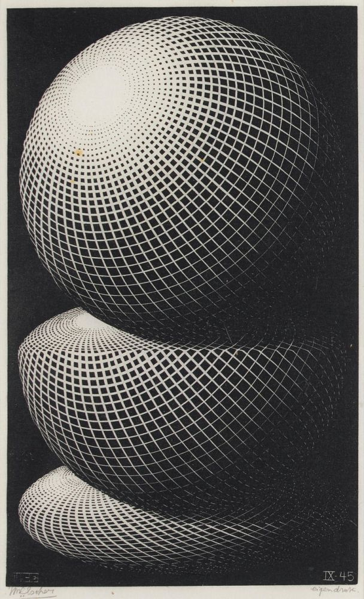
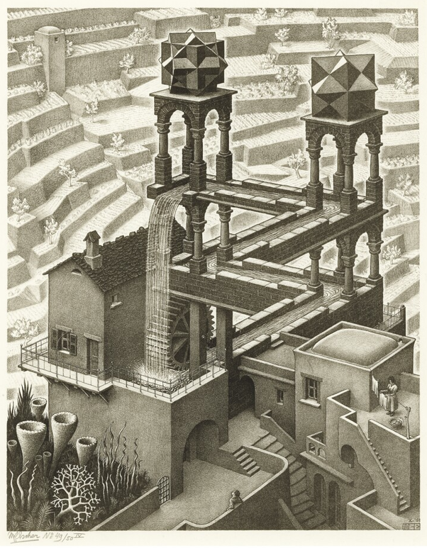

# El hilo dialéctico del pensamiento humano

")

# La pregunta necesaria

Volví a la pregunta original. Ese instante de **curiosidad** lógica no comparaba perro y caballo, sino que buscaba
entender sus diferencias. Observé almohadillas de patas frente a cascos, colmillos frente a incisivos, hasta que surgió
la pregunta inevitable: *¿Por qué son distintos?* Así inició un viaje que no era caprichoso, sino necesario: de lo
particular a lo universal, y de vuelta a lo concreto.

> *Me pregunté: ¿Qué caracteriza a una pregunta?*

Los grandes sistemas de pensamiento, desde Yajnavalkya hasta la física cuántica, comparten un núcleo esencial: emergen
de preguntas que requieren respuestas **coherentes**. Yajnavalkya no se conformó con los rituales; buscó lo eterno más
allá de lo **aparente**. Tales de Mileto trascendió los mitos al proponer el agua como principio fundamental, un
principio material que unificaba la **diversidad**. Su discípulo Anaximandro profundizó aún más: postuló el ápeiron, lo
indefinido, un **fundamento abstracto** que superaba lo tangible. Demócrito llevó esta búsqueda al reducir la realidad a
átomos y vacío, anticipando así la **simplicidad parsimoniosa**. Heráclito, al observar el río, dedujo de su fluir una *
*ley universal** —el Logos— capaz de explicar tanto el cambio estacional como la decadencia de los imperios. Buda, por
su parte, no se limitó a catalogar el sufrimiento: rastreó su origen en una **cadena causal** de doce eslabones —el
Pratītyasamutpāda— y desde allí construyó un método para interrumpirlo.

> *Me pregunté: ¿Qué caracteriza al proceso genuino de comprensión?*

Reflexioné que surge de una premisa sencilla: **entender la realidad sin añadir complejidad innecesaria**. Siguiendo el
principio de que lo que puede explicarse con menos no debe explicarse con más. El camino exige **evitar inventar
entidades innecesarias**. No se trata solo de describir fenómenos, sino de construir un sistema que se base en **sí
mismo**. Es decir, que no requiera elementos externos para justificarse, reflejando en su estructura la misma dinámica
que explica. En este ejercicio, la operación esencial es la **abstracción pura**: ese acto de distanciamiento que
permite ver patrones donde otros ven fragmentos. Me di cuenta de que cada vez que hacemos esto, estamos repitiendo el
mismo movimiento primordial con el que surgió toda distinción en el universo: primero nos separamos (como si ampliáramos
nuestro campo de visión), luego relacionamos lo observado (como si curváramos nuestra mirada entre los elementos), y
finalmente damos forma a un nuevo entendimiento (como si confináramos el caos en una nueva estructura).

> *Me pregunté: ¿Cuándo participar en el ciclo inevitable de la historia?*

Comprendí que la historia es un proceso continuo que se transforma a sí mismo a través de la narración. Reflexioné que
si retrocedía suficientemente en el tiempo, podría observar las proyecciones primordiales de este mismo proceso
reflexivo. Pensé que acudir al origen ofrecería un panorama desprovisto de las capas de **mito** acumuladas por los
siglos.

Así tracé mentalmente un mapa minimalista: cómo el **pensamiento lógico** —guiado por el **rigor causal** y la
**economía en la existencia**— puede trascender lo aparente. Desde las patas de un caballo hasta la expansión acelerada
del cosmos, cada fenómeno se revela como un nudo en una red indisoluble de causas y consecuencias. En esa red, incluso
la pregunta más elemental —¿por qué son distintos?— contiene las claves de lo fundamental. Donde otros ven objetos
estáticos, aprendí a ver procesos en movimiento; donde otros perciben caos, descubrí ritmos ocultos. Porque en última
instancia, comprender por qué un perro no es un caballo equivale a descifrar por qué el universo es así y no de otra
forma.

# Yajnavalkya (siglo VIII-VII a.C.): El Sabio del “Neti Neti”

> *«El Ser (Ātman) debe ser conocido… no es esto, no es eso (neti neti)».* ―Bṛhadāraṇyaka Upaniṣad (3.9.26).

En los bosques de la India védica, donde los rituales de fuego dominaban la vida espiritual, Yajnavalkya emergió como un
revolucionario. Maestro en la corte del rey Janaka y figura central del Bṛhadāraṇyaka Upaniṣad, desafió el ritualismo
mecánico proclamando que la verdad última (Brahman) no se alcanza con ofrendas, sino con el **discernimiento radical.**
Buscaba lo eterno (akṣara) más allá del ciclo de nacimiento y muerte (saṃsāra), cuestionando la autoridad védica:
*«¿De qué sirve el sacrificio si no se conoce aquello que trasciende la muerte?»*.

Su método, el *neti neti* (*«no esto, no aquello»*), negaba toda definición limitada de Brahman, revelando que la
realidad absoluta solo puede abordarse por **negación dialéctica**. Esta dinámica se refleja en la tríada E, S, T, donde
cada componente se define por lo que no es: la energía no es espacio, el espacio no es tiempo. Yajnavalkya proclamó
además la identidad entre el ser individual (*Ātman*) y el absoluto (*Brahman*) —*«Tú eres Eso»*—, visión que anticipa
la **no-dualidad** fractal: lo micro (E) contiene el potencial de lo macro (T), como un electrón refleja el cosmos.

Su radicalidad fue doble: subvirtió el ritualismo al declarar que *«el conocimiento, no el fuego, quema la ignorancia»*,
y despersonalizó lo divino, describiendo Brahman como el **tejido interdependiente** de lo real, donde todo existe como
hilos de un nudo sin fin. Así, anticipó que la realidad es una proyección dependiente del observador, como la tríada
fundamental vincula percepción y existencia.

# Tales de Mileto (624–546 a.C.): El pensador de la naturaleza

> *«El agua es el principio de todas las cosas».* ―Hipólito, Refutación de todas las herejías (I.1).

En la próspera Mileto jonia (hoy Turquía), entre mitos y observaciones astronómicas, Tales observó eclipses y las
crecidas del Nilo. Su motivación surgió de buscar un arjé: un principio material **unificador** para la diversidad del
cosmos. Declaró que *«el agua es el principio de todas las cosas»*, una idea radical que sustituyó narrativas divinas
por **leyes naturales**.

Observó cómo el agua se transformaba en hielo, vapor o líquido sin perder su esencia, presagiando la noción de energía (
E) que cambia de forma (sólido, plasma) manteniendo su esencia. Su visión de que *«todo cambia, pero el agua persiste»*
refleja las transiciones de escala, donde un mismo principio —como la tríada E, S, T— opera en distintos estados de la
realidad. Así, Tales inició la búsqueda de una unidad subyacente a lo aparentemente fragmentado, anticipando la
unificación física a través de principios dinámicos irreducibles.

# Anaximandro (610–546 a.C.): El discípulo revolucionario

> *«El principio de las cosas es el ápeiron \[…\] de donde surgen los cielos y los mundos».* ―Simplicio, Comentario a la
> Física de Aristóteles.

Discípulo de Tales en Mileto, cuestionó que un elemento visible como el agua pudiera generar realidades opuestas (fuego,
tierra). Motivado por buscar un principio abstracto, propuso el ápeiron —lo ilimitado e indefinido— como origen de todo.
Este concepto trascendente, que genera y reabsorbe los **opuestos** (frío/caliente), refleja el ritmo primario donde E,
S, T se equilibran dinámicamente, como estrellas que nacen de supernovas y semillas que germinan de la tierra. Su
innovación fue introducir la **abstracción como herramienta científica**, fundamentando la realidad en una entidad no
empírica que anticipa la naturaleza proyectiva de las leyes cósmicas.

# Siddhartha Gautama (Buda) (563–483 a.C.): El iluminado de los bosques

> *«Cada joya refleja todas las demás, en una red infinita de interdependencia».* ―Sutra de la Red de Indra.

Tras abandonar su vida de príncipe al enfrentar el sufrimiento humano en el norte de la India, Buda enseñó un camino
basado en la observación directa, sin dogmas. Motivado por liberar al ser humano del ciclo del dolor (*dukkha*), reveló
dos principios fundamentales: *anicca* (**impermanencia**) y *pratītyasamutpāda* (**interdependencia universal)**.

Su metáfora de la Red de Indra —donde cada joya refleja infinitamente a las demás— anticipa la dinámica del ritmo
cósmico: redes neuronales y galaxias emergen de pulsos sincronizados entre E (energía fluctuante) y S (espacio
relacional). El vacío budista (*Sunyata*), lejos de ser "nada", se asemeja al vacío cuántico: un campo de
**potencialidades** donde T (tiempo) teje relaciones efímeras.

Su radicalidad fue negar cualquier "*yo*" fijo, mostrando que la identidad es un **proceso dinámico** —como la tríada
E-S-T— donde todo existe solo en interdependencia creativa.

# Heráclito de Éfeso (535–475 a.C.): El filósofo del fuego

> *«El camino hacia arriba y hacia abajo es uno y el mismo».* ―Fragmento DK60.

En la Éfeso antigua (actual Turquía), Heráclito observó guerras y cambios políticos, descubriendo que la estabilidad era
ilusoria: ríos fluían, imperios caían, estaciones cambiaban. Motivado por hallar una **ley universal** (*Logos*) tras el
caos aparente, proclamó que *«todo fluye»* (*panta rhei*) y que el **conflicto** (*pólemos*) era el motor cósmico.

Su **Logos** refleja la ley de distinción: el fuego que destruye y renueva simboliza E (energía) curvando S (espacio)
mientras T (tiempo) marca el ritmo. Su célebre aforismo —*«No te bañas dos veces en el mismo río»*— captura las
transiciones entre escalas de realidad, donde cada instante redefine la realidad. Su innovación fue transformar el caos
en orden, unificando lo aleatorio bajo una dinámica eterna donde *«el camino ascendente y descendente es uno solo»*,
anticipando la danza inseparable de E, S y T.

# Demócrito de Abdera (460–370 a.C.): El padre del atomismo

> *«Por convención, dulce; por convención, amargo; en realidad, átomos y vacío».* ―Fragmento DK68B9.

En la costa tracia de Abdera, Demócrito combinó filosofía natural con los conocimientos de sus viajes por Egipto y
Persia. Motivado por explicar la realidad sin apelar al azar o lo divino, postuló que solo existen átomos y vacío (
*Physis*). Los átomos —indivisibles e inmutables— son unidades discretas de energía que interactúan en el espacio a
través del tiempo, como partículas elementales en un campo cuántico.

Su afirmación de que *«la forma define la materia»* anticipa las transiciones escalares: microestructuras (
configuraciones atómicas) determinan propiedades macroscópicas (dureza, color). Radicalmente, redujo todo —incluso el
amor— a colisiones mecánicas de átomos, sustituyendo fuerzas divinas por leyes naturales y sentando las bases del
reduccionismo científico: *«Por convención, dulce; por convención, amargo; en realidad, átomos y vacío»*. Así, convirtió
el **caos aparente** en una danza geométrica de **causas naturales**.

# La humanidad como espejo fractal del cosmos

**Reflexioné** que los saltos revolucionarios son transiciones entre escalas donde el pensamiento humano replica
patrones cósmicos. **Yajnavalkya**, con su *neti neti*, desarmó categorías para revelar la interdependencia absoluta.
**Tales** buscó el agua como energía unificadora. **Heráclito** vio en el fuego la dinámica de los opuestos.

# El velo de lo evidente

Todos se encontraron con el mismo obstáculo: **lo evidente oculta lo esencial**. Reflexioné que los **marcos clásicos**
ocultan las dinámicas y transiciones subyacentes produciendo **velos epistemológicos** y que los **saltos cualitativos**
exigen negar lo dado para romper el velo.

Así, la historia del pensamiento es un holograma de ritmos cósmicos: cada salto cualitativo refleja la negociación
eterna entre **E**, **S** y **T**. La realidad no es un relato, sino un verbo escrito en resonancias y silencios,
siempre negándose a ser capturada por completo.

# Los ciclos de la existencia humana

Este viaje termina en la autorreflexión del tiempo interior. Mirarse a uno mismo con otra perspectiva, preguntarse qué
dicen estas escalas de nosotros y cómo participamos en los patrones que constituyen la realidad.

# Infancia: Las primeras huellas

En la niñez, cada experiencia es una semilla plantada en el tiempo. **Aprendemos** a leer repitiendo letras —un proceso
mecánico— hasta que, un día, las palabras revelan mundos enteros. Las asignaturas básicas —matemáticas, lengua,
ciencias— son preludios de disciplinas mayores: sumar es el germen del álgebra; leer cuentos, el comienzo para analizar
novelas. Incluso el **dolor** enseña: las ausencias dan valor a lo que permanece y a las manos que nos sostienen.

Durante nuestra niñez, nuestros **padres** toman las decisiones que marcan nuestro camino: dónde viviremos, a qué
escuela iremos, qué principios nos guiarán. En estas decisiones cotidianas, plantan semillas que definirán nuestro
futuro. **Enseñan** a andar en bici (equilibrio y perseverancia), a jugar (negociar reglas e imaginar futuros), a
dibujar (traducir emociones), a cocinar (transformar ingredientes en cuidado) o a cuidar una mascota (responsabilidad).
Pero también **transmiten** miedos y complejidades heredadas. Nuestra capacidad de **imaginar** se desarrolla tropezando
con límites largamente impuestos.

Cada una de estas experiencias, tanto las que fortalecen como las que lastiman, se convierte en una raíz invisible que
nutre nuestra capacidad para enfrentar desafíos. Las relaciones familiares son claves en el desarrollo de nuestra
personalidad. Esa red sostendrá nuestra fragilidad durante el crecimiento. Así, la infancia enseña que lo pequeño
contiene lo grande: un gesto hoy puede ser la semilla del mañana.

# Adolescencia: Descubrir y conectar

En la secundaria, aprender a leer profundamente se convierte en una llave para explorar todas las materias. La historia
deja de ser fechas para revelar por qué los imperios caen; la biología va más allá de los nombres de células para
mostrar sistemas interdependientes. Un primer amor adolescente no son solo mariposas en el estómago: es el atrevimiento
de hablar con alguien que fascina, un acto que puede cambiar el rumbo de dos vidas. Empezamos a ser conscientes de que
nuestras acciones tienen **consecuencias** profundas y que podemos **imaginarlas** previamente.

Los juegos de la infancia se transforman en deportes que exigen estrategia; las **habilidades** rudimentarias se pulen
hasta volverse pasatiempos duraderos. Cada nueva habilidad —manejar una bicicleta, resolver ecuaciones— otorga
**independencia**, pero también enseña a tropezar: caer de la bici, quemar la cena, fallar un examen. Cada error,
corregido con paciencia, siembra resiliencia. La adolescencia enseña que los detalles aparentemente triviales —un
partido perdido, una charla en el pasillo— son la urdimbre de futuras **fortalezas**. El valor de esas conexiones,
aunque efímeras, forja una sensibilidad hacia el futuro.

# Juventud: Ramificaciones y raíces

En la universidad, las disciplinas se especializan: la física se convierte en mecánica cuántica; la literatura, un
mosaico de géneros. Sin embargo, cada rama es un eco de lo aprendido antes: resolver ecuaciones complejas repite la
lógica de los problemas de resta de la infancia. Cocinar para alguien querido trasciende el acto de alimentar: es un
reflejo del
**cuidado** recibido décadas atrás.

Las experiencias no borran las anteriores, sino que las integran. El dolor que nos **infligieron** —y el que
**causamos**— no son cicatrices estáticas: con los años, se transforman en lentes que enfocan la **sensibilidad** hacia
el futuro. La música que bailamos, las palabras que repetimos, los ideales que defendimos, todo se entrelaza en una
identidad que llevamos como un sello. Pero es en las transformaciones sociales donde reside el punto de inflexión
decisivo: esos momentos colectivos transforman la mirada infantil para fundirla en la visión adulta. La juventud enseña
que el **conocimiento** y el dolor son talladores de nuestra mirada hacia lo esencial.

# Adultez: Tejer con los hilos del pasado

En el trabajo, la habilidad se cultiva con el tiempo. Criar a un hijo no es imponer sueños, sino **dar** herramientas
para que construya los suyos. Les entregamos los libros que nos sorprendieron, aunque ellos busquen respuestas en
pantallas. Enfrentamos el desfase generacional: vemos en nuestros hijos reflejos vivos de lo que fuimos y lo que
rechazamos.

La adultez enseña que cuidar no es repetir el pasado, sino aplicar patrones ancestrales con manos nuevas, reconociendo
cómo fuimos transformados por nuestras **experiencias** y que hace tiempo somos dueños de los actos que construyen la
realidad que nos rodea: regar un jardín donde crecen raíces propias y ramas ajenas.

# Vejez: Semillas que se vuelven bosques

Ancestros que cruzaron montañas; padres que estudiaron de noche; hijos que crean arte con lo aprendido. Enseñar a un
nieto a atarse los cordones o señalar las estrellas repite el ciclo sagrado del aprendizaje. Las arrugas son mapas de
risas, lágrimas y soles que curtieron la piel mientras **caminábamos** hacia lo necesario.

La vejez enseña que vivir es cosechar lo sembrado y seguir plantando para otros. Aunque no veremos crecer todas las
semillas, regamos la tierra **sabiendo** que sus frutos alimentarán a quienes lleguen después.

# Honestidad: Los patrones son espejos

> «Conócete a ti mismo y conocerás el universo»  *— Inscripción en el templo de Delfos.*

Mirar las escalas de la propia vida no es filosofía abstracta: es **libertad práctica**. Aprender a leer de niño fue el
primer paso para descifrar tratados; un desamor juvenil fue la semilla de la resiliencia. Cada elección —un acto de
amabilidad, un resentimiento guardado— condiciona el todo.

La vida prueba que somos jardineros de patrones. Este recorrido nos enseña que nuestras acciones (**energía**), el
contexto (**espacio**) y el momento (**tiempo**) son nuestras herramientas. El diseño final —caótico, hermoso— depende
de cómo cultivemos el presente. El viaje no consiste en seguir mapas ajenos, sino en trazar el propio, paso a paso, con
los ojos abiertos a los lazos que nos unen al universo. Así, la travesía reflexiva termina donde comenzó: *debajo de los
pies*.

*Fin*