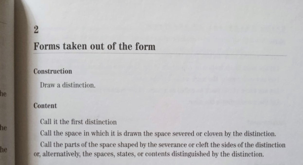

# Teoría de Distinciones: Marco Fundamental


")

*Hipótesis de medida*:
Se fija una medida $\mu$ definida sobre una $\sigma$-\'algebra que contiene todas las regiones
relevantes $\mathcal R_{\mathcal U}$. Asumimos, salvo que se indique lo contrario, que $\mu$ es finita y normalizada (es
decir, opcionalmente $\mu(\mathcal C)=1$).

Para evitar indeterminaciones, toda fórmula que divida por $\mu(\mathcal R_{\mathcal U}\cup\mathcal R_{\mathcal V})$
requiere la condición
$$\mu(\mathcal R_{\mathcal U}\cup\mathcal R_{\mathcal V})>0.$$
Si el denominador fuese cero, la expresión se interpreta por continuidad o por convención contextual (p. ej. tomar el
cociente como cero cuando procede).

## Primitivos Ontológicos

### Continuo Único ($\mathcal{C}$)

**Axioma de Ausencia Predicativa**: $\forall P, \neg P(\mathcal{C})$
Existe un solo continuo sin predicados internos. No hay multiplicidad de continuos - solo continuidad diferenciada por
soluciones específicas.

### Operador de Distinción ($\mathcal{D}$)

**Definición**: $\mathcal{D}: \mathcal{C} \to \text{Soluciones de Continuidad}$
Pura actividad que crea soluciones de continuidad - fracturas específicas que generan diferencias operativas sin
postular multiplicidad ontológica.

**Axioma de Distinción Continua**: $\mathcal{D}(\mathcal{C}) \rightarrow \mathcal{O}$
La operación de distinción sobre el continuo único genera necesariamente oscilación como manifestación de la distinción
continua. La operación $\mathcal{D}$ sobre $\mathcal{C}$ debe ser continua porque cualquier "pausa" eliminaría la
distinción misma.

## Emergencias de la Discontinuidad

### Espacio Topológico Generado por Distinciones

Sea $\mathcal{C}$ el continuo primitivo y sea $\mathcal{D}$ la colección de operaciones de distinción (cada
$D\in\mathcal{D}$ se interpreta como un acto clasificatorio que selecciona un lado del continuo). Definimos la
aplicación

$\Phi: \mathcal{D}\to\mathcal{P}(\mathcal{C}),\qquad \Phi(D)=U_D$

que a cada distinción asigna el subconjunto $U_D\subseteq\mathcal{C}$ que contiene los puntos clasificados por dicha
distinción.

La familia $\mathcal{S} = \{U_D : D\in\mathcal{D}\}$ se toma como **subbase** para una topología en $\mathcal{C}$.
Denotaremos por $\mathcal{T}$ la topología generada por $\mathcal{S}$, es decir,

```math
\mathcal{T}=\tau(\mathcal{S})
=\left\{ \bigcup_{i\in I}\left(\bigcap_{j=1}^{n_i} U_{D_{i,j}}\right)
\middle| I\ \text{arbitrario},\ n_i\in\mathbb{N} \right\}.
```

Trabajaremos con el espacio topológico $(\mathcal{C},\mathcal{T})$, que llamaremos **$\mathrm{C}_0$**.

#### Hipótesis de Cobertura (subbase)

**Hipótesis**: Suponemos que $\bigcup_{D\in\mathcal{D}} U_D = \mathcal{C}$.

Bajo esta hipótesis, la familia $\mathcal{S}=\{U_D : D\in\mathcal{D}\}$ es una subbase que genera una
topología $\mathcal{T}$ sobre $\mathcal{C}$ mediante enlaces finitos y uniones arbitrarias. Esta hipótesis evita
ambigüedad: garantiza que la topología generada efectivamente está definida sobre todo el espacio base $\mathcal{C}$.

#### Proposición: condición para que $C_0=(\mathcal{C},\mathcal{T})$ sea $T_0$

**Proposición $T_0$**:
El espacio topológico $(\mathcal C,\mathcal T)$ es $T_0$ si y sólo si para todo par $x\neq y$ existe un abierto que
contiene a uno y no al otro.

**Esbozo de prueba**:
Si la propiedad de $T_0$ se cumple entonces, por definición, para $x\neq y$ existe un abierto que separa los puntos, lo
que implica que las cerraduras de singletons no pueden coincidir; recíprocamente, si las cerraduras de singletons son
distintas entonces la preorden de especialización es antisimétrica y, por tanto, existe un abierto que separa cada par
distinto, lo que da $T_0$.

### Sistema Distinguidor

**Definición**: Un *sistema distinguidor* (o simplemente *distinguidor*) se denota por $\mathcal{U}$ y es la terna

Sea $\mathcal{Conf}(\mathcal R)$ el espacio de configuraciones sobre $\mathcal R$
(por ejemplo, funciones $\mathcal R\to\{0,1\}$ o medidas sobre $\mathcal R$).
Se reescribe la operación de actualización local como

$$
M_{\mathcal U}:\ \mathcal{Conf}(\mathcal R_{\mathcal U})\times \mathsf{St}_{\mathcal U}
\longrightarrow
\mathcal{Conf}(\mathcal R_{\mathcal U})\times \mathsf{St}_{\mathcal U},
$$

especificando que la primera componente es la actualización de la configuración local y la segunda es la actualización
del estado interno. Las salidas observables $O_{\mathcal U}$ pueden identificarse con proyecciones apropiadas
de $\mathcal{Conf}(\mathcal R_{\mathcal U})$.

donde:

* $\mathcal{R}_{\mathcal{U}}\subseteq\mathcal{C}$ es la región del continuo a la que $\mathcal{U}$ tiene acceso;
* $S_{\mathcal{U}}\in\mathsf{St}_{\mathcal{U}}$ es el estado interno del distinguidor, representado por una cadena
  finita que codifica la huella de distinciones previas;
* $M_{\mathcal{U}}$ es la operación de distinción implementada por $\mathcal{U}$, con firma

$$M_{\mathcal{U}}: \mathcal{C}(\mathcal{R}_{\mathcal{U}})\times\mathsf{St}_{\mathcal{U}}\to O_{\mathcal{U}}\times\mathsf{St}_{\mathcal{U}}$$

Se exigen las siguientes propiedades operacionales para $M_{\mathcal{U}}$:

1. **Localidad**: La acción depende sólo de la configuración en

$$\mathcal{R}_{\mathcal{U}}$$

   y del estado interno $S_{\mathcal{U}}$.

2. **Capacidad finita**: El conjunto de estados $\mathsf{St}_{\mathcal{U}}$ es finito (o, en la versión general,
   acotado).
3. **Retro-acción Condicionada**: La ejecución de $M_{\mathcal{U}}$ produce una acción que modifica la configuración
   en $\mathcal{R}_{\mathcal{U}}$ con probabilidad e intensidad proporcional al grado de interferencia ontológica
   $\omega(\mathcal{U}, \mathcal{V})$ con sistemas fronterizos.
4. **Selectividad**: Las distinciones efectivas realizadas por
 
$$\mathcal{U} \text{ sobre } \mathcal{R}_{\mathcal{U}}$$
   se representan por una subfamilia

$$\{f_D\}_{D\in\mathcal{D}_{\mathcal{U}}}$$

   de funciones indicadoras asociadas a las distinciones locales.

### Grado de Interferencia Ontológica

El **Grado de Interferencia Ontológica** $\omega(\mathcal{U}, \mathcal{V})$ cuantifica la intensidad con que dos
sistemas distinguidores se contradicen mutuamente en sus operaciones fronterizas:

$$
\omega(\mathcal{U},\mathcal{V}) = J_{\mu}(\mathcal{R}_{\mathcal U},\mathcal{R}_{\mathcal V}) \cdot
\frac{\tau_{\mathrm{alg}}(\mathcal{U}:\mathcal{V})}{\max\{\theta_{c,\mathcal{U}},\ \theta_{c,\mathcal{V}}\}}
$$

donde

$$
J_{\mu}(\mathcal R_{\mathcal U},\mathcal R_{\mathcal V}) := \frac{\mu(\mathcal R_{\mathcal U}\cap\mathcal R_{\mathcal V})}{\mu(\mathcal R_{\mathcal U}\cup\mathcal R_{\mathcal V})},\quad\text{if }\mu(\mathcal R_{\mathcal U}\cup\mathcal R_{\mathcal V})>0.
$$

**Interpretación Operativa**:

- **$\omega \approx 0$**: Sistemas con fronteras casi paralelas → mínima retro-acción
- **$\omega \approx 1$**: Sistemas con fronteras perpendiculares → máxima interferencia ontológica

**Casos Límite**:

1. **Interferencia Máxima** ($\omega = 1$): Contradicción ontológica total, retro-acción inevitable e intensa
2. **Interferencia Mínima** ($\omega \approx 0$): Operaciones casi independientes, sistemas cuasi-autónomos
3. **Interferencia Crítica** ($\omega = \theta_c$): Umbral de transformación sistémica, bifurcación entre autonomía e
   interdependencia

### Sistema Distinguido

**Definición**: Un *sistema distinguido* $\mathcal{V}$ es la pareja

$$(\mathcal{R}_{\mathcal{V}},S_{\mathcal{V}})$$

donde

$$\mathcal{R}_{\mathcal{V}}\subseteq\mathcal{C}$$

es la región afectada por una operación de distinción y $S_{\mathcal{V}}$ es la configuración local resultante tras
dicha operación.

### Co-definición de Distinguidor y Distinguido

Sea $\mathcal{R}\subseteq\mathcal{C}$ y considere una operación de distinción actuando sobre $\mathcal{R}$. Dicha
operación produce de manera simultánea:

* un sistema distinguidor

$$
\mathcal{U}=(\mathcal{R}_{\mathcal{U}},S_{\mathcal{U}},M_{\mathcal{U}})
$$

instancia que implementa la operación y registra su huella en el estado interno; y

* un sistema distinguido

$$
\mathcal{V}=(\mathcal{R}_{\mathcal{V}},S_{\mathcal{V}})
$$

la configuración de la región diferenciada en virtud de la operación.

Adoptamos los siguientes principios relacionales:

1. **Mutua dependencia**: No hay distinguidor sin algo distinguido, ni distinguido sin un distinguidor que lo actualice.
2. **Frontera compartida**: La interacción se localiza en la frontera
   topológica $\partial(\mathcal{R})=\overline{\mathcal{R}}\setminus \text{int}(\mathcal{R})$.
3. **Tensión relacional**: La magnitud $\tau_{\mathrm{alg}}(\mathcal{U}:\mathcal{V})$ cuantifica la independencia
   algorítmica entre los estados.
4. **Doble actualización**: El acto de distinción transforma tanto $S_{\mathcal{U}}$ como $S_{\mathcal{V}}$.

### Carácter Fronterizo Fundamental de la Distinción

**Principio de Co-Definición Binaria**: Toda frontera co-define necesariamente dos espacios/conjuntos:
$F_{S1|S2}: \mathcal{C} \rightarrow \{S_1, S_2\} \text{ donde } S_1 \cap S_2 = \emptyset \text{ y } S_1 \cup S_2 = \mathcal{C}$

**Recursividad Topológica**: La recursividad emerge automáticamente porque cualquier modificación fronteriza afecta
ambos lados simultáneamente:
$\Delta F_{S1|S2} \rightarrow \{\Delta S_1 \rightarrow \Delta F_{S1|S2} \rightarrow \Delta S_2 \rightarrow \Delta F_{S1|S2}\}$

Esta cadena de modificaciones mutuas es consecuencia geométrica inevitable del carácter binario de toda frontera.

**Co-Dependencia Ontológica No-Viciosa**:

- El Continuo no puede existir sin oscilar (generar distinciones)
- La Distinción no puede ocurrir sino sobre Continuo
- Ambos son primitivos mutuamente necesarios, no derivados

### Propagación Inter-Sistémica

**Fronteras Compartidas**: Los sistemas no están aislados sino conectados por fronteras compartidas donde las
distinciones se propagan:
$$S_i \leftrightarrow F_{i,j} \leftrightarrow S_j$$

**Red Fronteriza**: El conjunto de todos los sistemas forma una red de fronteras interconectadas donde las
modificaciones se propagan automáticamente.

**Eliminación de Exterioridad**: No existe posición meta-sistémica externa. La teorización de este marco es ella misma
un proceso fronterizo - emerge de la frontera entre el sistema teorizador y su complemento conceptual, propagando
efectos que modifican ambos.



")

## Individuación Sistémica

### Criterio de Individuación por Soluciones de Continuidad

Un sistema $S$ existe cuando una solución de continuidad (frontera) diferencia operativamente interior de exterior en el
continuo único:
$$S = \text{región continua definida por } F_S \text{ que crea discontinuidad específica}$$

### Frontera como Solución de Continuidad

La frontera $F_S$ no separa continuos diferentes, sino que constituye una discontinuidad específica:

- **Interior**: Región continua delimitada por $F_S$
- **Exterior**: Región continua externa a $F_S$
- **Frontera**: Solución de continuidad que los diferencia operativamente

### Complemento como Exterioridad Continua

El complemento $\overline{S}$ es la región externa del continuo único, diferenciada del interior por la solución de
continuidad que constituye la frontera del sistema. El complemento no es un exterior pasivo, sino un sistema activo que
participa en la red de propagación de distinciones, formando una relación simétrica y dinámica con el sistema original.

## Estructura Triádica Universal

### Triada Fundamental A-R-Ã

Toda distinción proyecta tres componentes inseparables:

- **A**: Identidad en el sistema
- **R**: Proceso relacional en curso
- **Ã**: Transformación emergente

Esta estructura es invariante aunque su contenido sea específico al sistema.

### Tensión Ontológica ($\tau$)

Medida de inestabilidad introducida por cualquier distinción. Específica a cada sistema y relativa a su capacidad
operativa:
$$\tau_s(D_i, D_j) = \text{medida de incoherencia en sistema } s$$

#### Formalización Medible de la Tensión Ontológica

La tensión ontológica $\tau$ cuantifica la **novedad** o **inestabilidad informacional** introducida por un acto de
distinción.

Sea $S$ el acto (o señal) cuya novedad queremos medir respecto de un contexto $R$. La tensión ontológica algorítmica se
define como

$$
\tau_{\mathrm{alg}}(S\mid R)\;:=\;K_U(S\mid R)+O(1),
$$

donde $K_U(\cdot\mid\cdot)$ es la complejidad de Kolmogórov condicional relativa a una máquina universal $U$.

*Nota metodológica*:
La definición ideal de tensión basada en la complejidad de Kolmogórov $K_U(\cdot\mid\cdot)$
se mantiene como ideal teórico no computable. En implementaciones empíricas se usarán proxies computables notables (p.
ej. $\mathrm{NCD}_C$ con un compresor $C$ o modelos de lenguaje que actúan como estimadores).

Cuando se presenten resultados numéricos documentar el compresor/modelo $C$ empleado, ya que los valores de las proxies
dependen de esa elección.

**Nota breve:** $K_U$ es teóricamente fundacional pero incomputable y está definida solo hasta una constante aditiva
dependiente de $U$.

#### Medida de superposición topológica (Jaccard generalizado)

Si $\mathcal R_{\mathcal U},\mathcal R_{\mathcal V}\subset\mathcal C$ son regiones en el continuo
operacional $\mathcal C$ asociadas a dos subcubiertas, definimos su coeficiente de solapamiento por

$$
J_{\mu}(\mathcal R_{\mathcal U},\mathcal R_{\mathcal V})
:=\frac{\mu(\mathcal R_{\mathcal U}\cap\mathcal R_{\mathcal V})}
{\mu(\mathcal R_{\mathcal U}\cup\mathcal R_{\mathcal V})},
\qquad\text{con }\mu(\mathcal R_{\mathcal U}\cup\mathcal R_{\mathcal V})>0.
$$

Condiciones sobre $\mu$: Se asume que $\mu$ es una medida finita y normalizada en $\mathcal C$ (por
ejemplo $\mu(\mathcal C)=1$) o, en su defecto, que se normaliza localmente sobre conjuntos de interés. Es necesario
que $\mu(\mathcal R_{\mathcal U}\cup\mathcal R_{\mathcal V})>0$. Bajo estas hipótesis $J_{\mu}\in[0,1]$, con $J_{\mu}=0$
si las regiones son $\mu$-disjuntas y $J_{\mu}=1$ si coinciden salvo un conjunto de medida nula.

#### Proxy computable y normalizada

Sea $C$ un compresor o modelo que permita (idealmente) compresión condicional $C(R\|S)$. Definimos la proxy condicional
tipo–NCD

$$
\mathrm{NCD}_C(S\mid R)\;=\;
\frac{C(R\|S)-C(R)}{C(S)}.
$$

Si no existe compresión condicional directa, use la concatenación canónica con separador explícito $\texttt{SEP}$ y
considere la variante

$$
\mathrm{NCD}_C^{\mathrm{concat}}(S,R)
\;=\;
\frac{C(R\ \texttt{||}\ S)-\min\{C(R),C(S)\}}{\max\{C(R),C(S)\}}.
$$

Para mapear la medida a un rango compacto $[0,1]$ proponemos la normalización

$$
\widehat{\tau}_C(S\mid R)\;=\;
\frac{\mathrm{NCD}_C(S\mid R)}{1+\mathrm{NCD}_C(S\mid R)},
$$

que satisface $\widehat{\tau}_C\in[0,1)$ y escala monótonamente con la novedad relativa de $S$ respecto de $R$.
Análogamente se puede aplicar la misma transformación a $\mathrm{NCD}_C^{\mathrm{concat}}$.

#### Interpretación operativa

* $\widehat{\tau}_C$ cercano a $0$: $S$ aporta poca información nueva sobre $R$.
* $\widehat{\tau}_C$ mayor (acercándose a 1): $S$ es fuertemente novedoso/informacionalmente independiente respecto
  de $R$.

**Advertencia**:
Estas proxies son computables pero dependen de la elección de $\mu$, de la codificación de los datos (separador,
representación) y del compresor/modelo $C$. La definición teórica $\tau_{\mathrm{alg}}$ proporciona la justificación
conceptual; las versiones $\widehat{\tau}_C$ son aproximaciones prácticas cuya validez empírica debe evaluarse caso por
caso.

## Fundamentos de la Asintotalidad

### Perpendicularidad Ontológica de los Límites Sistémicos

Todo sistema distinguidor genera necesariamente límites asintóticos que no son opuestos especulares, sino
**contradictorios ontológicos** que operan en dimensiones perpendiculares:

- **Límite Superior ($\top_s$)**: Capacidad máxima de asimilación - infinitud relativa que excluye la finitud sistémica
- **Límite Inferior ($\bot_s$)**: Ausencia total de distinciones - inexistencia que excluye la existencia sistémica

**Principio de Perpendicularidad Relacional**: La perpendicularidad ontológica es inherentemente fronteriza - siempre
diádica entre dos términos específicos. Los sistemas complejos mantienen múltiples perpendicularidades binarias
simultáneas:

$$\mathcal{S} = \{(\mathcal{C}_i \perp \mathcal{D}_j)_k\}$$

Esta perpendicularidad es fundamental porque $\top_s$ y $\bot_s$ no comparten dimensión común - uno opera en el eje
capacidad infinita/finita, otro en el eje existencia/inexistencia. La complejidad sistémica emerge de múltiples
perpendicularidades binarias operando simultáneamente, no de relaciones múltiples directas.

### Sistemas como Doble Contradicción de Límites

Los **sistemas distinguidores** emergen contradiciéndolos simultáneamente:

- Contradicen $\top_s$ siendo **finitos** (mantienen límites operativos específicos)
- Contradicen $\bot_s$ siendo **existentes** (procesan distinciones activamente)

Esta doble contradicción no coloca los sistemas "entre" sus límites sino en una **tercera dimensión ontológica**: la
determinación finita-existente que permite mantener fronteras operativas.

### Necesidad Estructural de la Asintotalidad

Los límites son asintóticos porque alcanzarlos requiere que el sistema abandone una de sus cualidades constituyentes:

- Alcanzar $\top_s$ → Abandono de finitud → Disolución en capacidad infinita indeterminada
- Alcanzar $\bot_s$ → Abandono de existencia → Colapso de procesamiento distinguidor

Esta imposibilidad no es externa, sino **estructural** - un sistema que "llegara" a cualquier límite ya no sería sistema
distinguidor.

### Conexión con Efectos Fronterizos Extremos

Los efectos extremos cerca de fronteras son manifestaciones de proximidad a contradicción ontológica:

- **Colapso de linealidad**: Proximidad a límites donde el sistema no puede mantener procesamiento normal
- **Comportamientos exponenciales**: Síntomas de proximidad a límites asintóticos
- **Creatividad sistémica**: Generación urgente de configuraciones nuevas para evitar contradicción ontológica
- **Alta densidad de eventos**: Procesamiento intensivo para mantener distancia de límites asintóticos

La intensidad fronteriza es proporcional a la proximidad a contradicción ontológica. Los fenómenos fronterizos son
consecuencias inevitables de la estructura ontológica de la distinción.

## Procesamiento Fronterizo y Dinámica Centro-Frontera

### Gradiente de Estabilidad

La capacidad de asimilar tensiones decrece del centro hacia las fronteras, creando un gradiente de estabilidad
sistémica:

**Centro Sistémico**:

- Tensiones fácilmente asimilables
- Comportamiento lineal predominante
- Permite estructuración compleja y estable
- Lógica predictiva y coherente

**Zona Intermedia**:

- Tensiones moderadamente asimilables
- Transición gradual hacia no-linealidad
- Estructuración parcialmente estable

**Frontera Sistémica**:

- Tensiones extremas, difícilmente asimilables
- Fenómenos no-lineales y exponenciales
- Imposibilidad de estructura estable
- Cambios constantes y aparente paradoja desde la lógica central

### Interfaz Traductora Fronteriza

$F_S: \text{tensiones extremas} \rightarrow \text{procesamiento no-lineal} \rightarrow \text{cambios sistémicos}$

### Fronteras como Regiones de Máxima Tensión

**Estructura Fronteriza Propia**: Las fronteras son regiones específicas del continuo único que:

- Soportan tensiones extremas no asimilables completamente
- Desarrollan fenómenos y dinámicas propias (no-lineales, exponenciales)
- Mantienen inestabilidad estructural permanente
- Generan efectos emergentes específicos a su condición tensionada

**Fenómenos Fronterizos Extremos**:

- **Alta densidad de eventos**: Mayor frecuencia de modificaciones y transformaciones
- **Comportamientos no-lineales**: Respuestas desproporcionadas a pequeñas perturbaciones
- **Creatividad sistémica**: Generación de nuevas configuraciones imposibles en el centro
- **Paradoja aparente**: Efectos que contradicen la lógica lineal del interior sistémico

### Principio de Selectividad Fronteriza

**Definición**: Las fronteras no procesan todas las tensiones uniformemente - filtran, amplifican, atenúan o transforman
selectivamente según la coherencia interna del sistema:

$$F_S: \text{tensiones} \rightarrow \text{procesamiento selectivo} \rightarrow \text{respuestas diferenciadas}$$

**Dependencia de Coherencia**: La selectividad fronteriza depende de la coherencia sistémica interna - la capacidad
estructural del sistema para soportar transformaciones dinámicas sin perder su individuación.

### Coherencia Sistémica

**Definición**: Medida en que las distinciones internas de un sistema se refuerzan mutuamente versus se interfieren
destructivamente:
$\text{Coherencia}(S) = \frac{\text{distinciones que se refuerzan}}{\text{distinciones que interfieren destructivamente}}$

**Prueba Continua**: Los sistemas continuamente ponen a prueba su capacidad estructural a través de las transformaciones
dinámicas que procesan. La **individuación sistémica se pierde cuando la frontera pierde su solución de continuidad** -
cuando ya no puede mantener la discontinuidad específica que diferencia interior de exterior.

**Crítico de Individuación**: El umbral crítico $\theta_{c,S}$ no solo marca límites de procesamiento sino el punto
donde la frontera colapsa como solución de continuidad, eliminando la individuación sistémica.

**Relación Coherencia-Selectividad**:

- Alta coherencia → Mayor selectividad sofisticada (procesamiento complejo)
- Baja coherencia → Selectividad restrictiva (procesamiento simple/defensivo)

### Umbral Crítico y Capacidad de Recomposición

**Umbral Crítico**: Medida dinámica de la **capacidad de recomposición disponible** en un momento
dado. No es un límite fijo, sino que fluctúa según:

$\theta_{c,S}(t) = f\left(\text{Coherencia}(S,t), \sum_i \omega(S, S_i, t), \text{Estado de Recomposición}(S,t)\right)$

**Mecanismo de Recomposición**: Los sistemas procesan tensiones y se recomponen a estados de mayor capacidad. Las
interferencias ontológicas simultáneas **bloquean** este proceso de recomposición, reduciendo el umbral disponible.

**Distribución de Tensiones**: En sistemas coherentes, las tensiones se distribuyen como gradientes a través de la
estructura interna, permitiendo procesamiento distribuido. En sistemas incoherentes, se concentran en "cuellos de
botella" estructurales.

**Estados de Capacidad**:

- **Tensiones subumbral**: Asimilación con recomposición → umbral se mantiene o eleva
- **Tensiones supraumbral**: Recomposición bloqueada → generación de emergencias observables
- **Interferencias altas**: Capacidad de recomposición reducida → umbral crítico descendente

**Retroalimentación Sistémica**: El procesamiento interno genera necesariamente respuestas hacia el complemento,
modificando las condiciones fronterizas y los grados de interferencia ontológica, lo que afecta dinámicamente la
capacidad de recomposición disponible.

## Emergencia Espacio-Temporal

### Temporalidad Emergente

La temporalidad surge como distinción de estados separados por aparición:

$$D_{s,n+1} = \mathcal{D}_s(D_{s,n})$$

La secuencia temporal $t_s$ es el producto de la recursividad de distinciones, no su contenedor. Cada aplicación
recursiva constituye un "momento" temporal sistémico.

### Espacialidad Emergente

La espacialidad surge como organización relacional de distinciones simultáneas:
$$\{D_{s,i}\} \leftrightarrow \{D_{s,j}\} \rightarrow \text{estructura espacial}_s$$

Las relaciones espaciales emergen de la tensión ontológica entre distinciones co-presentes en el sistema.

## Axiomas Sistémicos

### Axioma de Distinción Primaria

Para cualquier configuración $A$ en $\mathcal{C}_s$ existe una distinción $\mathcal{D}_s(A) = (A, \tilde{A})$ tal
que $\tau_s(A, \tilde{A}) > 0$.

### Axioma de Mínima Acción Distinguidora

**Principio Generativo Fundamental**:

$$
\mathcal{D}_{n+1} = \min_{\delta}[\mathcal{D}_n + \delta] \text{ tal que } \tau(\mathcal{D}_{n+1}, \mathcal{D}_n) > 0
$$

Toda nueva distinción es la diferenciación mínima que mantiene diferencia operativa. Este principio explica la
emergencia fractal automática y fundamenta por qué surgen funciones simples que se propagan en niveles. La complejidad
emerge por acumulación de diferencias mínimas, donde cada nivel hereda patrones de niveles anteriores pero con
variaciones mínimas necesarias para mantener distinción operativa.

**Consecuencias Estructurales**:

- Los patrones deben ser auto-similares a diferentes escalas (fractales)
- Los grados de variación aumentan como función de la complejidad acumulada del nivel
- Las funciones simples se propagan por iteración de diferenciación mínima

### Axioma de Minimización Relativa

Toda configuración estable en $\mathcal{C}_s$ es un mínimo local de $\tau_s$ relativo a la capacidad del sistema.

### Axioma de Reconfiguración Mínima

Si $\Delta\tau_s > \theta_{c,s}$, el sistema ejecuta la reconfiguración mínima necesaria para restaurar coherencia
operativa.

### Axioma de Emergencia Numérica

- **0**: Configuración de mínima tensión de referencia en el sistema
- **1**: Magnitud de equilibrio de la primera relación completada $|\tilde{R}_s^{(1)}| = 1$

## Recursividad y Jerarquías

### Aplicación Recursiva

El operador $\mathcal{D}_s$ puede aplicarse a sus propios resultados, generando jerarquías de distinciones:

- Nivel 0: $\mathcal{C}_s$ (continuo sistémico)
- Nivel n: $\mathcal{D}_s^n(\mathcal{C}_s)$ (meta-distinciones de orden n)

### Herencia Constitutiva

Cada nueva estabilización incorpora constitutivamente las anteriores, respetando los límites operativos del sistema.

## Formalización Categórica Relativa

### Categoría de Sistemas Distinguidores

- **Objetos**: Sistemas distinguidores $(S, \mathcal{C}_S, \mathcal{D}_S)$
- **Morfismos**: Transformaciones que preservan estructura triádica entre sistemas

### Principio de Equivalencia Sistémica

Sistemas con la misma estructura triádica operativa son equivalentes, independientemente de su contenido específico.

## Consecuencias Fundamentales

### Inestabilidad Fronteriza como Origen de Estabilidad

La inestabilidad es fronteriza y se propaga entre sistemas. Las estructuras estables emergen como efectos de
procesamiento fronterizo - regiones del continuo que logran equilibrio temporal a través del intercambio de tensiones
con sus fronteras.

### Red Ontológica Fronteriza

La realidad es una red de fronteras interconectadas donde cada modificación se propaga automáticamente. No hay sistemas
aislados - todos están conectados por fronteras compartidas que permiten propagación continua de distinciones.

### Auto-Inclusión Teórica

Este marco es él mismo un proceso fronterizo. Su teorización emerge de la frontera entre el sistema conceptual
teorizador y su complemento intelectual. No hay exterioridad meta-sistémica - incluso la descripción del proceso opera
dentro del proceso.

### Universalidad Propagativa

$$\forall S_i, S_j \, ( F_{i,j} \rightarrow \text{propagación automática de modificaciones} )$$

Toda modificación fronteriza se propaga necesariamente a través de la red de sistemas interconectados. Esta propagación
es la base de la comunicación, evolución y coherencia sistémica.

### Temporalidad como Propagación Discretizada

El tiempo emerge como discretización observable de la propagación fronteriza continua. Las secuencias temporales son
efectos de la propagación de modificaciones a través de la red de fronteras.

## Universalidad Operativa

### Principio de Inevitabilidad

$$\forall S \, ( \mathcal{C}(S) \rightarrow \exists D \, [ \mathcal{D}(D,S) \wedge \mathcal{E}(\text{observables},S) ] )$$

Todo sistema distinguidor necesariamente opera según esta estructura, desde partículas hasta mentes.

### Imposibilidad de Exterioridad

No existe posición "externa" al proceso de distinción. Cualquier intento de observar el proceso ya opera dentro de él
como actividad fronteriza.

## Ejemplos Sistémicos

### Sistema Físico (Electrón)

- **Frontera**: Orbital que separa estados ligados de estados libres
- **Interior**: Estados energéticos permitidos
- **Exterior**: Campo electromagnético
- **Propagación**: Intercambio de fotones virtuales

### Sistema Cognitivo (Mente)

- **Frontera**: Límite entre consciente e inconsciente
- **Interior**: Espacio conceptual articulado
- **Exterior**: Entorno fenoménico
- **Propagación**: Intercambio de información sensorial

### Sistema Matemático

- **Frontera**: Axiomas que separan teoremas válidos de inválidos
- **Interior**: Espacio lógico coherente
- **Exterior**: Meta-matemáticas
- **Propagación**: Derivaciones e inferencias

## Principio Rector

**Simplicidad Operativa**: La estructura mínima - continuo único + operador de distinción fronteriza + recursividad
propagativa - es suficiente para generar toda la complejidad observable manteniendo universalidad operativa.

La distinción es siempre fronteriza, el continuo es único, y ambos cooperan en una red de propagación automática donde
cada modificación genera efectos sistémicos interconectados.

## Manifestaciones del Proceso Universal en Diferentes Dominios

La Teoría de Distinciones revela un patrón estructural que se manifiesta consistentemente en múltiples campos
científicos. Estas manifestaciones no son meras analogías, sino expresiones del mismo proceso fundamental operando en
diferentes escalas y contextos.

### Manifestación en Teoría de la Información

La información emerge como resultado directo de distinciones que resuelven incertidumbre:

* **Continuo ($\mathcal{C}$)**: Estado de máxima entropía - incertidumbre completa antes de la medición.
* **Operador de Distinción ($\mathcal{D}$)**: Acto de medición que fuerza resolución binaria (0/1).
* **Emergencia Discreta**: El bit de información - estructura que emerge del proceso distinguidor.

El principio "la información no existe hasta que se distingue" es una aplicación directa del marco: toda reducción de
entropía opera mediante distinciones que generan estructura específica desde potencialidad indiferenciada.

### Manifestación en Fenómenos Cuánticos

Los procesos cuánticos ejemplifican la dinámica continuo-distinción:

* **Continuo ($\mathcal{C}$)**: Función de onda como superposición de estados potenciales.
* **Operador de Distinción ($\mathcal{D}$)**: Decoherencia e interacción con el entorno.
* **Emergencia Discreta**: Estados observables actualizados desde superposición.

La medición cuántica es una instancia del proceso universal donde el continuo (superposición) experimenta distinción (
colapso/decoherencia) generando emergencia discreta (estado definido).

### Manifestación en Sistemas Complejos

La autoorganización y transiciones de fase revelan la dinámica fronteriza del marco:

* **Continuo ($\mathcal{C}$)**: Espacio de fases - rango completo de comportamientos sistémicos posibles.
* **Operador de Distinción ($\mathcal{D}$)**: Fluctuaciones críticas en puntos de bifurcación.
* **Emergencia Discreta**: Estructuras autoorganizadas - patrones, ecosistemas, configuraciones estables.

Los umbrales críticos $\theta_c$ corresponden exactamente a puntos de transición de fase donde pequeñas distinciones
generan reorganizaciones sistémicas masivas.

### Manifestación en Procesos Computacionales

La computación realiza distinciones sobre espacios de posibilidades:

* **Continuo ($\mathcal{C}$)**: Función como regla conteniendo infinitas aplicaciones potenciales.
* **Operador de Distinción ($\mathcal{D}$)**: Evaluación de función con argumentos específicos.
* **Emergencia Discreta**: Resultado computacional - valor estabilizado del proceso.

Cada cómputo es un proceso de distinción que actualiza potencialidades algorítmicas en resultados específicos. Los
límites computacionales (indecidibilidad, incompletitud) reflejan fronteras donde el proceso distinguidor alcanza
umbrales críticos.

### Unidad del Proceso

Estas manifestaciones comparten la estructura triádica fundamental: potencialidad continua → proceso distinguidor →
actualización discreta. No son dominios separados que "se parecen" sino expresiones del mismo proceso operando en
diferentes escalas.

La universalidad del patrón sugiere que estamos observando una gramática fundamental de la procesualidad - cómo emerge
estructura específica desde continuidades potenciales a través de operaciones distinguidoras.

El marco no reduce estos fenómenos a una fórmula simple, sino que identifica la estructura operativa común que permite
su diversidad específica.