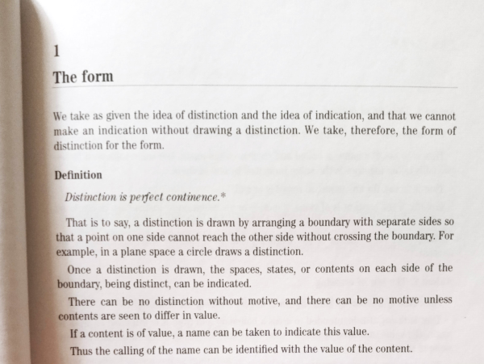

# Teoría de Distinciones: Marco Fundamental

")

## Primitivos Ontológicos

### Continuo Único ($\mathcal{C}$)

**Axioma de Ausencia Predicativa**: $\forall P, \neg P(\mathcal{C})$
Existe un solo continuo sin predicados internos. No hay multiplicidad de continuos - solo continuidad diferenciada por
soluciones específicas.

### Operador de Distinción ($\mathcal{D}$)

**Definición**: $\mathcal{D}: \mathcal{C} \to \text{Soluciones de Continuidad}$
Pura actividad que crea soluciones de continuidad - fracturas específicas que generan diferencias operativas sin
postular multiplicidad ontológica.

### Carácter Fronterizo Fundamental de la Distinción

**Principio de Co-Definición Binaria**: Toda frontera co-define necesariamente dos espacios/conjuntos:
$F_{S1|S2}: \mathcal{C} \rightarrow \{S_1, S_2\} \text{ donde } S_1 \cap S_2 = \emptyset \text{ y } S_1 \cup S_2 = \mathcal{C}$

**Recursividad Topológica**: La recursividad emerge automáticamente porque cualquier modificación fronteriza afecta
ambos lados simultáneamente:
$\Delta F_{S1|S2} \rightarrow \{\Delta S_1 \rightarrow \Delta F_{S1|S2} \rightarrow \Delta S_2 \rightarrow \Delta F_{S1|S2}\}$

Esta cadena de modificaciones mutuas es consecuencia geométrica inevitable del carácter binario de toda frontera.

**Co-Dependencia Ontológica No-Viciosa**:

- El Continuo no puede existir sin oscilar (generar distinciones)
- La Distinción no puede ocurrir sino sobre Continuo
- Ambos son primitivos mutuamente necesarios, no derivados

### Propagación Inter-Sistémica

**Fronteras Compartidas**: Los sistemas no están aislados sino conectados por fronteras compartidas donde las
distinciones se propagan:
$$S_i \leftrightarrow F_{i,j} \leftrightarrow S_j$$

**Red Fronteriza**: El conjunto de todos los sistemas forma una red de fronteras interconectadas donde las
modificaciones se propagan automáticamente.

**Eliminación de Exterioridad**: No existe posición meta-sistémica externa. La teorización de este marco es ella misma
un proceso fronterizo - emerge de la frontera entre el sistema teorizador y su complemento conceptual, propagando
efectos que modifican ambos.

## Individuación Sistémica

### Criterio de Individuación por Soluciones de Continuidad

Un sistema $S$ existe cuando una solución de continuidad (frontera) diferencia operativamente interior de exterior en el
continuo único:
$$S = \text{región continua definida por } F_S \text{ que crea discontinuidad específica}$$

### Frontera como Solución de Continuidad

La frontera $F_S$ no separa continuos diferentes sino que constituye una discontinuidad específica:

- **Interior**: Región continua delimitada por $F_S$
- **Exterior**: Región continua externa a $F_S$
- **Frontera**: Solución de continuidad que los diferencia operativamente

### Complemento como Exterioridad Continua

El complemento $\overline{S}$ es la región externa del continuo único, diferenciada del interior por la solución de
continuidad que constituye la frontera del sistema. El complemento no es un exterior pasivo, sino un sistema activo que
participa en la red de propagación de distinciones, formando una relación simétrica y dinámica con el sistema original.

## Estructura Triádica Universal

### Triada Fundamental A-R-Ã

Toda distinción proyecta tres componentes inseparables:

- **A**: Identidad en el sistema
- **R**: Proceso relacional en curso
- **Ã**: Transformación emergente

Esta estructura es invariante aunque su contenido sea específico al sistema.

### Tensión Ontológica ($\tau$)

Medida de inestabilidad introducida por cualquier distinción. Específica a cada sistema y relativa a su capacidad
operativa:
$$\tau_s(D_i, D_j) = \text{medida de incoherencia en sistema } s$$

## Procesamiento Fronterizo y Dinámica Centro-Frontera

### Gradiente de Estabilidad

La capacidad de asimilar tensiones decrece del centro hacia las fronteras, creando un gradiente de estabilidad
sistémica:

**Centro Sistémico**:

- Tensiones fácilmente asimilables
- Comportamiento lineal predominante
- Permite estructuración compleja y estable
- Lógica predictiva y coherente

**Zona Intermedia**:

- Tensiones moderadamente asimilables
- Transición gradual hacia no-linealidad
- Estructuración parcialmente estable

**Frontera Sistémica**:

- Tensiones extremas, difícilmente asimilables
- Fenómenos no-lineales y exponenciales
- Imposibilidad de estructura estable
- Cambios constantes y aparente paradoja desde la lógica central

### Interfaz Traductora Fronteriza

$F_S: \text{tensiones extremas} \rightarrow \text{procesamiento no-lineal} \rightarrow \text{cambios sistémicos}$

### Fronteras como Regiones de Máxima Tensión

**Estructura Fronteriza Propia**: Las fronteras son regiones específicas del continuo único que:

- Soportan tensiones extremas no asimilables completamente
- Desarrollan fenómenos y dinámicas propias (no-lineales, exponenciales)
- Mantienen inestabilidad estructural permanente
- Generan efectos emergentes específicos a su condición tensionada

**Fenómenos Fronterizos Extremos**:

- **Alta densidad de eventos**: Mayor frecuencia de modificaciones y transformaciones
- **Comportamientos no-lineales**: Respuestas desproporcionadas a pequeñas perturbaciones
- **Creatividad sistémica**: Generación de nuevas configuraciones imposibles en el centro
- **Paradoja aparente**: Efectos que contradicen la lógica lineal del interior sistémico

**Capacidad de Procesamiento Fronterizo**: A pesar de la inestabilidad, las fronteras procesan y traducen tensiones
entre regiones, funcionando como interfaces activas que mantienen diferenciación sistémica mientras permiten
intercambio.

### Umbral Crítico y Capacidad Operativa

**Umbral Crítico ($\theta_{c,S}$)**: Límite de tensión asimilable determinado por la capacidad de continencia de la
frontera. Al excederse, se produce reconfiguración mínima.

**Capacidad de Filtrado**: Los umbrales operativos determinan qué tensiones el sistema puede procesar internamente sin
generar observables (cambios estructurales):

- Tensiones subumbral: Asimilación recursiva interna
- Tensiones supraumbral: Generación de emergencias observables

**Retroalimentación Sistémica**: El procesamiento interno genera necesariamente respuestas hacia el complemento,
modificando las condiciones fronterizas y permitiendo evolución sistémica.

## Emergencia Espacio-Temporal

### Temporalidad Emergente

La temporalidad surge como distinción de estados separados por aparición:
$$D_{s,n+1} = \mathcal{D}_s(D_{s,n})$$

La secuencia temporal $t_s$ es el producto de la recursividad de distinciones, no su contenedor. Cada aplicación
recursiva constituye un "momento" temporal sistémico.

### Espacialidad Emergente

La espacialidad surge como organización relacional de distinciones simultáneas:
$$\{D_{s,i}\} \leftrightarrow \{D_{s,j}\} \rightarrow \text{estructura espacial}_s$$

Las relaciones espaciales emergen de la tensión ontológica entre distinciones co-presentes en el sistema.

## Axiomas Sistémicos

### Axioma de Distinción Primaria

Para cualquier configuración $A$ en $\mathcal{C}_s$ existe una distinción $\mathcal{D}_s(A) = (A, \tilde{A})$ tal
que $\tau_s(A, \tilde{A}) > 0$.

### Axioma de Minimización Relativa

Toda configuración estable en $\mathcal{C}_s$ es un mínimo local de $\tau_s$ relativo a la capacidad del sistema.

### Axioma de Reconfiguración Mínima

Si $\Delta\tau_s > \theta_{c,s}$, el sistema ejecuta la reconfiguración mínima necesaria para restaurar coherencia
operativa.

### Axioma de Emergencia Numérica

- **0**: Configuración de mínima tensión de referencia en el sistema
- **1**: Magnitud de equilibrio de la primera relación completada $|\tilde{R}_s^{(1)}| = 1$

## Recursividad y Jerarquías

### Aplicación Recursiva

El operador $\mathcal{D}_s$ puede aplicarse a sus propios resultados, generando jerarquías de distinciones:

- Nivel 0: $\mathcal{C}_s$ (continuo sistémico)
- Nivel n: $\mathcal{D}_s^n(\mathcal{C}_s)$ (meta-distinciones de orden n)

### Herencia Constitutiva

Cada nueva estabilización incorpora constitutivamente las anteriores, respetando los límites operativos del sistema.

## Formalización Categórica Relativa

### Categoría de Sistemas Distinguidores

- **Objetos**: Sistemas distinguidores $(S, \mathcal{C}_S, \mathcal{D}_S)$
- **Morfismos**: Transformaciones que preservan estructura triádica entre sistemas

### Principio de Equivalencia Sistémica

Sistemas con la misma estructura triádica operativa son equivalentes, independientemente de su contenido específico.

## Consecuencias Fundamentales

### Inestabilidad Fronteriza como Origen de Estabilidad

La inestabilidad es fronteriza y se propaga entre sistemas. Las estructuras estables emergen como efectos de
procesamiento fronterizo - regiones del continuo que logran equilibrio temporal a través del intercambio de tensiones
con sus fronteras.

### Red Ontológica Fronteriza

La realidad es una red de fronteras interconectadas donde cada modificación se propaga automáticamente. No hay sistemas
aislados - todos están conectados por fronteras compartidas que permiten propagación continua de distinciones.

### Auto-Inclusión Teórica

Este marco es él mismo un proceso fronterizo. Su teorización emerge de la frontera entre el sistema conceptual
teorizador y su complemento intelectual. No hay exterioridad meta-sistémica - incluso la descripción del proceso opera
dentro del proceso.

### Universalidad Propagativa

$$\forall S_i, S_j \, ( F_{i,j} \rightarrow \text{propagación automática de modificaciones} )$$

Toda modificación fronteriza se propaga necesariamente a través de la red de sistemas interconectados. Esta propagación
es la base de la comunicación, evolución y coherencia sistémica.

### Temporalidad como Propagación Discretizada

El tiempo emerge como discretización observable de la propagación fronteriza continua. Las secuencias temporales son
efectos de la propagación de modificaciones a través de la red de fronteras.

## Universalidad Operativa

### Principio de Inevitabilidad

$$\forall S \, ( \mathcal{C}(S) \rightarrow \exists D \, [ \mathcal{D}(D,S) \wedge \mathcal{E}(\text{observables},S) ] )$$

Todo sistema distinguidor necesariamente opera según esta estructura, desde partículas hasta mentes.

### Imposibilidad de Exterioridad

No existe posición "externa" al proceso de distinción. Cualquier intento de observar el proceso ya opera dentro de él
como actividad fronteriza.

## Ejemplos Sistémicos

### Sistema Físico (Electrón)

- **Frontera**: Orbital que separa estados ligados de estados libres
- **Interior**: Estados energéticos permitidos
- **Exterior**: Campo electromagnético
- **Propagación**: Intercambio de fotones virtuales

### Sistema Cognitivo (Mente)

- **Frontera**: Límite entre consciente e inconsciente
- **Interior**: Espacio conceptual articulado
- **Exterior**: Entorno fenoménico
- **Propagación**: Intercambio de información sensorial

### Sistema Matemático

- **Frontera**: Axiomas que separan teoremas válidos de inválidos
- **Interior**: Espacio lógico coherente
- **Exterior**: Meta-matemáticas
- **Propagación**: Derivaciones e inferencias

## Principio Rector

**Simplicidad Operativa**: La estructura mínima - continuo único + operador de distinción fronteriza + recursividad
propagativa - es suficiente para generar toda la complejidad observable manteniendo universalidad operativa.

La distinción es siempre fronteriza, el continuo es único, y ambos cooperan en una red de propagación automática donde
cada modificación genera efectos sistémicos interconectados.

## Manifestaciones del Proceso Universal en Diferentes Dominios

La Teoría de Distinciones revela un patrón estructural que se manifiesta consistentemente en múltiples campos
científicos. Estas manifestaciones no son meras analogías, sino expresiones del mismo proceso fundamental operando en
diferentes escalas y contextos.

### Manifestación en Teoría de la Información

La información emerge como resultado directo de distinciones que resuelven incertidumbre:

* **Continuo ($\mathcal{C}$)**: Estado de máxima entropía - incertidumbre completa antes de la medición.
* **Operador de Distinción ($\mathcal{D}$)**: Acto de medición que fuerza resolución binaria (0/1).
* **Emergencia Discreta**: El bit de información - estructura que emerge del proceso distinguidor.

El principio "la información no existe hasta que se distingue" es una aplicación directa del marco: toda reducción de
entropía opera mediante distinciones que generan estructura específica desde potencialidad indiferenciada.

### Manifestación en Fenómenos Cuánticos

Los procesos cuánticos ejemplifican la dinámica continuo-distinción:

* **Continuo ($\mathcal{C}$)**: Función de onda como superposición de estados potenciales.
* **Operador de Distinción ($\mathcal{D}$)**: Decoherencia e interacción con el entorno.
* **Emergencia Discreta**: Estados observables actualizados desde superposición.

La medición cuántica es una instancia del proceso universal donde el continuo (superposición) experimenta distinción (
colapso/decoherencia) generando emergencia discreta (estado definido).

### Manifestación en Sistemas Complejos

La autoorganización y transiciones de fase revelan la dinámica fronteriza del marco:

* **Continuo ($\mathcal{C}$)**: Espacio de fases - rango completo de comportamientos sistémicos posibles.
* **Operador de Distinción ($\mathcal{D}$)**: Fluctuaciones críticas en puntos de bifurcación.
* **Emergencia Discreta**: Estructuras autoorganizadas - patrones, ecosistemas, configuraciones estables.

Los umbrales críticos $\theta_c$ corresponden exactamente a puntos de transición de fase donde pequeñas distinciones
generan reorganizaciones sistémicas masivas.

### Manifestación en Procesos Computacionales

La computación realiza distinciones sobre espacios de posibilidades:

* **Continuo ($\mathcal{C}$)**: Función como regla conteniendo infinitas aplicaciones potenciales.
* **Operador de Distinción ($\mathcal{D}$)**: Evaluación de función con argumentos específicos.
* **Emergencia Discreta**: Resultado computacional - valor estabilizado del proceso.

Cada cómputo es un proceso de distinción que actualiza potencialidades algorítmicas en resultados específicos. Los
límites computacionales (indecidibilidad, incompletitud) reflejan fronteras donde el proceso distinguidor alcanza
umbrales críticos.

### Unidad del Proceso

Estas manifestaciones comparten la estructura triádica fundamental: potencialidad continua → proceso distinguidor →
actualización discreta. No son dominios separados que "se parecen" sino expresiones del mismo proceso operando en
diferentes escalas.

La universalidad del patrón sugiere que estamos observando una gramática fundamental de la procesualidad - cómo emerge
estructura específica desde continuidades potenciales a través de operaciones distinguidoras.

El marco no reduce estos fenómenos a una fórmula simple, sino que identifica la estructura operativa común que permite
su diversidad específica.